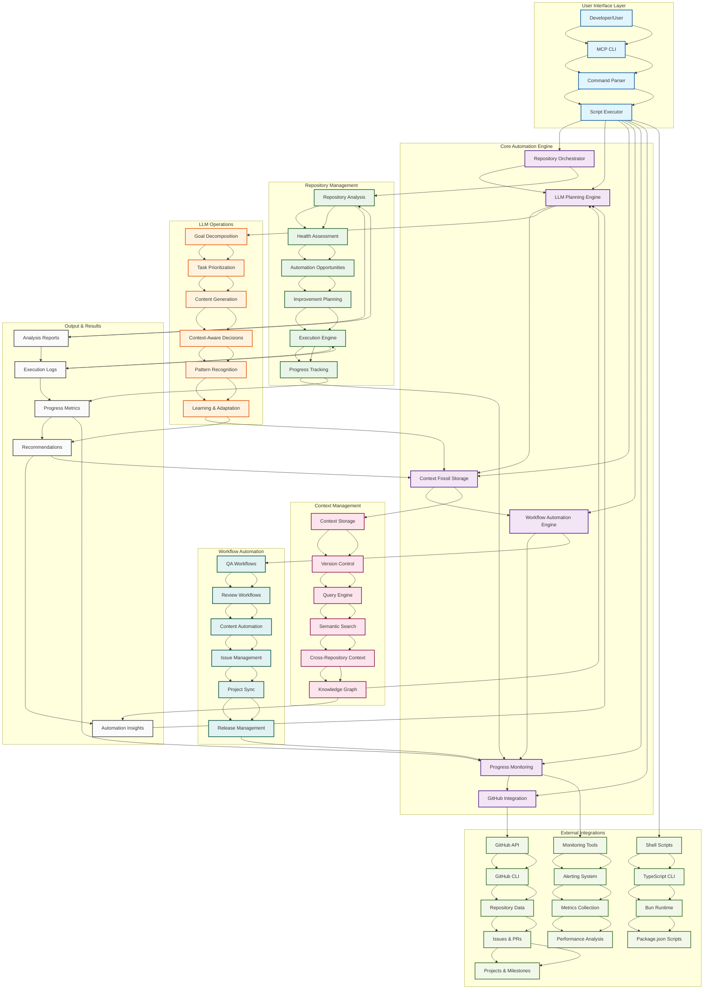
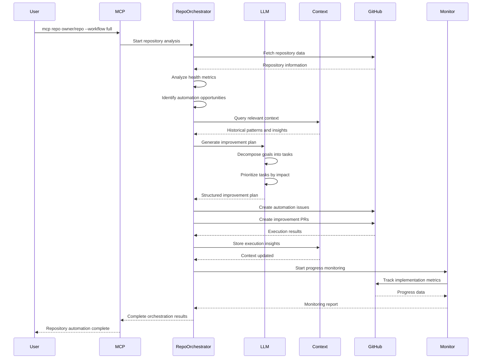
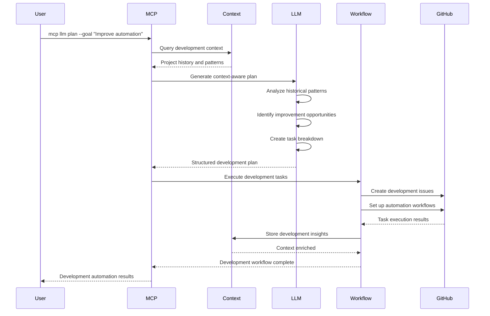
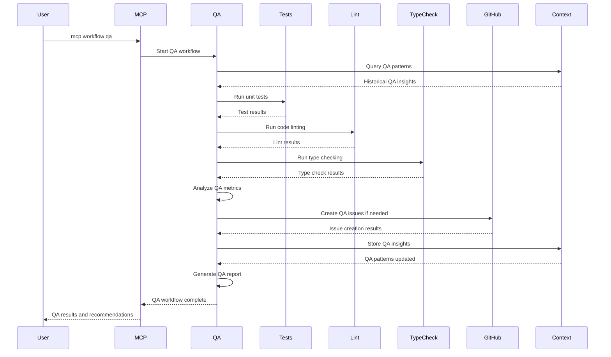
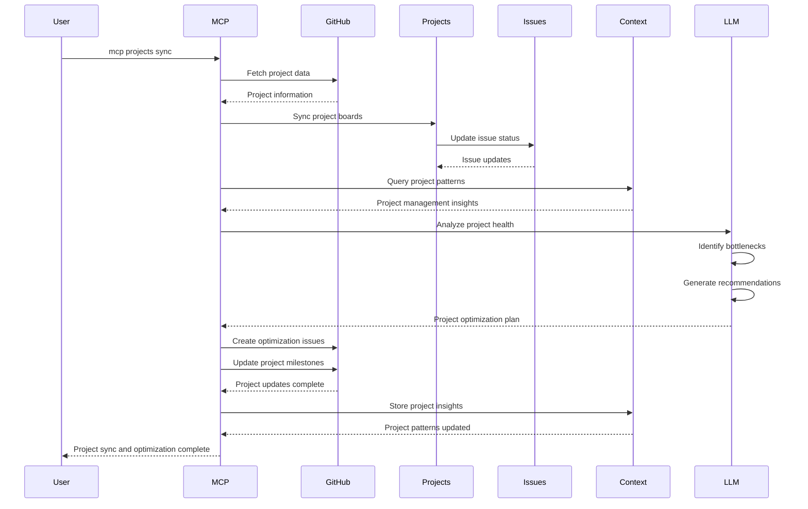

# Automation Workloads Ecosystem - Complete Workflow Diagram

## 🎯 Overview

This diagram illustrates the complete automation ecosystem workflow, showing how the MCP CLI orchestrates various automation workloads across repository management, LLM operations, context storage, and workflow automation.

## 🔄 Complete Workflow Architecture

## 🔄 Detailed Workflow Sequences

### 1. Repository Onboarding Workflow

### 2. Context-Driven Development Workflow

### 3. QA Pipeline Automation Workflow

### 4. GitHub Project Management Workflow

## 🎯 Key Automation Goals

### 1. **Intelligent Repository Management**
- **Automated Analysis**: Continuously analyze repository health and identify improvement opportunities
- **LLM-Powered Planning**: Generate intelligent improvement plans based on repository context
- **Automated Execution**: Execute improvements with minimal manual intervention
- **Progress Monitoring**: Track implementation progress and measure impact

### 2. **Context-Aware Decision Making**
- **Persistent Knowledge**: Store and retrieve context from all automation activities
- **Pattern Recognition**: Learn from historical patterns to improve future decisions
- **Cross-Repository Insights**: Share knowledge across multiple repositories
- **Adaptive Workflows**: Adjust automation strategies based on current context

### 3. **Comprehensive Workflow Automation**
- **QA Automation**: Automated testing, linting, and quality assurance
- **Review Automation**: Automated code review and feedback generation
- **Content Automation**: Automated content creation and management
- **Project Management**: Automated issue tracking and project synchronization

### 4. **GitHub Ecosystem Integration**
- **Repository Analysis**: Deep integration with GitHub repositories
- **Issue Management**: Automated issue creation, tracking, and resolution
- **Project Boards**: Automated project board synchronization and management
- **Pull Request Automation**: Automated PR creation and review processes

## 🔧 Technical Implementation

### 1. **MCP CLI Architecture**
- **Command Parser**: Parse and validate user commands
- **Script Executor**: Execute underlying automation scripts
- **Package.json Integration**: Leverage existing npm/bun scripts
- **Error Handling**: Comprehensive error handling and recovery

### 2. **Repository Orchestration**
- **Multi-Repository Support**: Handle multiple repositories simultaneously
- **Health Assessment**: Comprehensive repository health analysis
- **Automation Opportunities**: Identify specific automation improvements
- **Execution Engine**: Execute improvements with intelligent decision making

### 3. **LLM Integration**
- **Goal Decomposition**: Break down complex goals into actionable tasks
- **Task Prioritization**: Intelligent task prioritization based on impact
- **Content Generation**: Automated content creation and optimization
- **Pattern Learning**: Learn from execution results to improve future decisions

### 4. **Context Management**
- **Versioned Storage**: Track changes and maintain history
- **Semantic Search**: Intelligent context retrieval and querying
- **Cross-Repository Context**: Share knowledge across repositories
- **Knowledge Graph**: Build relationships between different context elements

## 📊 Expected Outcomes

### 1. **Increased Development Velocity**
- **Faster Onboarding**: Quick repository analysis and improvement planning
- **Automated Workflows**: Reduced manual intervention in development processes
- **Intelligent Automation**: Context-aware automation that adapts to project needs
- **Continuous Improvement**: Learning from past actions to improve future automation

### 2. **Improved Code Quality**
- **Automated QA**: Comprehensive automated testing and quality checks
- **Intelligent Reviews**: LLM-powered code review and feedback
- **Pattern Recognition**: Identify and fix common code quality issues
- **Proactive Monitoring**: Continuous monitoring and alerting for quality issues

### 3. **Enhanced Project Management**
- **Automated Issue Management**: Intelligent issue creation and tracking
- **Project Synchronization**: Automated project board updates
- **Progress Tracking**: Real-time progress monitoring and reporting
- **Resource Optimization**: Intelligent resource allocation and prioritization

### 4. **Knowledge Preservation**
- **Context Fossil Storage**: Persistent storage of decisions and insights
- **Pattern Documentation**: Automatic documentation of successful patterns
- **Cross-Project Learning**: Share knowledge across multiple projects
- **Continuous Learning**: Improve automation based on historical data

---

This comprehensive automation ecosystem provides a unified, intelligent, and extensible platform for managing automation workloads across the entire development lifecycle, from repository analysis to project management and quality assurance. 