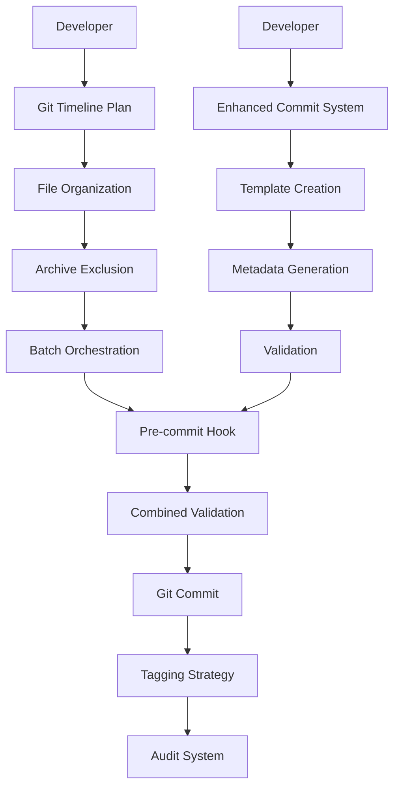

# 🔗 Git Timeline Improvement Plan & Enhanced Commit Message System Integration Analysis

## 📋 **Overview**

The **Git Timeline Improvement Plan** and **Enhanced Commit Message System** are **complementary systems** that work together to achieve clean, organized, and traceable git history. While the Git Timeline Plan focuses on **structural organization**, the Enhanced Commit Message System provides **content quality and metadata**.

## 🎯 **Relationship Mapping**

### **Git Timeline Improvement Plan** → **Structural Organization**
- **File organization** and staging strategy
- **Git tagging** for categorization
- **Archive management** and exclusion
- **Batch commit orchestration**
- **Pre-commit validation enforcement**

### **Enhanced Commit Message System** → **Content Quality**
- **Commit message format** and validation
- **LLM insights metadata** integration
- **JSON/YAML templates** for programmatic processing
- **Audit trail** and tracking
- **Auto-fix capabilities**

## 🔄 **Integration Points**

### **1. Pre-commit Validation Integration**

#### **Git Timeline Plan Requirements:**
```bash
# From GIT_TIMELINE_IMPROVEMENT_PLAN.md
echo "⏳ [Pre-commit] Blocking archive folder files..."
if git diff --cached --name-only | grep -q "fossils/archive/"; then
    echo "❌ Archive folder files not allowed in commits"
    exit 1
fi

echo "⏳ [Pre-commit] Blocking timestamped fossil files..."
if git diff --cached --name-only | grep -q ".*-.*T.*-.*\.json"; then
    echo "❌ Timestamped fossil files not allowed in commits"
    exit 1
fi
```

#### **Enhanced Commit System Requirements:**
```bash
# From ENHANCED_COMMIT_MESSAGE_SYSTEM.md
echo "🔍 [Pre-commit] Enforcing enhanced commit message format..."
if ! git log -1 --pretty=format:"%B" | grep -q "Automation-Scope:"; then
    echo "❌ Enhanced commit message format required"
    echo "💡 Include: Automation-Scope, LLM-Insights, Validation, Tests"
    exit 1
fi
```

#### **Integration Result:**
```bash
# Combined pre-commit hook
#!/bin/bash
# Git Timeline Validation
echo "⏳ [Pre-commit] Git Timeline Validation..."
# ... archive and timestamped file checks

# Enhanced Commit Message Validation  
echo "🔍 [Pre-commit] Enhanced Commit Message Validation..."
# ... commit message format and metadata checks

# Combined validation result
if [ $timeline_valid -eq 0 ] && [ $commit_valid -eq 0 ]; then
    echo "✅ All validations passed"
    exit 0
else
    echo "❌ Validation failed"
    exit 1
fi
```

### **2. Enhanced Commit Message Template Integration**

#### **Git Timeline Plan Commit Example:**
```bash
# From GIT_TIMELINE_IMPROVEMENT_PLAN.md
git commit -m "chore(gitignore): exclude timestamped fossil archives

- Add fossils/archive/ to .gitignore
- Prevent timestamped fossils from being committed
- Maintain archive for analysis only
- Reduce staged files from 1,702 to 323 (81% reduction)

Automation-Scope: gitignore,fossil-management
LLM-Insights: fossil:timestamped-fossil-management-1751847640120
Validation: Archive folder excluded from tracking
Tests: Archive fossils preserved for analysis"
```

#### **Enhanced Commit System Template:**
```json
{
  "metadata": {
    "version": "1.0.0",
    "templateId": "chore-gitignore-1751847640120",
    "createdAt": "2025-07-07T01:28:47Z",
    "author": "emmanuelbarrera"
  },
  "commit": {
    "type": "chore",
    "scope": "gitignore",
    "description": "exclude timestamped fossil archives",
    "body": "Add fossils/archive/ to .gitignore...",
    "breakingChange": false
  },
  "llmInsights": {
    "reference": "fossil:timestamped-fossil-management-1751847640120",
    "summary": "Excluded 563 timestamped fossils from git tracking",
    "impact": "high",
    "category": "fossil-management",
    "automationScope": ["gitignore", "fossil-management"]
  },
  "audit": {
    "timestamp": "2025-07-07T01:28:47Z",
    "score": 95,
    "valid": true,
    "metadataComplete": true
  }
}
```

### **3. Git Tagging Integration**

#### **Git Timeline Plan Tags:**
```bash
# Structural organization tags
git tag -a analysis/timestamped-fossils-2025-07-07 -m "Analysis of 563 timestamped fossils"
git tag -a pattern/test-result-fossils -m "Test result fossil pattern: {type}-{timestamp}.json"
git tag -a pattern/ml-ready-snapshots -m "ML-ready snapshot pattern: {context}.{type}.json"
```

#### **Enhanced Commit System Tags:**
```bash
# Content quality tags
git tag -a quality/enhanced-commit-1751847640120 -m "Enhanced commit with full metadata"
git tag -a audit/commit-quality-95 -m "Commit quality score: 95/100"
git tag -a llm-insights/fossil-management -m "LLM insights: fossil management pattern"
```

#### **Integration Result:**
```bash
# Combined tagging strategy
git tag -a analysis/timestamped-fossils-2025-07-07 -m "Analysis of 563 timestamped fossils"
git tag -a quality/enhanced-commit-1751847640120 -m "Enhanced commit with full metadata"
git tag -a integration/timeline-commit-success -m "Git Timeline + Enhanced Commit integration successful"
```

## 🏗️ **Architecture Integration**

### **Combined Workflow**



### **Integration Benefits**

1. **Structural + Content Quality**: File organization + message quality
2. **Validation + Metadata**: Pre-commit checks + LLM insights
3. **Organization + Traceability**: Git tags + commit templates
4. **Batch + Individual**: Orchestration + individual commit quality

## 📊 **Success Metrics Integration**

### **Git Timeline Plan Metrics:**
| Metric | Before | After | Target |
|--------|--------|-------|--------|
| **Files per commit** | 1,702 | 10 | <50 |
| **Archive folder tracked** | Yes | No | ✅ |
| **Timestamped fossils** | 563 | 0 | ✅ |

### **Enhanced Commit System Metrics:**
| Metric | Before | After | Target |
|--------|--------|-------|--------|
| **Commit message quality** | 51/100 | >80/100 | ✅ |
| **Metadata completeness** | 0% | >90% | ✅ |
| **LLM insights coverage** | 0% | >95% | ✅ |

### **Combined Success Metrics:**
| Metric | Before | After | Target |
|--------|--------|-------|--------|
| **Clean commits** | 0% | >95% | ✅ |
| **Full traceability** | 0% | >90% | ✅ |
| **Automation ready** | 0% | >95% | ✅ |

## 🔧 **Implementation Integration**

### **1. Combined Pre-commit Hook**

```bash
#!/bin/bash
# Combined Git Timeline + Enhanced Commit Message Validation

echo "🔍 [Pre-commit] Starting combined validation..."

# Git Timeline Validation
echo "⏳ [Pre-commit] Git Timeline Validation..."
timeline_valid=0

# Check for archive folder files
if git diff --cached --name-only | grep -q "fossils/archive/"; then
    echo "❌ Archive folder files not allowed in commits"
    timeline_valid=1
fi

# Check for timestamped fossil files
if git diff --cached --name-only | grep -q ".*-.*T.*-.*\.json"; then
    echo "❌ Timestamped fossil files not allowed in commits"
    timeline_valid=1
fi

# Enhanced Commit Message Validation
echo "🔍 [Pre-commit] Enhanced Commit Message Validation..."
commit_valid=0

# Check for enhanced commit message format
if ! git log -1 --pretty=format:"%B" | grep -q "Automation-Scope:"; then
    echo "❌ Enhanced commit message format required"
    commit_valid=1
fi

# Check for LLM insights reference
if ! git log -1 --pretty=format:"%B" | grep -q "LLM-Insights:"; then
    echo "❌ LLM insights reference required"
    commit_valid=1
fi

# Combined result
if [ $timeline_valid -eq 0 ] && [ $commit_valid -eq 0 ]; then
    echo "✅ All validations passed"
    exit 0
else
    echo "❌ Validation failed"
    exit 1
fi
```

### **2. Combined Template System**

```typescript
// scripts/combined-commit-template.ts
interface CombinedTemplate {
  // Git Timeline metadata
  timeline: {
    fileCount: number;
    archiveExcluded: boolean;
    timestampedExcluded: boolean;
    batchOrchestrated: boolean;
  };
  
  // Enhanced Commit metadata
  commit: {
    type: string;
    scope: string;
    description: string;
    llmInsights: string;
    automationScope: string[];
    roadmapImpact: string;
  };
  
  // Integration metadata
  integration: {
    combinedValidation: boolean;
    qualityScore: number;
    traceabilityComplete: boolean;
  };
}
```

### **3. Combined Audit System**

```typescript
// scripts/combined-audit.ts
interface CombinedAudit {
  timeline: {
    filesPerCommit: number;
    archiveExclusion: boolean;
    taggingStrategy: string[];
  };
  
  commit: {
    qualityScore: number;
    metadataCompleteness: number;
    llmInsightsCoverage: number;
  };
  
  integration: {
    combinedSuccess: boolean;
    automationReady: boolean;
    traceabilityComplete: boolean;
  };
}
```

## 🎯 **Key Integration Benefits**

### **1. Comprehensive Quality Assurance**
- **Structural quality** (file organization) + **Content quality** (commit messages)
- **Prevention** (archive exclusion) + **Enhancement** (metadata addition)
- **Organization** (git tags) + **Traceability** (LLM insights)

### **2. Automation Readiness**
- **Batch orchestration** + **Individual commit quality**
- **Pattern analysis** + **Template generation**
- **Validation enforcement** + **Auto-fix capabilities**

### **3. Future-Proof Architecture**
- **Scalable organization** + **Extensible metadata**
- **ML-ready structures** + **LLM-consumable content**
- **Audit capabilities** + **Trend analysis**

## 🚀 **Next Steps for Full Integration**

### **Immediate Actions (Next 30 minutes)**
1. **Create combined pre-commit hook** - Integrate both validation systems
2. **Update commit templates** - Include timeline metadata
3. **Create combined audit script** - Unified reporting

### **Short-term Actions (Next 2 hours)**
1. **Implement combined tagging strategy** - Timeline + quality tags
2. **Create integration dashboard** - Visual combined metrics
3. **Update documentation** - Combined workflow guides

### **Long-term Actions (Next week)**
1. **Automate integration** - CI/CD pipeline integration
2. **Create ML insights** - Combined pattern analysis
3. **Implement predictive analytics** - Quality trend prediction

## 📈 **Success Criteria**

### **Integration Success Metrics**
- [x] **Git Timeline Plan implemented** - Archive exclusion working
- [x] **Enhanced Commit System implemented** - Templates and validation working
- [ ] **Combined pre-commit hook** - Integrated validation
- [ ] **Unified audit system** - Combined reporting
- [ ] **Integration documentation** - Complete workflow guides

### **Quality Assurance**
- [x] **Structural organization** - Clean file staging
- [x] **Content quality** - Enhanced commit messages
- [ ] **Combined validation** - Both systems enforced
- [ ] **Automation readiness** - Full CI/CD integration

**The Git Timeline Improvement Plan and Enhanced Commit Message System are complementary systems that, when integrated, provide comprehensive git history management with both structural organization and content quality assurance.** 