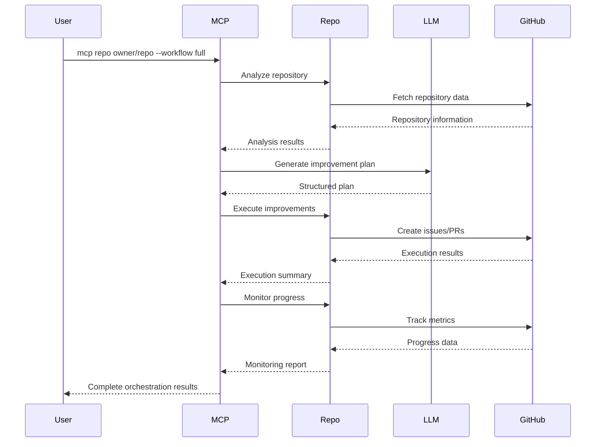
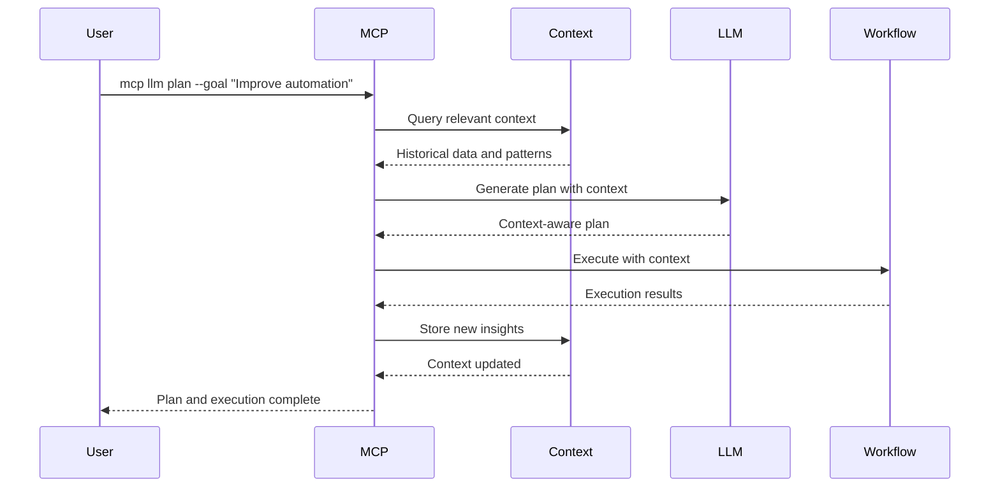
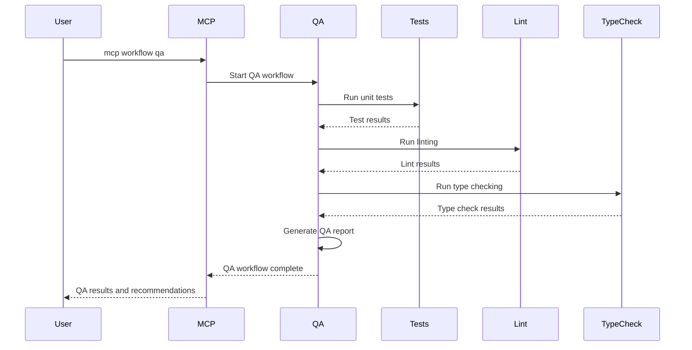

# MCP CLI - Modal Context Protocol Command Line Interface

## 🎯 Overview

The MCP CLI is a unified command-line interface for the `automate_workloads` ecosystem that provides comprehensive automation capabilities for repository orchestration, LLM-powered planning, context management, and workflow automation.

## 🏗️ Architecture



```mermaid
graph TB
    subgraph "MCP CLI Core"
        A[MCP CLI Service] --> B[Command Parser]
        B --> C[Script Executor]
        C --> D[Package.json Integration]
    end
    
    subgraph "Automation Categories"
        E[Repository Orchestration] --> F[Analysis]
        E --> G[Planning]
        E --> H[Execution]
        E --> I[Monitoring]
        
        J[Context Fossil Storage] --> K[Add/Update]
        J --> L[Query/Get]
        J --> M[Backup/Export]
        
        N[LLM Operations] --> O[Plan Generation]
        N --> P[Goal Decomposition]
        N --> Q[Task Prioritization]
        
        R[Workflow Automation] --> S[QA Workflows]
        R --> T[Review Workflows]
        R --> U[Content Automation]
        
        V[GitHub Integration] --> W[Issues Management]
        V --> X[Projects Integration]
        V --> Y[Repository Analysis]
    end
    
    subgraph "External Tools"
        Z[GitHub CLI] --> V
        AA[Bun Runtime] --> C
        BB[Shell Scripts] --> C
        CC[TypeScript CLI] --> C
    end
    
    A --> E
    A --> J
    A --> N
    A --> R
    A --> V
```

## 🚀 Core Features

### 1. Repository Orchestration
- **Multi-Repository Analysis**: Analyze any GitHub repository for automation opportunities
- **LLM-Powered Planning**: Generate comprehensive action plans and recommendations
- **Automated Execution**: Execute improvements with intelligent decision making
- **Progress Tracking**: Monitor implementation and measure impact

### 2. Context Fossil Storage
- **Persistent Knowledge Base**: Store decisions, insights, and context for future reference
- **Multi-Source Input**: Accept input from LLMs, terminals, APIs, and manual sources
- **Versioned Entries**: Track changes and maintain history of all entries
- **LLM Integration**: Provide context summaries and insights for AI systems

### 3. LLM-Powered Operations
- **Goal Decomposition**: Break down complex goals into actionable tasks
- **Task Prioritization**: Intelligent prioritization based on impact and effort
- **Content Generation**: Automated content creation and optimization
- **Context-Aware Execution**: Adapt workflows based on historical context

### 4. Workflow Automation
- **QA Workflows**: Automated testing, linting, and quality assurance
- **Review Workflows**: Automated code review and feedback generation
- **Content Automation**: Automated content creation and management
- **Issue Management**: Automated issue creation, tracking, and resolution

## 📋 Command Structure

### Repository Commands
```bash
# Full orchestration workflow
mcp repo <owner> <repo> --workflow full

# Analysis only
mcp repo <owner> <repo> --workflow analyze

# Planning only
mcp repo <owner> <repo> --workflow plan

# Execution only
mcp repo <owner> <repo> --workflow execute

# Monitoring only
mcp repo <owner> <repo> --workflow monitor
```

### Context Commands
```bash
# Initialize context storage
mcp context init

# Add context data
mcp context add --data '{"key": "value"}'

# Query context
mcp context query --query "automation patterns"

# Export context
mcp context export --output context.json

# Get context stats
mcp context stats
```

### LLM Commands
```bash
# Generate plan
mcp llm plan --goal "Improve repository automation"

# Analyze current state
mcp llm analyze --context '{"repo": "owner/repo"}'

# Execute LLM workflow
mcp llm execute --goal "Deploy automation improvements"

# Monitor LLM operations
mcp llm monitor
```

### Workflow Commands
```bash
# Run QA workflow
mcp workflow qa

# Run review workflow
mcp workflow review

# Run content automation
mcp workflow content

# Run issue management
mcp workflow issues

# Run general automation
mcp workflow automate

# Sync workflows
mcp workflow sync
```

### GitHub Integration Commands
```bash
# List issues
mcp issues list

# List CI issues
mcp issues ci

# List quality issues
mcp issues quality

# Run issue manager
mcp issues manager

# Projects integration
mcp projects integration

# Projects sync
mcp projects sync
```

### Development Commands
```bash
# Build project
mcp dev build

# Start development server
mcp dev start

# Setup environment
mcp dev setup

# Run tests
mcp dev test

# Format code
mcp dev format

# Lint code
mcp dev lint

# Type check
mcp dev type-check
```

### Testing Commands
```bash
# Run unit tests
mcp test unit

# Run integration tests
mcp test integration

# Run audit tests
mcp test audit

# Watch mode
mcp test unit --watch
```

### Migration Commands
```bash
# Migrate up
mcp migrate up

# Migrate down
mcp migrate down

# Check migration status
mcp migrate status

# List migrations
mcp migrate list
```

### Utility Commands
```bash
# List all commands
mcp list

# Show system status
mcp status
```

## 🔄 Workflow Automation Patterns

### Pattern 1: Repository Analysis → Planning → Execution → Monitoring



### Pattern 2: Context-Aware Automation



### Pattern 3: QA Workflow Automation



## 🎯 Use Cases

### Use Case 1: Repository Onboarding
```bash
# Analyze a new repository for automation opportunities
mcp repo microsoft vscode --workflow analyze

# Generate a comprehensive improvement plan
mcp repo microsoft vscode --workflow plan

# Execute the improvements
mcp repo microsoft vscode --workflow execute

# Monitor the progress
mcp repo microsoft vscode --workflow monitor
```

### Use Case 2: Context-Driven Development
```bash
# Initialize context storage
mcp context init

# Add development context
mcp context add --data '{"project": "automate_workloads", "phase": "planning"}'

# Generate LLM plan with context
mcp llm plan --goal "Implement new automation feature" --context '{"project": "automate_workloads"}'

# Execute with context awareness
mcp llm execute --goal "Deploy automation improvements"
```

### Use Case 3: Automated QA Pipeline
```bash
# Run comprehensive QA workflow
mcp workflow qa

# Run specific QA tests
mcp qa test

# Run review workflow
mcp workflow review

# Monitor QA metrics
mcp repo owner/repo --workflow monitor
```

### Use Case 4: GitHub Project Management
```bash
# List current issues
mcp issues list

# Run issue manager
mcp issues manager

# Sync GitHub projects
mcp projects sync

# Generate project report
mcp projects report
```

## 🔧 Integration Points

### 1. Package.json Scripts
The MCP CLI integrates with existing `package.json` scripts to provide a unified interface:

```json
{
  "scripts": {
    "repo:analyze": "bun run src/cli/repo-orchestrator.ts analyze",
    "repo:plan": "bun run src/cli/llm-plan.ts",
    "repo:orchestrate": "bun run src/cli/repo-orchestrator.ts orchestrate",
    "context:add": "bun run src/cli/context-fossil.ts add",
    "llm:plan": "bun run src/cli/llm-plan.ts",
    "workflow:qa": "./scripts/automation/qa-workflow.sh",
    "issues:list": "gh issue list",
    "projects:sync": "./scripts/automation/github-projects-integration.sh"
  }
}
```

### 2. Shell Scripts
Integration with existing shell scripts for automation:

```bash
# Repository orchestration
scripts/automation/repo-orchestrator.sh

# Progress monitoring
scripts/automation/monitor-progress.sh

# LLM workflows
scripts/automation/llm-workflow.sh

# QA workflows
scripts/automation/qa-workflow.sh
```

### 3. TypeScript CLI Tools
Integration with TypeScript-based CLI tools:

```typescript
// Repository orchestrator
src/cli/repo-orchestrator.ts

// LLM planning
src/cli/llm-plan.ts

// Context fossil storage
src/cli/context-fossil.ts

// Progress tracking
src/cli/track-progress.ts
```

## 📊 Benefits

### 1. Unified Interface
- **Single Command**: Access all automation capabilities through one CLI
- **Consistent Experience**: Standardized command structure across all operations
- **Reduced Complexity**: No need to remember multiple command patterns

### 2. Intelligent Automation
- **LLM Integration**: AI-powered planning and decision making
- **Context Awareness**: Leverage historical data for better decisions
- **Adaptive Workflows**: Automatically adjust based on current context

### 3. Comprehensive Coverage
- **Repository Management**: Full lifecycle from analysis to monitoring
- **Development Workflows**: Complete development pipeline automation
- **Quality Assurance**: Automated testing and quality checks
- **Project Management**: GitHub integration for issue and project management

### 4. Extensibility
- **Modular Design**: Easy to add new commands and capabilities
- **Script Integration**: Leverage existing shell scripts and tools
- **Package.json Integration**: Seamless integration with npm/bun scripts

## 🚀 Getting Started

### Installation
```bash
# Clone the repository
git clone https://github.com/BarreraSlzr/automate_workloads.git
cd automate_workloads

# Install dependencies
bun install

# Make MCP CLI executable
chmod +x mcp-cli.ts

# Run MCP CLI
bun run mcp-cli.ts --help
```

### First Steps
```bash
# Check system status
bun run mcp-cli.ts status

# List available commands
bun run mcp-cli.ts list

# Initialize context storage
bun run mcp-cli.ts context init

# Analyze a repository
bun run mcp-cli.ts repo microsoft vscode --workflow analyze

# Run QA workflow
bun run mcp-cli.ts workflow qa
```

## 🔮 Future Enhancements

### 1. Enhanced LLM Integration
- **Multi-Model Support**: Support for different LLM providers
- **Fine-tuned Models**: Custom models trained on automation patterns
- **Real-time Learning**: Continuous improvement from execution results

### 2. Advanced Context Management
- **Semantic Search**: Intelligent context retrieval
- **Context Clustering**: Group related context automatically
- **Cross-Repository Context**: Share context across multiple repositories

### 3. Workflow Orchestration
- **Visual Workflow Builder**: GUI for creating custom workflows
- **Workflow Templates**: Pre-built templates for common scenarios
- **Conditional Execution**: Smart workflow branching based on context

### 4. Integration Ecosystem
- **Plugin System**: Third-party integrations
- **API Gateway**: REST API for programmatic access
- **Web Dashboard**: Web interface for monitoring and management

---

This MCP CLI design provides a comprehensive, intelligent, and extensible interface for automation workloads, leveraging the full power of the `automate_workloads` ecosystem while providing a unified and user-friendly experience. 