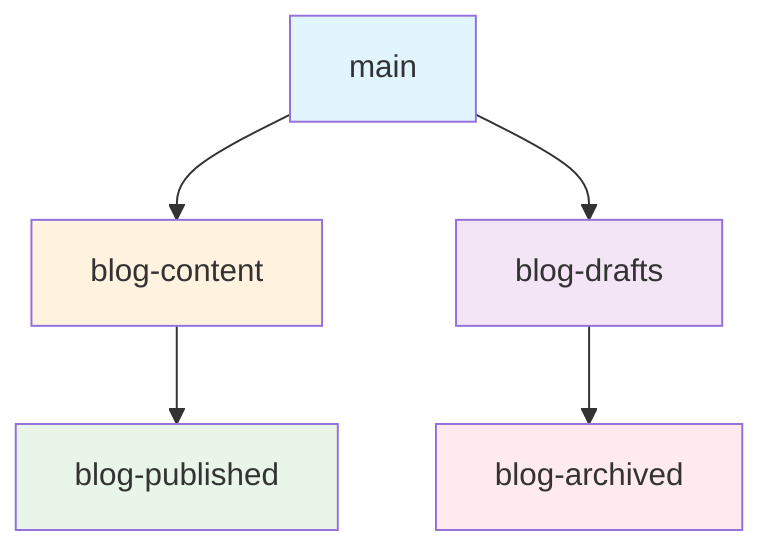

# Blog Publication Strategy: Managing Content Separately from Main Repository

## Overview

This document outlines the strategy for managing blog content in the `docs/blog/` folder without pushing it to the main repository, while maintaining local development capabilities and future update workflows.

## Problem Statement

- Blog content should not be pushed to the main repository
- Need to maintain local development and editing capabilities
- Future updates should be managed separately
- Content should be easily deployable to various platforms

## Solution: Multi-Branch Strategy

### 1. Branch Structure



**Branch Purposes:**
- `main`: Core application code (no blog content)
- `blog-content`: Dedicated branch for all blog content
- `blog-drafts`: Work-in-progress blog posts
- `blog-published`: Published content ready for deployment
- `blog-archived`: Old content and versions

### 2. Git Configuration

#### Update .gitignore for main branch

```bash
# Add to .gitignore in main branch
docs/blog/
blog-content/
*.blog.md
blog-publications/
```

#### Create blog-specific .gitignore

```bash
# Create .gitignore-blog for blog branches
# Ignore everything except blog content
*
!.gitignore-blog
!docs/
docs/*
!docs/blog/
!docs/blog/**/*
!blog-config/
!publication-scripts/
```

### 3. Branch Management Scripts

#### Create blog branch management script

```bash
#!/bin/bash
# scripts/manage-blog-branches.sh

set -e

BLOG_BRANCH="blog-content"
DRAFTS_BRANCH="blog-drafts"
PUBLISHED_BRANCH="blog-published"

function create_blog_branches() {
    echo "Creating blog branch structure..."
    
    # Create blog-content branch from main
    git checkout -b $BLOG_BRANCH main
    
    # Add blog content to this branch
    git add docs/blog/
    git commit -m "feat(blog): initialize blog content structure"
    
    # Create drafts branch
    git checkout -b $DRAFTS_BRANCH $BLOG_BRANCH
    
    # Create published branch
    git checkout -b $PUBLISHED_BRANCH $BLOG_BRANCH
    
    echo "Blog branches created successfully!"
}

function switch_to_blog_branch() {
    local branch=${1:-$BLOG_BRANCH}
    git checkout $branch
    echo "Switched to blog branch: $branch"
}

function publish_blog_post() {
    local post_file=$1
    local target_branch=${2:-$PUBLISHED_BRANCH}
    
    if [ ! -f "$post_file" ]; then
        echo "Error: Blog post file not found: $post_file"
        exit 1
    fi
    
    # Switch to published branch
    git checkout $target_branch
    
    # Copy post to published location
    cp "$post_file" "docs/blog/published/"
    
    # Commit the publication
    git add "docs/blog/published/"
    git commit -m "publish(blog): publish $(basename $post_file)"
    
    echo "Blog post published to $target_branch"
}

function sync_blog_content() {
    # Sync from main to blog branches
    git checkout $BLOG_BRANCH
    git merge main --no-edit
    
    # Update drafts
    git checkout $DRAFTS_BRANCH
    git merge $BLOG_BRANCH --no-edit
    
    # Update published
    git checkout $PUBLISHED_BRANCH
    git merge $BLOG_BRANCH --no-edit
    
    echo "Blog content synced across branches"
}

# Main script logic
case "${1:-help}" in
    "create")
        create_blog_branches
        ;;
    "switch")
        switch_to_blog_branch "$2"
        ;;
    "publish")
        publish_blog_post "$2" "$3"
        ;;
    "sync")
        sync_blog_content
        ;;
    *)
        echo "Usage: $0 {create|switch|publish|sync}"
        echo "  create              - Create blog branch structure"
        echo "  switch [branch]     - Switch to blog branch"
        echo "  publish <file> [branch] - Publish blog post"
        echo "  sync                - Sync content across branches"
        ;;
esac
```

#### Create blog workflow script

```bash
#!/bin/bash
# scripts/blog-workflow.sh

set -e

BLOG_DIR="docs/blog"
DRAFTS_DIR="$BLOG_DIR/drafts"
PUBLISHED_DIR="$BLOG_DIR/published"

function create_new_post() {
    local title=$1
    local platform=${2:-"general"}
    local date=$(date +%Y-%m-%d)
    
    # Create filename
    local filename=$(echo "$title" | tr '[:upper:]' '[:lower:]' | sed 's/[^a-z0-9]/-/g')
    local filepath="$DRAFTS_DIR/${date}-${filename}.md"
    
    # Create post template
    cat > "$filepath" << EOF
---
title: "$title"
description: "Description for $title"
date: "$(date -u +%Y-%m-%dT%H:%M:%SZ)"
author: "Emmanuel Barrera"
tags: ["$platform", "automation", "developer-tools"]
platform: "$platform"
---

# $title

> **🧲 SEO gets them in the door. Great content makes them stay, talk, and return.**

## Introduction

[Your introduction here]

## Main Content

[Your main content here]

## Conclusion

[Your conclusion here]

---

## Resources

- 📚 [Documentation](https://automateworkloads.com/docs)
- 🐙 [GitHub Repository](https://github.com/BarreraSlzr/automate_workloads)
- 💬 [Community](https://discord.gg/automate-workloads)

**Share this post if you found it helpful!** 🚀
EOF

    echo "Created new blog post: $filepath"
    echo "Switch to blog branch to edit: ./scripts/manage-blog-branches.sh switch blog-drafts"
}

function list_posts() {
    echo "=== Draft Posts ==="
    find "$DRAFTS_DIR" -name "*.md" -type f | sort
    
    echo -e "\n=== Published Posts ==="
    find "$PUBLISHED_DIR" -name "*.md" -type f | sort
}

function publish_post() {
    local draft_file=$1
    local target_platform=${2:-"all"}
    
    if [ ! -f "$draft_file" ]; then
        echo "Error: Draft file not found: $draft_file"
        exit 1
    fi
    
    # Switch to blog branch
    ./scripts/manage-blog-branches.sh switch blog-content
    
    # Copy to published
    local filename=$(basename "$draft_file")
    cp "$draft_file" "$PUBLISHED_DIR/"
    
    # Commit the publication
    git add "$PUBLISHED_DIR/$filename"
    git commit -m "publish(blog): publish $filename"
    
    echo "Published: $filename"
    echo "Ready for deployment to $target_platform"
}

function deploy_to_platform() {
    local platform=$1
    local post_file=$2
    
    case $platform in
        "medium")
            echo "Deploying to Medium..."
            # Add Medium deployment logic
            ;;
        "dev.to")
            echo "Deploying to Dev.to..."
            # Add Dev.to deployment logic
            ;;
        "linkedin")
            echo "Deploying to LinkedIn..."
            # Add LinkedIn deployment logic
            ;;
        "twitter")
            echo "Deploying to Twitter..."
            # Add Twitter deployment logic
            ;;
        *)
            echo "Unknown platform: $platform"
            exit 1
            ;;
    esac
}

# Main script logic
case "${1:-help}" in
    "new")
        create_new_post "$2" "$3"
        ;;
    "list")
        list_posts
        ;;
    "publish")
        publish_post "$2" "$3"
        ;;
    "deploy")
        deploy_to_platform "$2" "$3"
        ;;
    *)
        echo "Usage: $0 {new|list|publish|deploy}"
        echo "  new <title> [platform]    - Create new blog post"
        echo "  list                      - List all posts"
        echo "  publish <file> [platform] - Publish draft post"
        echo "  deploy <platform> <file>  - Deploy to platform"
        ;;
esac
```

### 4. Package.json Scripts

Add these scripts to your `package.json`:

```json
{
  "scripts": {
    "blog:create": "chmod +x scripts/manage-blog-branches.sh && ./scripts/manage-blog-branches.sh create",
    "blog:switch": "chmod +x scripts/manage-blog-branches.sh && ./scripts/manage-blog-branches.sh switch",
    "blog:publish": "chmod +x scripts/manage-blog-branches.sh && ./scripts/manage-blog-branches.sh publish",
    "blog:sync": "chmod +x scripts/manage-blog-branches.sh && ./scripts/manage-blog-branches.sh sync",
    "blog:new": "chmod +x scripts/blog-workflow.sh && ./scripts/blog-workflow.sh new",
    "blog:list": "chmod +x scripts/blog-workflow.sh && ./scripts/blog-workflow.sh list",
    "blog:deploy": "chmod +x scripts/blog-workflow.sh && ./scripts/blog-workflow.sh deploy"
  }
}
```

### 5. Pre-commit Hook Configuration

Update your pre-commit configuration to exclude blog content:

```yaml
# .pre-commit-config.yaml
repos:
  - repo: local
    hooks:
      - id: exclude-blog-content
        name: Exclude blog content from main branch
        entry: bash -c 'if git diff --cached --name-only | grep -q "docs/blog/"; then echo "Error: Blog content should not be committed to main branch. Use blog branches instead."; exit 1; fi'
        language: system
        stages: [commit]
```

### 6. GitHub Actions for Blog Management

Create a workflow for blog content management:

```yaml
# .github/workflows/blog-management.yml
name: Blog Content Management

on:
  push:
    branches: [blog-content, blog-drafts, blog-published]
  pull_request:
    branches: [blog-content, blog-drafts, blog-published]

jobs:
  validate-blog-content:
    runs-on: ubuntu-latest
    if: github.ref != 'refs/heads/main'
    
    steps:
      - uses: actions/checkout@v3
      
      - name: Validate blog post structure
        run: |
          # Check for required frontmatter
          for file in docs/blog/**/*.md; do
            if ! head -n 10 "$file" | grep -q "---"; then
              echo "Error: $file missing frontmatter"
              exit 1
            fi
          done
      
      - name: Check for broken links
        run: |
          # Add link checking logic
          echo "Checking for broken links in blog posts..."
      
      - name: Validate images
        run: |
          # Check that referenced images exist
          echo "Validating image references..."

  deploy-blog-content:
    runs-on: ubuntu-latest
    if: github.ref == 'refs/heads/blog-published'
    needs: validate-blog-content
    
    steps:
      - uses: actions/checkout@v3
      
      - name: Deploy to platforms
        run: |
          echo "Deploying blog content to various platforms..."
          # Add deployment logic for different platforms
```

### 7. Local Development Workflow

#### Daily Blog Workflow

```bash
# 1. Create new blog post
bun run blog:new "My New Blog Post" "medium"

# 2. Switch to blog branch for editing
bun run blog:switch blog-drafts

# 3. Edit the post
code docs/blog/drafts/2024-01-15-my-new-blog-post.md

# 4. Publish when ready
bun run blog:publish docs/blog/drafts/2024-01-15-my-new-blog-post.md

# 5. Deploy to platform
bun run blog:deploy medium docs/blog/published/2024-01-15-my-new-blog-post.md
```

#### Branch Switching Workflow

```bash
# Switch between branches
git checkout main          # Core application development
git checkout blog-content  # Blog content management
git checkout blog-drafts   # Work on drafts
git checkout blog-published # Review published content
```

### 8. Content Organization

#### Directory Structure

```
docs/blog/
├── drafts/                 # Work-in-progress posts
│   ├── 2024-01-15-post-1.md
│   └── 2024-01-16-post-2.md
├── published/              # Ready for deployment
│   ├── technical-deep-dive.md
│   ├── social-media-thread.md
│   └── linkedin-article.md
├── templates/              # Post templates
│   ├── technical-post.md
│   ├── social-media.md
│   └── business-case.md
└── assets/                 # Blog-specific assets
    ├── images/
    └── diagrams/
```

### 9. Publication Strategy

#### Platform-Specific Deployment

```typescript
// scripts/publication/deploy.ts
interface PublicationConfig {
  platform: 'medium' | 'dev.to' | 'linkedin' | 'twitter' | 'reddit';
  apiKey?: string;
  endpoint?: string;
  transform?: (content: string) => string;
}

class BlogPublisher {
  async deployToPlatform(
    postPath: string, 
    platform: PublicationConfig['platform']
  ): Promise<void> {
    const content = await this.readPost(postPath);
    const transformed = this.transformForPlatform(content, platform);
    await this.publish(transformed, platform);
  }
  
  private transformForPlatform(content: string, platform: string): string {
    // Platform-specific transformations
    switch (platform) {
      case 'medium':
        return this.transformForMedium(content);
      case 'dev.to':
        return this.transformForDevTo(content);
      case 'linkedin':
        return this.transformForLinkedIn(content);
      default:
        return content;
    }
  }
}
```

### 10. Backup and Sync Strategy

#### Local Backup

```bash
#!/bin/bash
# scripts/backup-blog.sh

BLOG_BACKUP_DIR="blog-backups/$(date +%Y-%m-%d)"

mkdir -p "$BLOG_BACKUP_DIR"

# Backup all blog content
cp -r docs/blog/ "$BLOG_BACKUP_DIR/"
cp -r scripts/blog-workflow.sh "$BLOG_BACKUP_DIR/"
cp -r scripts/manage-blog-branches.sh "$BLOG_BACKUP_DIR/"

# Create archive
tar -czf "blog-backup-$(date +%Y-%m-%d).tar.gz" "$BLOG_BACKUP_DIR"

echo "Blog content backed up to: blog-backup-$(date +%Y-%m-%d).tar.gz"
```

#### Remote Sync (Optional)

```bash
#!/bin/bash
# scripts/sync-blog-remote.sh

# Sync blog branches to remote (if needed)
git push origin blog-content
git push origin blog-drafts
git push origin blog-published

echo "Blog branches synced to remote"
```

## Implementation Steps

### 1. Initial Setup

```bash
# 1. Create blog branches
bun run blog:create

# 2. Update .gitignore in main branch
echo "docs/blog/" >> .gitignore
echo "blog-content/" >> .gitignore

# 3. Commit the changes
git add .gitignore
git commit -m "chore: exclude blog content from main branch"

# 4. Push main branch
git push origin main
```

### 2. Move Existing Blog Content

```bash
# 1. Switch to blog-content branch
bun run blog:switch blog-content

# 2. Move existing blog content
git mv docs/blog/* docs/blog/published/

# 3. Commit the move
git commit -m "feat(blog): move existing content to published"

# 4. Push blog branches
git push origin blog-content
git push origin blog-drafts
git push origin blog-published
```

### 3. Verify Setup

```bash
# 1. Switch back to main
git checkout main

# 2. Verify blog content is not tracked
git status

# 3. Test blog workflow
bun run blog:new "Test Post" "medium"
bun run blog:list
```

## Benefits of This Approach

### 1. **Separation of Concerns**
- Main repository stays focused on application code
- Blog content is managed separately
- Clear boundaries between different types of content

### 2. **Flexible Publication**
- Easy deployment to multiple platforms
- Platform-specific transformations
- Independent versioning of content

### 3. **Local Development**
- Full local editing capabilities
- Version control for blog content
- Easy backup and restore

### 4. **Team Collaboration**
- Multiple authors can work on different posts
- Clear review process for publications
- Conflict-free development

### 5. **Scalability**
- Easy to add new platforms
- Automated deployment workflows
- Content analytics and tracking

## Maintenance and Updates

### Regular Tasks

1. **Weekly**: Sync blog branches with main
2. **Monthly**: Review and archive old content
3. **Quarterly**: Update publication workflows
4. **Annually**: Review and optimize strategy

### Monitoring

- Track publication success rates
- Monitor engagement metrics
- Review platform performance
- Update content strategy based on data

## Conclusion

This strategy provides a robust solution for managing blog content separately from your main repository while maintaining full development capabilities. The multi-branch approach ensures clean separation, while the automation scripts make the workflow efficient and repeatable.

**Key Success Factors:**
- Consistent use of the branch workflow
- Regular backups of blog content
- Platform-specific optimization
- Continuous monitoring and improvement

**Next Steps:**
1. Implement the branch structure
2. Set up the automation scripts
3. Migrate existing content
4. Test the publication workflow
5. Train team members on the new process

This approach will help you maintain a clean main repository while having full control over your blog content and publication strategy. 