# Canonical Fossil Workflow Diagram (2025, Canonical-Only)

This diagram illustrates the unified canonical fossil workflow, showing how all GitHub objects and project artifacts are processed through the canonical fossil manager.

```mermaid
graph TB
    %% Input Sources
    subgraph "Input Sources"
        A[GitHub CLI Commands]
        B[Project Scripts]
        C[Manual Creation]
        D[Pre-commit Hooks]
    end
    
    %% Canonical Fossil Manager
    subgraph "Canonical Fossil Manager"
        E[Parameter Validation]
        F[Deduplication Check]
        G[GitHub Object Creation]
        H[Fossil Entry Creation]
        I[Metadata Assignment]
        J[Version Archival]
    end
    
    %% GitHub Objects
    subgraph "GitHub Objects"
        K[Issues]
        L[Labels]
        M[Milestones]
        N[Pull Requests]
        O[Releases]
        P[Discussions]
        Q[Project Boards]
    end
    
    %% Canonical Fossils
    subgraph "Canonical Fossils"
        subgraph "Core Fossils"
            R[roadmap.yml]
            S[project_status.yml]
            T[traceability.json]
        end
        
        subgraph "GitHub Object Fossils"
            U[github_issues.json]
            V[github_labels.json]
            W[github_milestones.json]
            X[github_pull_requests.json]
            Y[github_releases.json]
            Z[github_discussions.json]
            AA[github_projects.json]
        end
        
        subgraph "Analysis Fossils"
            BB[analysis_summary.json]
            CC[performance_metrics.json]
        end
        
        subgraph "Context Fossils"
            DD[yaml_context.yml]
            EE[github_objects_context.yml]
        end
    end
    
    %% Outputs
    subgraph "Outputs"
        FF[YAML Context for LLM]
        GG[Pre-commit Validation]
        HH[ML-Ready Data]
        II[Audit Trail]
    end
    
    %% Workflow Connections
    A --> E
    B --> E
    C --> E
    D --> E
    
    E --> F
    F --> G
    G --> H
    H --> I
    I --> J
    
    G --> K
    G --> L
    G --> M
    G --> N
    G --> O
    G --> P
    G --> Q
    
    H --> R
    H --> S
    H --> T
    H --> U
    H --> V
    H --> W
    H --> X
    H --> Y
    H --> Z
    H --> AA
    H --> BB
    H --> CC
    H --> DD
    H --> EE
    
    %% Context Generation
    U --> EE
    V --> EE
    W --> EE
    X --> EE
    Y --> EE
    Z --> EE
    AA --> EE
    
    R --> DD
    S --> DD
    T --> DD
    BB --> DD
    CC --> DD
    EE --> DD
    
    %% Validation and Outputs
    DD --> FF
    EE --> FF
    
    T --> GG
    U --> GG
    V --> GG
    W --> GG
    X --> GG
    Y --> GG
    Z --> GG
    AA --> GG
    
    R --> HH
    S --> HH
    T --> HH
    U --> HH
    V --> HH
    W --> HH
    X --> HH
    Y --> HH
    Z --> HH
    AA --> HH
    BB --> HH
    CC --> HH
    
    T --> II
    
    %% Styling
    classDef inputSource fill:#e1f5fe,stroke:#01579b,stroke-width:2px
    classDef manager fill:#f3e5f5,stroke:#4a148c,stroke-width:2px
    classDef githubObject fill:#e8f5e8,stroke:#1b5e20,stroke-width:2px
    classDef coreFossil fill:#fff3e0,stroke:#e65100,stroke-width:2px
    classDef githubFossil fill:#e3f2fd,stroke:#0d47a1,stroke-width:2px
    classDef analysisFossil fill:#fce4ec,stroke:#880e4f,stroke-width:2px
    classDef contextFossil fill:#f1f8e9,stroke:#33691e,stroke-width:2px
    classDef output fill:#e0f2f1,stroke:#004d40,stroke-width:2px
    
    class A,B,C,D inputSource
    class E,F,G,H,I,J manager
    class K,L,M,N,O,P,Q githubObject
    class R,S,T coreFossil
    class U,V,W,X,Y,Z,AA githubFossil
    class BB,CC analysisFossil
    class DD,EE contextFossil
    class FF,GG,HH,II output
```

## Workflow Description

### 1. Input Sources
- **GitHub CLI Commands**: Direct GitHub object creation via CLI
- **Project Scripts**: Automated fossil creation from scripts
- **Manual Creation**: Human-initiated fossil creation
- **Pre-commit Hooks**: Automated validation and fossil generation

### 2. Canonical Fossil Manager
- **Parameter Validation**: Ensures all inputs meet schema requirements
- **Deduplication Check**: Prevents duplicate fossils
- **GitHub Object Creation**: Creates actual GitHub objects via CLI
- **Fossil Entry Creation**: Creates canonical fossil entries
- **Metadata Assignment**: Adds standardized metadata
- **Version Archival**: Archives previous versions with timestamps

### 3. GitHub Objects
All GitHub objects are supported with fossil-backed creation:
- **Issues**: Bug reports, feature requests, tasks
- **Labels**: Categorization and organization
- **Milestones**: Project phases and releases
- **Pull Requests**: Code reviews and merges
- **Releases**: Version releases and changelogs
- **Discussions**: Community engagement
- **Project Boards**: Workflow management

### 4. Canonical Fossils
Organized by type and purpose:

#### Core Fossils
- **roadmap.yml**: Project direction and planning
- **project_status.yml**: Current project health
- **traceability.json**: Complete audit trail

#### GitHub Object Fossils
- **github_issues.json**: Fossilized issues with metadata
- **github_labels.json**: Fossilized labels with usage patterns
- **github_milestones.json**: Fossilized milestones with progress
- **github_pull_requests.json**: Fossilized PRs with review status
- **github_releases.json**: Fossilized releases with changelog
- **github_discussions.json**: Fossilized discussions with engagement
- **github_projects.json**: Fossilized project boards with workflows

#### Analysis Fossils
- **analysis_summary.json**: Comprehensive project analysis
- **performance_metrics.json**: Performance benchmarks

#### Context Fossils
- **yaml_context.yml**: Human-LLM chat context
- **github_objects_context.yml**: GitHub objects summary for automation

### 5. Outputs
- **YAML Context for LLM**: Enhanced context for AI interactions
- **Pre-commit Validation**: Ensures canonical compliance
- **ML-Ready Data**: Structured data for machine learning
- **Audit Trail**: Complete change history

## Key Benefits

1. **Unified Pattern**: All objects follow the same canonical fossil pattern
2. **Complete Traceability**: Every change is tracked and fossilized
3. **Deduplication**: Prevents duplicate objects and maintains integrity
4. **ML Integration**: All fossils optimized for machine learning workflows
5. **Automation**: Enables comprehensive automation and orchestration
6. **Collaboration**: Standardized approach for team collaboration

## Implementation Status

- ✅ **Core Fossils**: Fully implemented
- ✅ **Issues, Labels, Milestones**: Fully implemented
- 🔄 **Pull Requests, Releases**: Planned implementation
- 🔄 **Discussions, Project Boards**: Planned implementation
- ✅ **Analysis Fossils**: Fully implemented
- ✅ **Context Fossils**: Fully implemented

This unified workflow ensures that all GitHub objects and project artifacts are processed consistently through the canonical fossil manager, providing complete traceability, deduplication, and ML-ready data structures. 