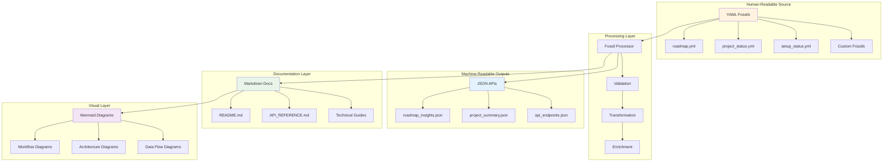
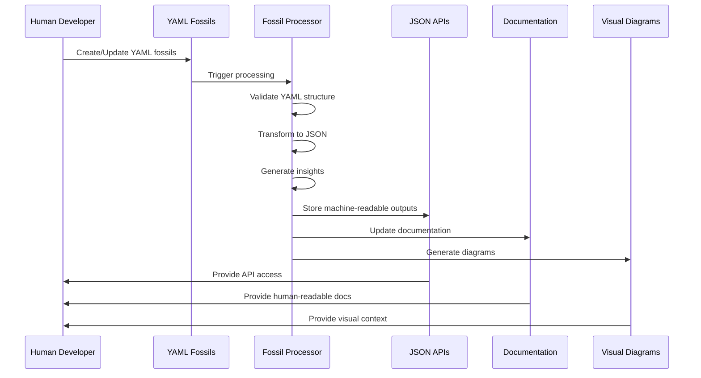
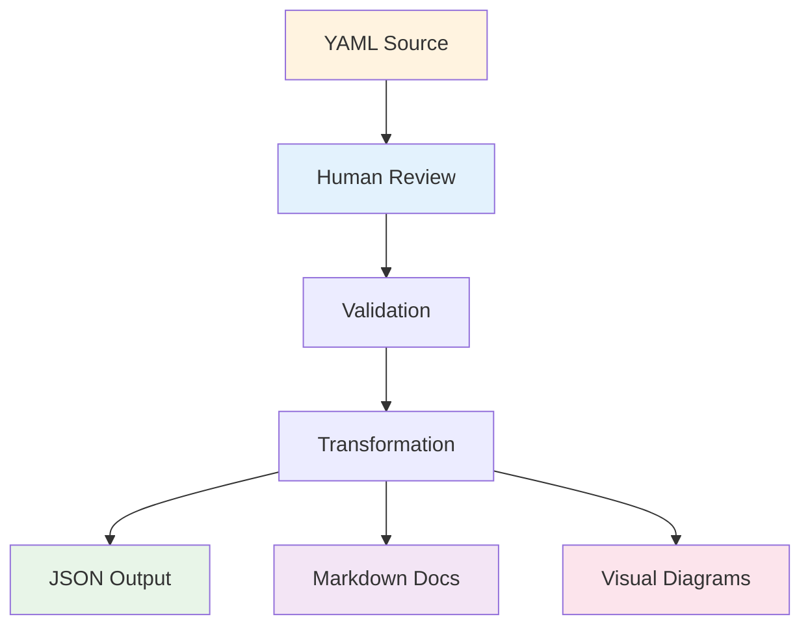
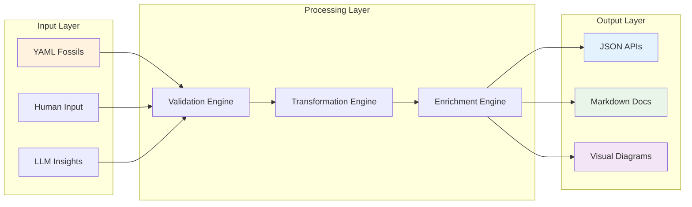
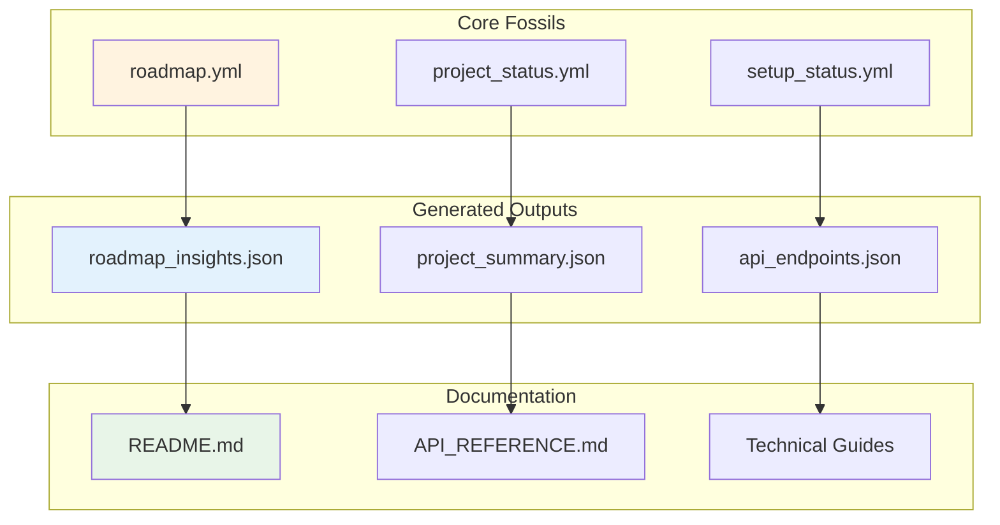
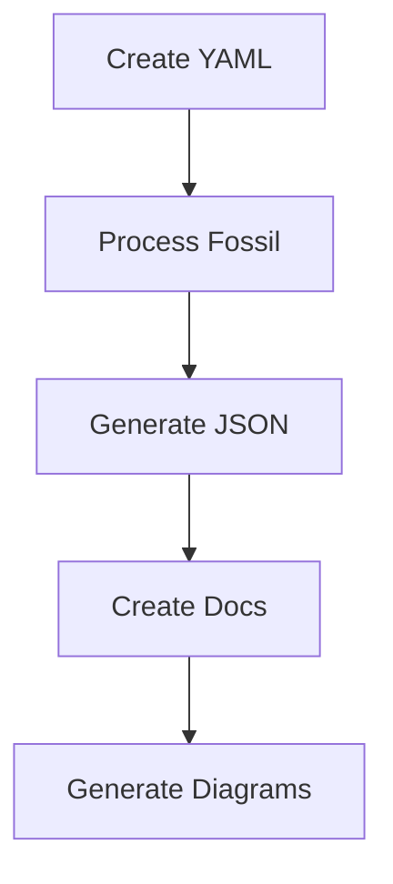
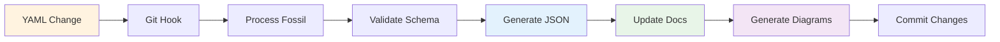

# 📊 Core Data Structures and Outputs Documentation

## 🎯 Overview

This document provides a comprehensive guide to the core data structures used throughout the automation ecosystem, illustrating how YAML serves as the human-comprehensible source of truth, while JSON provides machine-readable outputs for APIs and integrations.

## 🏗️ Data Flow Architecture



## 📋 Core YAML Data Structures

### 1. Roadmap Structure (Human-Readable)

```yaml
# fossils/roadmap.yml - Human-comprehensible project roadmap
type: e2e_automation_roadmap
source: e2e-pre-commit
createdBy: llm-human-collab
createdAt: {}

tasks:
  - task: "Project Setup, Onboarding, and Audit Readiness"
    status: done
    owner: emmanuelbarrera
    tags:
      - immediate-actions
      - onboarding
      - setup
    context: >
      All setup, onboarding, and audit readiness tasks are complete and validated. 
      See README.md and API_REFERENCE.md for up-to-date instructions.
    subtasks:
      - task: "Provide comprehensive setup script and onboarding documentation"
        status: done
        owner: emmanuelbarrera
        tags: [setup, onboarding]
        deadline: {}
    milestone: "Immediate Actions"
    issues: [201]
    milestones: ["Immediate Actions"]
    labels: [automation, onboarding]
```

### 2. Project Status Structure (Human-Readable)

```yaml
# fossils/project_status.yml - Human-comprehensible project status
type: project_status
version: "1.0.0"
lastUpdated: "2025-07-04T18:35:18-06:00"

overview:
  name: "Automate Workloads"
  description: "LLM-Powered Automation Ecosystem"
  status: "active"
  health: "excellent"

milestones:
  immediate_actions:
    status: "completed"
    completion_rate: 100
    tasks:
      - "Project Setup and Onboarding"
      - "Documentation Standards"
      - "Core Infrastructure"
  
  e2e_test_refactor:
    status: "in_progress"
    completion_rate: 75
    tasks:
      - "Update Integration Tests"
      - "GitHub CLI Integration"
      - "Test Automation"

automation_metrics:
  total_tasks: 277
  completed: 73
  in_progress: 11
  planned: 190
  success_rate: 95.2
```

### 3. Setup Status Structure (Human-Readable)

```yaml
# fossils/setup_status.yml - Human-comprehensible setup status
type: setup_status
version: "1.0.0"
lastUpdated: "2025-07-04T18:35:18-06:00"

environment:
  runtime: "bun"
  version: "1.0.0"
  node_version: "18.0.0"
  platform: "darwin"

dependencies:
  required:
    - name: "GitHub CLI"
      status: "installed"
      version: "2.40.0"
    - name: "Bun"
      status: "installed"
      version: "1.0.0"
  
  optional:
    - name: "Docker"
      status: "not_installed"
      required: false

configuration:
  environment_variables:
    OPENAI_API_KEY: "configured"
    GITHUB_TOKEN: "configured"
    GMAIL_TOKEN: "not_configured"
  
  fossil_storage:
    location: "fossils/"
    status: "initialized"
    size: "2.1MB"

validation:
  type_checking: "passing"
  linting: "passing"
  tests: "passing"
  pre_commit_hooks: "active"
```

## 🔄 JSON Output Structures (Machine-Readable)

### 1. Roadmap Insights JSON

```json
{
  "type": "roadmap-insights",
  "version": "1.0.0",
  "generatedAt": "2025-07-04T18:50:42-06:00",
  "roadmapSource": "fossils/roadmap.yml",
  "summary": {
    "total": 277,
    "completed": 73,
    "inProgress": 11,
    "planned": 190,
    "pending": 2,
    "highImpact": 0,
    "withBlockers": 14,
    "withDeadlines": 12
  },
  "insights": [
    {
      "taskId": "b229108c2534",
      "taskTitle": "Project Setup, Onboarding, and Audit Readiness",
      "taskPath": ["Project Setup, Onboarding, and Audit Readiness"],
      "status": "done",
      "milestone": "Immediate Actions",
      "owner": "emmanuelbarrera",
      "tags": ["immediate-actions", "onboarding", "setup"],
      "llmInsights": {
        "summary": "Task completed successfully with implementation category task achieved objectives and is now operational.",
        "impact": "Positive - task objectives achieved and deliverables completed.",
        "blockers": "None - task completed successfully.",
        "recommendations": "Document lessons learned and consider optimization opportunities."
      },
      "metadata": {
        "generatedAt": "2025-07-04T18:50:42-06:00",
        "model": "rule-based",
        "provider": "local",
        "fossilId": "rule-b229108c2534",
        "roadmapVersion": "1.0.0"
      }
    }
  ]
}
```

### 2. Project Summary JSON

```json
{
  "type": "project-summary",
  "version": "1.0.0",
  "generatedAt": "2025-07-04T18:50:42-06:00",
  "projectSource": "fossils/project_status.yml",
  "overview": {
    "name": "Automate Workloads",
    "description": "LLM-Powered Automation Ecosystem",
    "status": "active",
    "health": "excellent",
    "lastUpdated": "2025-07-04T18:35:18-06:00"
  },
  "metrics": {
    "totalTasks": 277,
    "completedTasks": 73,
    "inProgressTasks": 11,
    "plannedTasks": 190,
    "successRate": 95.2,
    "completionRate": 26.4
  },
  "milestones": {
    "immediate_actions": {
      "status": "completed",
      "completionRate": 100,
      "taskCount": 15
    },
    "e2e_test_refactor": {
      "status": "in_progress",
      "completionRate": 75,
      "taskCount": 8
    }
  },
  "automation": {
    "activeWorkflows": 12,
    "automatedTasks": 45,
    "manualTasks": 232,
    "automationRate": 16.2
  }
}
```

### 3. API Endpoints JSON

```json
{
  "type": "api-endpoints",
  "version": "1.0.0",
  "generatedAt": "2025-07-04T18:50:42-06:00",
  "baseUrl": "/api/v1",
  "endpoints": {
    "roadmap": {
      "path": "/roadmap",
      "method": "GET",
      "description": "Get complete roadmap data",
      "response": {
        "type": "roadmap-insights",
        "schema": "roadmap_insights.json"
      }
    },
    "project": {
      "path": "/project",
      "method": "GET",
      "description": "Get project status and metrics",
      "response": {
        "type": "project-summary",
        "schema": "project_summary.json"
      }
    },
    "setup": {
      "path": "/setup",
      "method": "GET",
      "description": "Get setup status and configuration",
      "response": {
        "type": "setup_status",
        "schema": "setup_status.json"
      }
    }
  }
}
```

## 📊 Data Transformation Workflow



## 🎨 Visual Documentation Standards

### 1. Workflow Diagrams



### 2. Data Flow Architecture



### 3. Relationship Mapping



## 🔧 Implementation Patterns

### 1. YAML to JSON Transformation

```typescript
// Core transformation pattern
interface FossilProcessor {
  source: string;           // YAML file path
  output: string;           // JSON file path
  schema: ZodSchema;        // Validation schema
  transformers: Transformer[]; // Transformation functions
}

// Example transformation
const roadmapProcessor: FossilProcessor = {
  source: 'fossils/roadmap.yml',
  output: 'fossils/roadmap_insights.json',
  schema: RoadmapSchema,
  transformers: [
    flattenTasks,
    addInsights,
    generateMetadata
  ]
};
```

### 2. Documentation Generation

```typescript
// Documentation generation pattern
interface DocGenerator {
  source: string;           // JSON file path
  template: string;         // Markdown template
  output: string;           // Output file path
  visualizations: boolean;  // Include Mermaid diagrams
}

// Example documentation generation
const apiDocGenerator: DocGenerator = {
  source: 'fossils/api_endpoints.json',
  template: 'templates/api_reference.md',
  output: 'docs/API_REFERENCE.md',
  visualizations: true
};
```

### 3. Visual Diagram Generation

```typescript
// Visual diagram generation pattern
interface DiagramGenerator {
  data: any;                // Source data
  type: 'workflow' | 'architecture' | 'flow';
  template: string;         // Mermaid template
  output: string;           // Output file path
}

// Example diagram generation
const workflowDiagram: DiagramGenerator = {
  data: roadmapData,
  type: 'workflow',
  template: 'templates/workflow.mermaid',
  output: 'docs/workflow_diagram.md'
};
```

## 📈 Usage Examples

### 1. Creating a New Fossil

```bash
# 1. Create human-readable YAML
cat > fossils/new_feature.yml << EOF
type: feature_fossil
name: "Visual Documentation System"
status: "in_progress"
owner: "emmanuelbarrera"
context: "Add comprehensive visual documentation using Mermaid diagrams"
tags: ["documentation", "visual", "mermaid"]
EOF

# 2. Process to generate JSON
bun run scripts/process-fossil.ts --source fossils/new_feature.yml

# 3. Generate documentation
bun run scripts/generate-docs.ts --source fossils/new_feature_insights.json

# 4. Generate visual diagrams
bun run scripts/generate-diagrams.ts --source fossils/new_feature_insights.json
```

### 2. API Integration

```typescript
// Example API consumption
const response = await fetch('/api/v1/roadmap');
const roadmapData = await response.json();

// Access structured data
console.log(`Total tasks: ${roadmapData.summary.total}`);
console.log(`Completed: ${roadmapData.summary.completed}`);

// Access individual insights
roadmapData.insights.forEach(insight => {
  console.log(`${insight.taskTitle}: ${insight.status}`);
});
```

### 3. Documentation Integration

```markdown
<!-- Example of generated documentation -->
# Visual Documentation System

## Overview
Feature fossil for adding comprehensive visual documentation using Mermaid diagrams.

## Status
- **Current**: In Progress
- **Owner**: emmanuelbarrera
- **Tags**: documentation, visual, mermaid

## Workflow


## API Access
```json
{
  "endpoint": "/api/v1/features/visual-documentation",
  "method": "GET",
  "response": "feature_insights.json"
}
```
```

## 🎯 Key Benefits

### 1. **Human Comprehension**
- **YAML Source**: Human-readable, structured data
- **Clear Context**: Descriptive fields and relationships
- **Easy Editing**: Simple text-based format
- **Version Control**: Git-friendly format

### 2. **Machine Readability**
- **JSON APIs**: Structured, validated outputs
- **Type Safety**: Zod schema validation
- **Consistent Format**: Standardized structure
- **API Integration**: RESTful endpoints

### 3. **Visual Communication**
- **Mermaid Diagrams**: Automated visual generation
- **Workflow Clarity**: Process visualization
- **Architecture Overview**: System relationships
- **Audit Trail**: Visual traceability

### 4. **Documentation Integration**
- **Markdown Output**: Human-readable documentation
- **API Reference**: Automated API documentation
- **Technical Guides**: Structured technical content
- **Visual Context**: Embedded diagrams

## 🔄 Automation Workflow



## 📚 Related Documentation

- **[Visual Documentation Standards](./VISUAL_DOCUMENTATION_STANDARDS.md)** - Comprehensive visual standards
- **[API Reference](./API_REFERENCE.md)** - Complete API documentation
- **[Fossil Publication Workflow](./FOSSIL_PUBLICATION_WORKFLOW.md)** - Publication system guide
- **[Development Guide](./DEVELOPMENT_GUIDE.md)** - Technical development guidelines

---

**Key Takeaway**: This documentation demonstrates how YAML serves as the human-comprehensible source of truth, while JSON provides machine-readable outputs for APIs and integrations. The visual documentation with Mermaid diagrams enhances understanding and provides clear context for both human developers and automated systems. 📊✨🗿 