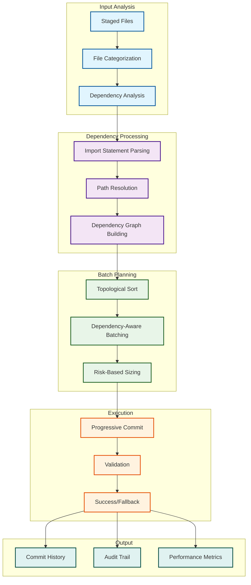

# Dependency-Aware Batch Orchestration

## 🎯 Overview

The **Dependency-Aware Batch Orchestrator** enhances the existing smart batch system with intelligent dependency analysis and topological sorting to ensure files are committed in the correct order.

## 🔄 Workflow Diagram



## 🚀 Key Features

### 1. **Intelligent Dependency Analysis**
- Parses import statements in TypeScript/JavaScript files
- Resolves relative and absolute import paths
- Handles path aliases (`@/utils`, `@/types`, etc.)
- Builds complete dependency graphs

### 2. **Topological Sorting**
- Ensures dependencies are committed before dependent files
- Detects circular dependencies
- Maintains optimal commit order

### 3. **Risk-Based Batch Sizing**
- **High Risk**: 5 files per batch (services, fossils)
- **Medium Risk**: 10 files per batch (utilities, tests)
- **Low Risk**: 10+ files per batch (documentation, types)

### 4. **Progressive Execution**
- Commits batches in dependency order
- Validates each batch before proceeding
- Fallback strategies for failed batches

## 📊 File Categories

| Category | Pattern | Risk Level | Priority | Description |
|----------|---------|------------|----------|-------------|
| `documentation` | `docs/`, `*.md`, `README` | Low | 1 | Documentation updates |
| `types` | `src/types/`, `*.d.ts` | Low | 2 | Type definitions |
| `tests` | `tests/`, `*.test.ts` | Medium | 3 | Test files |
| `utilities` | `src/utils/`, `scripts/` | Medium | 4 | Utility functions |
| `services` | `src/services/`, `src/cli/` | High | 5 | Core services |
| `fossils` | `fossils/`, `*.json`, `*.yml` | High | 6 | Fossil files |
| `cleanup` | `deleted:`, `temp/` | Low | 7 | Cleanup files |

## 🔧 Usage

### Basic Usage
```bash
# Run dependency-aware batch orchestration
bun run scripts/smart-batch-orchestrator.ts
```

### Enhanced CLI Commands
```bash
# Analyze dependencies only
bun run scripts/smart-batch-orchestrator.ts --analyze-deps

# Dry run with dependency analysis
bun run scripts/smart-batch-orchestrator.ts --dry-run
```

## 📈 Benefits

### 1. **Prevents Build Failures**
- Ensures type definitions are committed before dependent files
- Maintains import/export relationships
- Prevents circular dependency issues

### 2. **Optimizes Commit History**
- Logical grouping of related changes
- Clear dependency relationships
- Easier rollback and debugging

### 3. **Improves CI/CD Reliability**
- Reduces build failures in CI
- Better integration with automated testing
- Consistent deployment patterns

### 4. **Enhanced Developer Experience**
- Clear progress indicators
- Detailed dependency analysis
- Comprehensive audit trails

## 🔍 Example Output

```
🚀 Smart Batch Orchestrator
===========================

🔍 Analyzing staged files...
📊 Found 45 staged files

📂 File Categorization:
   documentation: 8 files
   types: 12 files
   utilities: 15 files
   services: 10 files

🔍 Analyzing dependencies for types (12 files)...
🔍 Analyzing dependencies for utilities (15 files)...
🔍 Analyzing dependencies for services (10 files)...
🔍 Analyzing dependencies for documentation (8 files)...

📦 Created 8 dependency-aware batches:
   batch-1: types (5 files, low risk)
   batch-2: types (7 files, low risk)
   batch-3: utilities (8 files, medium risk)
   batch-4: utilities (7 files, medium risk)
   batch-5: services (5 files, high risk)
   batch-6: services (5 files, high risk)
   batch-7: documentation (8 files, low risk)

✅ Executing batches...
   batch-1: ✅ Committed abc1234 (2.1s)
   batch-2: ✅ Committed def5678 (1.8s)
   batch-3: ✅ Committed ghi9012 (3.2s)
   batch-4: ✅ Committed jkl3456 (2.9s)
   batch-5: ✅ Committed mno7890 (4.1s)
   batch-6: ✅ Committed pqr1234 (3.8s)
   batch-7: ✅ Committed stu5678 (1.5s)

🔍 Running final validation...
✅ Final validation passed

📊 Batch Execution Report
========================
✅ Successful batches: 7
❌ Failed batches: 0
📈 Success rate: 100.0%

🎉 Smart batch orchestration completed successfully!
```

## 🛡️ Safety Features

### 1. **Circular Dependency Detection**
- Prevents infinite loops
- Clear error messages
- Automatic resolution strategies

### 2. **Validation at Each Step**
- TypeScript compilation checks
- Import/export validation
- Pre-commit hook execution

### 3. **Fallback Strategies**
- Automatic batch splitting
- Retry mechanisms
- Manual intervention options

### 4. **Comprehensive Logging**
- Detailed progress tracking
- Performance metrics
- Audit trail preservation

## 🔄 Integration

This system integrates seamlessly with existing project patterns:

- **Canonical Utilities**: Uses `@/utils/cli` for command execution
- **Type Safety**: Leverages existing Zod schemas and TypeScript types
- **Fossil Management**: Preserves audit trails and metadata
- **Validation**: Integrates with existing pre-commit hooks

## 📚 Related Documentation

- [Batch Commit Orchestration Guide](./BATCH_COMMIT_ORCHESTRATION_GUIDE.md)
- [Canonical Fossil Management Guide](./CANONICAL_FOSSIL_MANAGEMENT_GUIDE.md)
- [Type and Schema Patterns](./TYPE_AND_SCHEMA_PATTERNS.md)

---

*This dependency-aware system ensures reliable, efficient batch commits while maintaining project integrity and developer productivity.* 