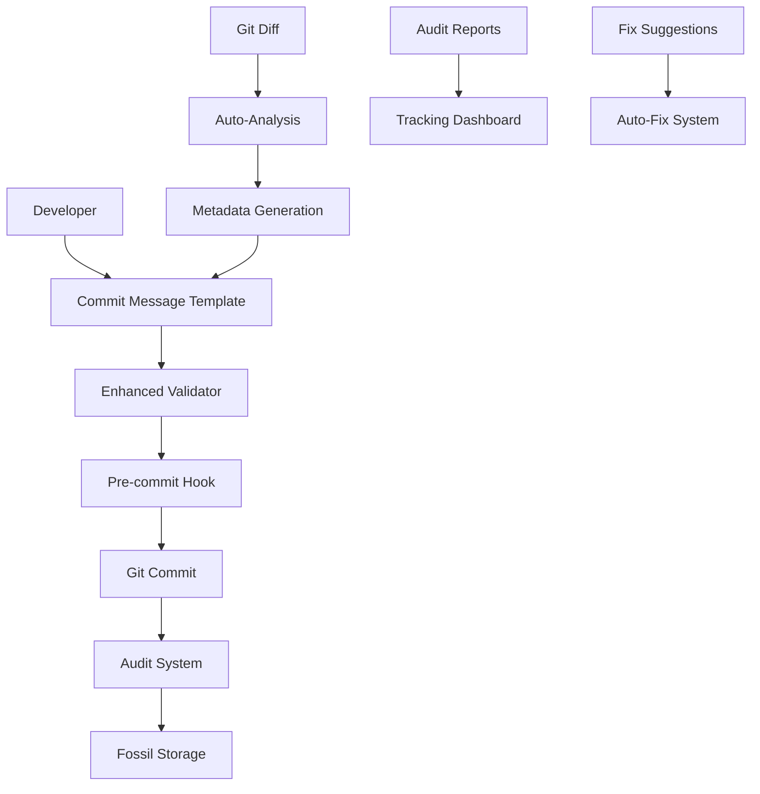
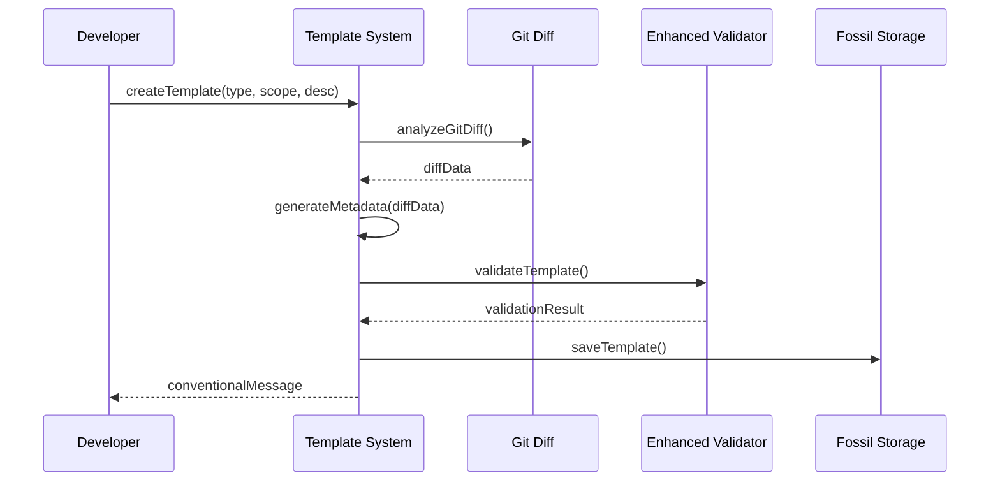
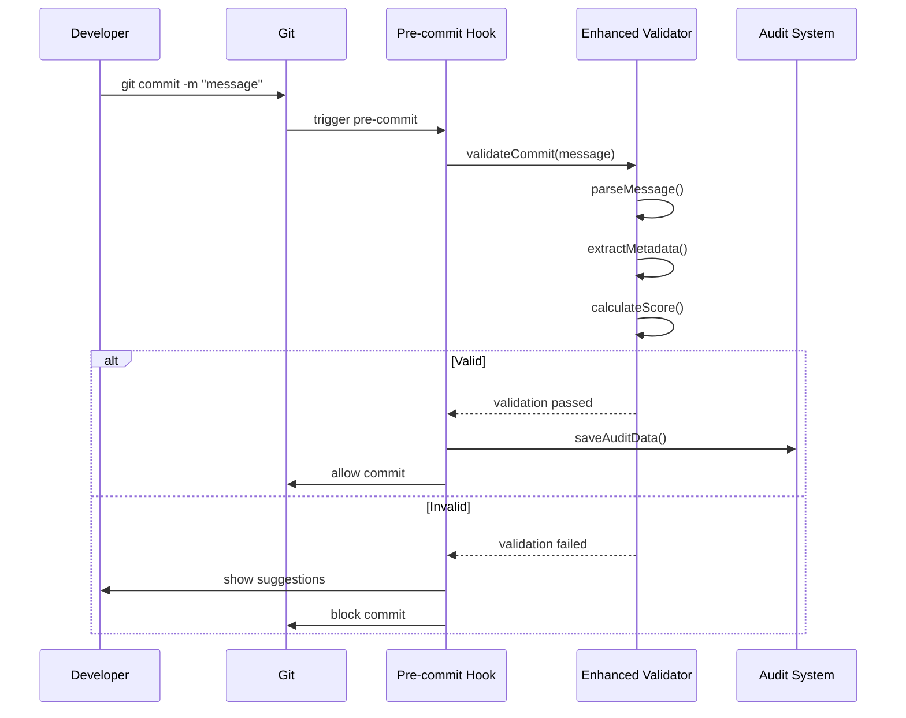

# 🚀 Enhanced Commit Message System

## 📋 Overview

The Enhanced Commit Message System enforces strict validation with LLM insights metadata and provides structured JSON/YAML templates for better programmatic mapping and audit processes. This system ensures all commits include proper traceability, roadmap impact tracking, and automation scope identification.

### 🎯 Key Features

- **Strict Validation**: Enforces conventional commit format + LLM insights metadata
- **JSON/YAML Templates**: Structured commit messages for programmatic processing
- **Audit Trail**: Complete tracking of commit message evolution
- **Auto-Fix Capabilities**: Programmatic fixing of commit messages
- **Git Diff Integration**: Automatic metadata generation from code changes
- **Pre-commit Enforcement**: Blocks commits without proper metadata

## 🏗️ Architecture



## 🔧 Implementation Components

### 1. Enhanced Pre-commit Validator (`scripts/enhanced-pre-commit-validator.ts`)

**Strict Validation Requirements:**
- ✅ Conventional commit format: `type(scope): description`
- ✅ LLM insights reference: `LLM-Insights: fossil:reference`
- ✅ Roadmap impact: `Roadmap-Impact: low|medium|high`
- ✅ Automation scope: `Automation-Scope: area1,area2`
- ✅ Proper scope identification
- ✅ Issue references (optional)

**Usage Examples:**
```bash
# Validate current commit
bun run scripts/enhanced-pre-commit-validator.ts --validate --pre-commit --strict

# Audit commit history
bun run scripts/enhanced-pre-commit-validator.ts --audit --since 2025-01-01 --output audit.json

# Fix commit messages
bun run scripts/enhanced-pre-commit-validator.ts --fix --commit HEAD --auto-fix

# Track evolution
bun run scripts/enhanced-pre-commit-validator.ts --track --output tracking.json
```

### 2. Commit Message Template System (`scripts/commit-message-template.ts`)

**JSON/YAML Template Structure:**
```json
{
  "metadata": {
    "version": "1.0.0",
    "templateId": "feat-cli-1234567890",
    "createdAt": "2025-01-07T10:30:00.000Z",
    "author": "emmanuelbarrera",
    "validator": "enhanced-pre-commit-validator"
  },
  "commit": {
    "type": "feat",
    "scope": "cli",
    "description": "add new feature with comprehensive validation",
    "body": "This commit adds a new feature that includes enhanced validation patterns.",
    "breakingChange": false,
    "issues": ["123", "456"]
  },
  "llmInsights": {
    "reference": "insight-feat-cli-1234567890",
    "summary": "Commit feat(cli): add new feature with comprehensive validation",
    "impact": "high",
    "category": "feature",
    "blockers": [],
    "recommendations": [
      "Add tests for the new feature",
      "Update documentation"
    ],
    "automationOpportunities": [
      "Automate CLI testing"
    ],
    "roadmapImpact": {
      "level": "high",
      "affectedTasks": [],
      "newTasks": [],
      "completedTasks": []
    },
    "automationScope": ["cli", "validation"]
  },
  "audit": {
    "timestamp": "2025-01-07T10:30:00.000Z",
    "score": 95,
    "valid": true,
    "metadataComplete": true,
    "suggestions": []
  }
}
```

**Usage Examples:**
```bash
# Create template
bun run scripts/commit-message-template.ts --create --type feat --scope cli --description "add new feature"

# Convert conventional message to template
bun run scripts/commit-message-template.ts --to-json "feat(cli): add new feature"

# Load template and generate conventional message
bun run scripts/commit-message-template.ts --from-json template.json

# Validate template
bun run scripts/commit-message-template.ts --validate template.json

# Generate from git diff
bun run scripts/commit-message-template.ts --create --type feat --scope cli --description "add feature" --auto-analyze
```

## 📊 Validation Scoring System

### Score Calculation (0-100 points)

- **Conventional Format**: 30 points
- **Length (10-72 chars)**: 20 points
- **Scope Presence**: 15 points
- **Issue References**: 10 points
- **LLM Insights Reference**: 15 points
- **Roadmap Impact**: 5 points
- **Automation Scope**: 5 points

### Validation Levels

#### **Strict Mode** (Default)
- ✅ Requires conventional commit format
- ✅ Requires LLM insights reference
- ✅ Requires roadmap impact
- ✅ Requires automation scope
- ✅ Requires proper scope
- **Blocks commit** if any requirement is missing

#### **Standard Mode**
- ✅ Requires conventional commit format
- ⚠️ Suggests but doesn't require metadata
- **Warns** but allows commit to proceed

## 🔄 Workflow

### 1. Template Creation Workflow


### 2. Pre-commit Validation Workflow


## 📈 Usage Patterns

### 1. Development Workflow

#### **Option A: Template-First Approach**
```bash
# 1. Create template from git diff
bun run scripts/commit-message-template.ts --create \
  --type feat \
  --scope cli \
  --description "add new feature" \
  --auto-analyze \
  --output template.json

# 2. Review and edit template
cat template.json

# 3. Generate conventional message
bun run scripts/commit-message-template.ts --from-json template.json

# 4. Commit with generated message
git commit -m "$(bun run scripts/commit-message-template.ts --from-json template.json)"
```

#### **Option B: Direct Template Creation**
```bash
# Create template with specific metadata
bun run scripts/commit-message-template.ts --create \
  --type feat \
  --scope cli \
  --description "add new feature" \
  --llm-insights-ref "insight-feature-123" \
  --roadmap-impact "high" \
  --automation-scope "cli,validation" \
  --output feature-template.json
```

### 2. Audit and Tracking

#### **Commit History Audit**
```bash
# Audit last 30 days
bun run scripts/enhanced-pre-commit-validator.ts --audit \
  --since 2025-01-01 \
  --output audit-report.json

# Generate summary
cat audit-report.json | jq '.validation'
```

#### **Evolution Tracking**
```bash
# Track commit message evolution
bun run scripts/enhanced-pre-commit-validator.ts --track \
  --since 2025-01-01 \
  --output tracking-data.json

# View trends
cat tracking-data.json | jq '.evolution'
```

### 3. Fix and Improve

#### **Auto-Fix Commit Messages**
```bash
# Fix specific commit
bun run scripts/enhanced-pre-commit-validator.ts --fix \
  --commit HEAD \
  --auto-fix

# Fix range of commits
bun run scripts/enhanced-pre-commit-validator.ts --fix \
  --commit HEAD~5..HEAD \
  --auto-fix
```

#### **Batch Template Generation**
```bash
# Generate templates for multiple commits
for commit in $(git log --pretty=format:"%H" -n 10); do
  bun run scripts/commit-message-template.ts --to-json \
    "$(git log -1 --pretty=format:"%B" $commit)" \
    --output "template-$commit.json"
done
```

## 🦴 Fossil Integration

### Fossil Storage Structure
```
fossils/
├── commit_audits/
│   ├── commit-audit-{hash}-{timestamp}.json
│   └── ...
├── commit_templates/
│   ├── feat-cli-{timestamp}.json
│   ├── fix-utils-{timestamp}.json
│   └── ...
└── audit_reports/
    ├── audit-report-{date}.json
    ├── tracking-data-{date}.json
    └── ...
```

### Fossil Types
1. **Commit Audit Fossils**: Individual commit validation results
2. **Template Fossils**: Structured commit message templates
3. **Audit Report Fossils**: Historical analysis and trends
4. **Fix Fossils**: Applied and suggested fixes

## 🔍 Advanced Features

### 1. Git Diff Analysis

The system automatically analyzes git diffs to:
- **Determine Impact Level**: Based on number of changes
- **Identify Automation Scope**: Based on file paths
- **Generate LLM Insights**: Based on change patterns
- **Suggest Recommendations**: Based on commit type and scope

### 2. Programmatic Mapping

JSON/YAML templates enable:
- **Automated Analysis**: Parse commit patterns programmatically
- **Trend Analysis**: Track commit quality over time
- **Team Metrics**: Analyze team commit patterns
- **Integration**: Connect with external tools and dashboards

### 3. Auto-Fix System

The system can automatically:
- **Add Missing Metadata**: Generate LLM insights references
- **Fix Format Issues**: Correct conventional commit format
- **Add Scopes**: Determine appropriate scopes from file changes
- **Update References**: Link commits to issues and tasks

## 🚀 Integration Examples

### 1. CI/CD Integration

```yaml
# GitHub Actions example
- name: Validate Commit Messages
  run: |
    bun run scripts/enhanced-pre-commit-validator.ts --validate --pre-commit --strict
    
- name: Generate Audit Report
  run: |
    bun run scripts/enhanced-pre-commit-validator.ts --audit --since ${{ github.event.head_commit.timestamp }} --output audit.json
    
- name: Upload Audit Report
  uses: actions/upload-artifact@v2
  with:
    name: commit-audit
    path: audit.json
```

### 2. IDE Integration

```json
// VS Code settings.json
{
  "git.commitTemplate": "fossils/commit_templates/default.json",
  "git.preCommitHook": "bun run scripts/enhanced-pre-commit-validator.ts --validate --pre-commit --strict"
}
```

### 3. Team Dashboard Integration

```bash
# Generate team metrics
bun run scripts/enhanced-pre-commit-validator.ts --track \
  --since 2025-01-01 \
  --output team-metrics.json

# Upload to dashboard
curl -X POST https://dashboard.example.com/api/metrics \
  -H "Content-Type: application/json" \
  -d @team-metrics.json
```

## 📊 Metrics and Analytics

### Key Metrics Tracked
- **Commit Quality Score**: Average validation score
- **Metadata Completeness**: Percentage of commits with full metadata
- **Format Compliance**: Percentage of conventional commits
- **Automation Opportunities**: Identified automation potential
- **Roadmap Impact Distribution**: Low/medium/high impact breakdown

### Sample Analytics Output
```json
{
  "period": {
    "start": "2025-01-01",
    "end": "2025-01-07",
    "totalCommits": 45
  },
  "validation": {
    "valid": 42,
    "invalid": 3,
    "metadataComplete": 38,
    "averageScore": 87.3
  },
  "issues": {
    "missingLLMInsights": 7,
    "missingRoadmapImpact": 5,
    "missingAutomationScope": 3,
    "invalidFormat": 2,
    "missingScope": 1
  },
  "recommendations": [
    "Add LLM insights to 7 commits for better traceability",
    "Add scope to 1 commit for better categorization",
    "Improve 3 commits with scores below 70"
  ]
}
```

## 🎯 Best Practices

### 1. Template Usage
- **Use templates for all feature commits**
- **Customize templates for different commit types**
- **Include comprehensive metadata**
- **Review templates before committing**

### 2. Validation
- **Always use strict mode in production**
- **Fix validation issues immediately**
- **Use auto-fix for historical commits**
- **Regular audit and review**

### 3. Metadata Quality
- **Provide meaningful LLM insights references**
- **Accurately assess roadmap impact**
- **Include relevant automation scopes**
- **Link to related issues and tasks**

### 4. Team Adoption
- **Start with standard mode, move to strict**
- **Provide training on template usage**
- **Regular team reviews of commit quality**
- **Celebrate improvements in metrics**

## 🔧 Troubleshooting

### Common Issues

**1. "Missing LLM insights reference"**
```bash
# Generate LLM insights reference
bun run scripts/commit-message-template.ts --create \
  --type feat --scope cli --description "add feature" \
  --llm-insights-ref "insight-feature-$(date +%s)"
```

**2. "Invalid conventional commit format"**
```bash
# Use template to generate proper format
bun run scripts/commit-message-template.ts --create \
  --type feat --scope cli --description "add feature"
```

**3. "Missing automation scope"**
```bash
# Auto-analyze git diff for scope
bun run scripts/commit-message-template.ts --create \
  --type feat --scope cli --description "add feature" \
  --auto-analyze
```

### Debug Mode

```bash
# Enable verbose validation
DEBUG=1 bun run scripts/enhanced-pre-commit-validator.ts --validate --pre-commit --strict

# Save detailed validation report
bun run scripts/enhanced-pre-commit-validator.ts --validate --pre-commit --strict --output debug.json
```

## 📚 Related Documentation

- [LLM Insights Workflow](./LLM_INSIGHTS_WORKFLOW.md)
- [Git History LLM Insights Approach](./GIT_HISTORY_LLM_INSIGHTS_APPROACH.md)
- [Development Guide](./DEVELOPMENT_GUIDE.md)
- [Contributing Guide](../CONTRIBUTING_GUIDE.md)

---

This enhanced commit message system provides comprehensive validation, structured templates, and programmatic audit capabilities to ensure high-quality, traceable commits throughout the development lifecycle. 