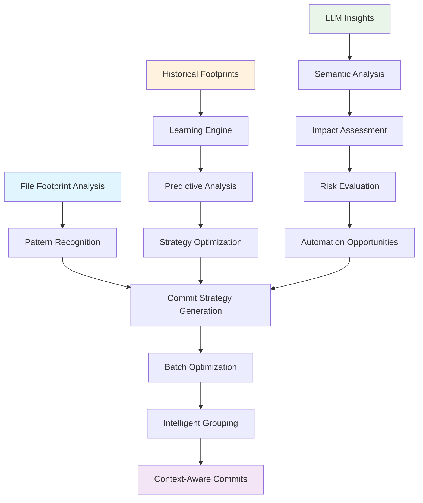

# Footprint-Batch Integration Approach

## Overview

The **Footprint-Batch Integration Approach** leverages the comprehensive file footprint system to enhance batch commit operations with intelligent insights, predictive analysis, and automated optimization. This approach transforms batch commits from simple file grouping into intelligent, context-aware automation that learns from development patterns and optimizes commit strategies.

## Core Architecture

### 1. **Intelligent Batch Orchestration**



### 2. **Footprint-Driven Batch Strategy**

#### **Current State Analysis**
```typescript
interface FootprintBatchAnalysis {
  currentFootprint: FileFootprint;
  historicalFootprints: FileFootprint[];
  changePatterns: ChangePattern[];
  commitStrategies: CommitStrategy[];
  optimizationOpportunities: OptimizationOpportunity[];
  riskAssessment: RiskAssessment;
}
```

#### **Intelligent Grouping Algorithm**
```typescript
interface IntelligentBatchGrouping {
  // Analyze file relationships
  fileRelationships: FileRelationship[];
  
  // Identify logical commit boundaries
  commitBoundaries: CommitBoundary[];
  
  // Generate optimal batch sizes
  optimalBatchSizes: BatchSize[];
  
  // Predict commit impact
  impactPrediction: ImpactPrediction;
  
  // Suggest commit messages
  suggestedMessages: CommitMessage[];
}
```

## Implementation Patterns

### 1. **Footprint-Enhanced Batch Orchestrator**

#### **Enhanced Batch Commit Script**
```typescript
// scripts/enhanced-batch-commit-orchestrator.ts
interface EnhancedBatchCommitParams {
  footprintAnalysis: boolean;
  llmInsights: boolean;
  predictiveGrouping: boolean;
  riskAssessment: boolean;
  optimizationMode: 'conservative' | 'balanced' | 'aggressive';
}

class EnhancedBatchCommitOrchestrator {
  async orchestrateBatchCommit(params: EnhancedBatchCommitParams) {
    // 1. Generate comprehensive footprint
    const footprint = await this.generateFootprint();
    
    // 2. Analyze historical patterns
    const patterns = await this.analyzeHistoricalPatterns();
    
    // 3. Generate LLM insights
    const insights = await this.generateLLMInsights(footprint);
    
    // 4. Create intelligent batch strategy
    const strategy = await this.createBatchStrategy({
      footprint,
      patterns,
      insights,
      optimizationMode: params.optimizationMode
    });
    
    // 5. Execute optimized batch commits
    const results = await this.executeBatchCommits(strategy);
    
    // 6. Fossilize results for future learning
    await this.fossilizeBatchResults(results);
    
    return results;
  }
}
```

#### **Footprint Analysis Integration**
```typescript
class FootprintBatchAnalyzer {
  async analyzeForBatchCommit(footprint: FileFootprint): Promise<BatchAnalysis> {
    return {
      // File categorization by change type
      fileCategories: this.categorizeFiles(footprint.files),
      
      // Dependency analysis
      dependencies: this.analyzeDependencies(footprint.files),
      
      // Risk assessment
      risks: this.assessRisks(footprint),
      
      // Optimization opportunities
      opportunities: this.identifyOpportunities(footprint),
      
      // Suggested batch strategy
      strategy: await this.generateStrategy(footprint)
    };
  }
  
  private categorizeFiles(files: FileInfo[]): FileCategory[] {
    return files.map(file => ({
      path: file.path,
      category: this.determineCategory(file),
      priority: this.calculatePriority(file),
      risk: this.assessFileRisk(file),
      dependencies: this.findDependencies(file)
    }));
  }
  
  private async generateStrategy(footprint: FileFootprint): Promise<BatchStrategy> {
    const categories = this.categorizeFiles(footprint.files);
    const dependencies = this.analyzeDependencies(footprint.files);
    
    return {
      batches: this.createOptimalBatches(categories, dependencies),
      commitMessages: this.generateCommitMessages(categories),
      riskMitigation: this.createRiskMitigationPlan(footprint),
      validationSteps: this.determineValidationSteps(footprint)
    };
  }
}
```

### 2. **LLM-Enhanced Batch Intelligence**

#### **Commit Strategy Generation**
```typescript
class LLMBatchIntelligence {
  async generateBatchStrategy(params: {
    footprint: FileFootprint;
    historicalPatterns: ChangePattern[];
    llmService: LLMService;
  }): Promise<IntelligentBatchStrategy> {
    
    const prompt = this.createStrategyPrompt(params);
    const response = await params.llmService.callLLM({
      model: 'gpt-4',
      messages: [
        {
          role: 'system',
          content: 'You are an expert in software development and commit strategies. Analyze the file footprint and suggest optimal batch commit strategies.'
        },
        {
          role: 'user',
          content: prompt
        }
      ]
    });
    
    return this.parseStrategyResponse(response);
  }
  
  private createStrategyPrompt(params: any): string {
    return `
    Analyze this file footprint and suggest optimal batch commit strategies:
    
    Files to commit: ${JSON.stringify(params.footprint.files, null, 2)}
    Historical patterns: ${JSON.stringify(params.historicalPatterns, null, 2)}
    
    Consider:
    1. Logical grouping based on functionality
    2. Dependency relationships
    3. Risk assessment
    4. Optimal batch sizes
    5. Commit message suggestions
    
    Provide a structured response with:
    - Batch groupings
    - Commit messages
    - Risk assessments
    - Validation recommendations
    `;
  }
}
```

### 3. **Predictive Batch Optimization**

#### **Historical Pattern Learning**
```typescript
class PredictiveBatchOptimizer {
  async learnFromHistory(footprints: FileFootprint[]): Promise<BatchOptimizationModel> {
    const patterns = this.extractPatterns(footprints);
    const correlations = this.analyzeCorrelations(patterns);
    const predictions = this.generatePredictions(correlations);
    
    return {
      patterns,
      correlations,
      predictions,
      confidence: this.calculateConfidence(predictions)
    };
  }
  
  async optimizeBatchStrategy(
    currentFootprint: FileFootprint,
    model: BatchOptimizationModel
  ): Promise<OptimizedBatchStrategy> {
    
    const predictions = await this.predictOptimalStrategy(currentFootprint, model);
    const optimization = this.applyOptimization(predictions);
    
    return {
      batches: optimization.batches,
      commitOrder: optimization.commitOrder,
      riskMitigation: optimization.riskMitigation,
      expectedOutcome: optimization.expectedOutcome
    };
  }
}
```

## Integration Workflows

### 1. **Enhanced Pre-Commit Integration**

#### **Footprint-Aware Pre-Commit**
```typescript
// scripts/precommit-footprint-enhanced.ts
async function precommitFootprintEnhanced() {
  // 1. Generate current footprint
  const footprint = await generateFootprint();
  
  // 2. Analyze for batch opportunities
  const batchAnalysis = await analyzeForBatchCommit(footprint);
  
  // 3. Generate LLM insights
  const insights = await generateLLMInsights(footprint);
  
  // 4. Create batch strategy
  const strategy = await createBatchStrategy({
    footprint,
    analysis: batchAnalysis,
    insights
  });
  
  // 5. Validate strategy
  const validation = await validateBatchStrategy(strategy);
  
  // 6. Suggest optimizations
  const suggestions = await suggestOptimizations(strategy, validation);
  
  // 7. Fossilize analysis
  await fossilizeBatchAnalysis({
    footprint,
    analysis: batchAnalysis,
    insights,
    strategy,
    validation,
    suggestions
  });
  
  return {
    strategy,
    validation,
    suggestions
  };
}
```

### 2. **Intelligent Batch Commit CLI**

#### **Enhanced CLI Commands**
```bash
# Analyze current state for batch optimization
bun run batch:analyze --footprint --insights --optimize

# Execute intelligent batch commit
bun run batch:commit --intelligent --footprint --llm-insights

# Generate batch strategy without committing
bun run batch:strategy --footprint --output strategy.json

# Validate batch strategy
bun run batch:validate --strategy strategy.json

# Learn from historical patterns
bun run batch:learn --historical --optimize-model
```

#### **CLI Implementation**
```typescript
// src/cli/enhanced-batch-commit.ts
export async function enhancedBatchCommit(params: {
  analyze: boolean;
  commit: boolean;
  strategy: boolean;
  validate: boolean;
  learn: boolean;
  footprint: boolean;
  llmInsights: boolean;
  optimizationMode: 'conservative' | 'balanced' | 'aggressive';
}) {
  
  if (params.analyze) {
    const analysis = await analyzeCurrentState(params);
    console.log('📊 Batch Analysis:', analysis);
  }
  
  if (params.strategy) {
    const strategy = await generateBatchStrategy(params);
    console.log('🎯 Batch Strategy:', strategy);
  }
  
  if (params.validate) {
    const validation = await validateBatchStrategy(params);
    console.log('✅ Validation Results:', validation);
  }
  
  if (params.commit) {
    const results = await executeIntelligentBatchCommit(params);
    console.log('🚀 Batch Commit Results:', results);
  }
  
  if (params.learn) {
    const learning = await learnFromHistory(params);
    console.log('🧠 Learning Results:', learning);
  }
}
```

### 3. **Fossil-Backed Batch Intelligence**

#### **Batch Intelligence Fossils**
```typescript
interface BatchIntelligenceFossil {
  type: 'batch-intelligence';
  timestamp: string;
  footprint: FileFootprint;
  analysis: BatchAnalysis;
  strategy: BatchStrategy;
  insights: LLMInsights;
  results: BatchResults;
  learning: BatchLearning;
  metadata: {
    model: string;
    confidence: number;
    optimizationMode: string;
    performance: PerformanceMetrics;
  };
}
```

#### **Fossil Generation**
```typescript
class BatchIntelligenceFossilizer {
  async fossilizeBatchIntelligence(params: {
    footprint: FileFootprint;
    analysis: BatchAnalysis;
    strategy: BatchStrategy;
    insights: LLMInsights;
    results: BatchResults;
  }): Promise<BatchIntelligenceFossil> {
    
    const fossil: BatchIntelligenceFossil = {
      type: 'batch-intelligence',
      timestamp: new Date().toISOString(),
      footprint: params.footprint,
      analysis: params.analysis,
      strategy: params.strategy,
      insights: params.insights,
      results: params.results,
      learning: await this.extractLearning(params),
      metadata: {
        model: 'enhanced-batch-intelligence-v1',
        confidence: this.calculateConfidence(params),
        optimizationMode: params.strategy.optimizationMode,
        performance: await this.calculatePerformance(params)
      }
    };
    
    await this.saveFossil(fossil);
    return fossil;
  }
}
```

## Advanced Features

### 1. **Predictive Risk Assessment**

#### **Risk Analysis Engine**
```typescript
class BatchRiskAnalyzer {
  async assessBatchRisks(strategy: BatchStrategy): Promise<RiskAssessment> {
    return {
      // File-level risks
      fileRisks: await this.assessFileRisks(strategy.files),
      
      // Dependency risks
      dependencyRisks: await this.assessDependencyRisks(strategy.dependencies),
      
      // Commit order risks
      orderRisks: await this.assessOrderRisks(strategy.commitOrder),
      
      // Integration risks
      integrationRisks: await this.assessIntegrationRisks(strategy),
      
      // Overall risk score
      overallRisk: this.calculateOverallRisk(strategy),
      
      // Mitigation strategies
      mitigations: await this.suggestMitigations(strategy)
    };
  }
}
```

### 2. **Intelligent Commit Message Generation**

#### **Context-Aware Message Generation**
```typescript
class IntelligentCommitMessageGenerator {
  async generateCommitMessage(params: {
    files: FileInfo[];
    changes: ChangeAnalysis;
    insights: LLMInsights;
    context: CommitContext;
  }): Promise<CommitMessage> {
    
    const prompt = this.createMessagePrompt(params);
    const response = await this.llmService.callLLM({
      model: 'gpt-4',
      messages: [
        {
          role: 'system',
          content: 'You are an expert in conventional commit messages. Generate clear, descriptive commit messages based on the file changes and context.'
        },
        {
          role: 'user',
          content: prompt
        }
      ]
    });
    
    return this.parseCommitMessage(response);
  }
}
```

### 3. **Performance Optimization**

#### **Batch Performance Monitoring**
```typescript
class BatchPerformanceMonitor {
  async monitorBatchPerformance(batchId: string): Promise<PerformanceMetrics> {
    const startTime = Date.now();
    
    // Monitor execution
    const execution = await this.monitorExecution(batchId);
    
    // Monitor resource usage
    const resources = await this.monitorResources(batchId);
    
    // Monitor outcomes
    const outcomes = await this.monitorOutcomes(batchId);
    
    const endTime = Date.now();
    
    return {
      batchId,
      executionTime: endTime - startTime,
      execution,
      resources,
      outcomes,
      efficiency: this.calculateEfficiency(execution, resources, outcomes)
    };
  }
}
```

## Usage Examples

### 1. **Basic Intelligent Batch Commit**

```bash
# Analyze and commit with footprint intelligence
bun run batch:commit --intelligent --footprint

# Output:
# 📊 Analyzing current state...
# 🎯 Generated batch strategy:
#   Batch 1: Core infrastructure (3 files)
#   Batch 2: CLI commands (5 files)
#   Batch 3: Documentation (8 files)
# ✅ Strategy validated
# 🚀 Executing intelligent batch commits...
# ✅ All batches committed successfully
```

### 2. **Advanced Optimization**

```bash
# Generate optimized strategy with LLM insights
bun run batch:strategy --footprint --llm-insights --optimize aggressive

# Output:
# 🧠 Analyzing with LLM insights...
# 🎯 Optimized strategy generated:
#   - Reduced from 5 to 3 batches
#   - Improved commit message quality
#   - Identified 2 automation opportunities
#   - Risk assessment: Low (0.2/1.0)
# 📄 Strategy saved to: batch-strategy-2024-01-15.json
```

### 3. **Learning and Improvement**

```bash
# Learn from historical patterns
bun run batch:learn --historical --update-model

# Output:
# 📚 Analyzing 50 historical footprints...
# 🧠 Learning patterns:
#   - Optimal batch size: 4-6 files
#   - Best commit order: core → features → docs
#   - Common risk factors identified
# ✅ Model updated with new insights
```

## Benefits

### 1. **Intelligent Automation**
- **Context-aware batching** based on file relationships
- **Predictive optimization** using historical patterns
- **Risk-aware execution** with automatic mitigation
- **Learning capabilities** that improve over time

### 2. **Enhanced Developer Experience**
- **Reduced cognitive load** with intelligent suggestions
- **Faster commit cycles** through optimization
- **Better commit messages** with LLM assistance
- **Comprehensive traceability** through fossilization

### 3. **Improved Code Quality**
- **Logical commit grouping** that maintains code coherence
- **Dependency-aware ordering** that prevents conflicts
- **Risk mitigation** that prevents problematic commits
- **Validation integration** that ensures quality

### 4. **Operational Excellence**
- **Performance monitoring** for continuous improvement
- **Historical analysis** for pattern recognition
- **Automation opportunities** identification
- **Comprehensive audit trail** through fossilization

## Future Enhancements

### 1. **AI-Powered Optimization**
- **Machine learning models** for batch optimization
- **Predictive analytics** for commit success rates
- **Automated strategy refinement** based on outcomes
- **Intelligent rollback strategies**

### 2. **Advanced Integration**
- **IDE integration** for real-time suggestions
- **CI/CD pipeline optimization** based on batch patterns
- **Team collaboration features** for shared strategies
- **Cross-repository analysis** for multi-project optimization

### 3. **Enhanced Intelligence**
- **Semantic code analysis** for better grouping
- **Business context integration** for strategic commits
- **Team velocity optimization** based on individual patterns
- **Predictive maintenance** through pattern recognition

## Conclusion

The **Footprint-Batch Integration Approach** transforms batch commit operations from simple file grouping into intelligent, context-aware automation that learns and optimizes over time. By leveraging comprehensive file footprints, LLM insights, and historical pattern analysis, this approach provides developers with powerful tools for efficient, safe, and intelligent batch commit management.

The key to success is the seamless integration of footprint analysis, LLM intelligence, and predictive optimization, creating a system that not only automates batch commits but continuously improves the process through learning and adaptation. 