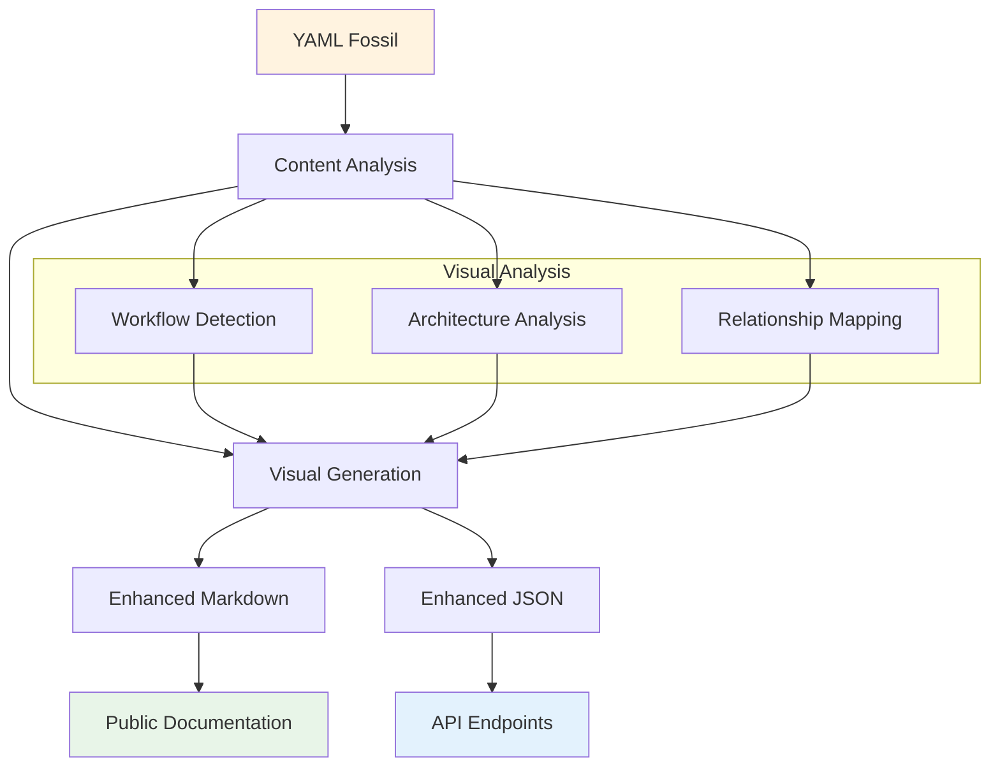

# 🦴 Fossil Publication Workflow

## Overview

This document describes the canonical workflow for publishing curated project state and automation artifacts from YAML fossils to public-facing markdown and JSON, supporting future integrations with blogs, docs, APIs, and automation systems.

---

## 1. Workflow: YAML → JSON → Markdown

- **YAML**: The canonical, curated, CI-stamped source of truth (e.g., `fossils/project_status.yml`).
- **JSON**: Machine-readable, API/automation-friendly export (e.g., `fossils/public/api/project_status_public.json`).
- **Markdown**: Human/public/blog/docs-ready, metadata-rich markdown with visual elements (e.g., `fossils/public/blog/project_status.post.md`).

### Why This Pattern?
- **YAML** is best for curation, versioning, and CI validation.
- **JSON** enables programmatic access, public APIs, and metadata-driven automation.
- **Markdown** is ideal for human consumption, blogs, docs, and can be enriched with frontmatter and Mermaid diagrams for future React/MDX/Next.js/Remix/TanStack integrations.

### Visual Enhancement
- **Mermaid Diagrams**: Automatically generated workflow, architecture, and relationship diagrams
- **Status Indicators**: Visual progress tracking and health indicators
- **Audience-Specific Visuals**: Tailored diagrams for technical, management, and stakeholder audiences

---

## 2. Folder Structure

```
fossils/
  project_status.yml         # Canonical YAML fossil (source of truth)
  roadmap.yml
  setup_status.yml
  llm_insights/
    ...
  public/
    blog/
      project_status.post.md     # Public/blog-ready markdown (auto-generated)
      ...
    api/
      project_status_public.json # Public API/automation JSON (auto-generated)
      ...
  prompts/
    ... # Future: curated prompt/system message fossils
```

- **All files in `fossils/` are curated and CI/pre-commit stamped.**
- **`fossils/public/blog/`**: Public/blog/docs-ready markdown, with frontmatter metadata.
- **`fossils/public/api/`**: Public API/automation JSON, for dashboards, endpoints, or external consumers.
- **`fossils/prompts/`**: (Future) Curated prompt/system message fossils for LLM/automation workflows.

---

## 3. Future-Proofing: GitHub Actions, API, Prompts

- **GitHub Actions/CI**: Automate the fossil-to-markdown/json process on commit/PR/merge. Validate outputs, publish to docs/blog/API, and optionally update GitHub issues with the latest markdown.
- **Public API**: Serve JSON outputs as public endpoints for dashboards, integrations, or external tools.
- **Prompt/System Message Fossilization**: Store curated prompts in `fossils/prompts/` for LLM context, automation, and reproducibility.
- **Metadata-rich Markdown/JSON**: All outputs include frontmatter/metadata for future React/MDX/Next.js/Remix/TanStack integrations (e.g., audience, timestamp, source, usage).

---

## 4. Format Distinctions

- **YAML**: Curated, CI-stamped, versioned, human-editable, source of truth.
- **JSON**: API/automation, machine-readable, metadata-rich, for programmatic use.
- **Markdown**: Human/public/blog/docs, frontmatter metadata, ready for publication and future web integrations.

---

## 5. Example: Fossil Publication Workflow

1. **Update YAML fossil** (e.g., `fossils/project_status.yml`) via automation or manual curation.
2. **Run publication script** (TypeScript, using luxon/date-fns for timestamps):
   - Reads YAML
   - Analyzes content for visual opportunities
   - Generates `fossils/public/blog/project_status.post.md` (with frontmatter and Mermaid diagrams)
   - Generates `fossils/public/api/project_status_public.json` (with metadata and visual references)
3. **Outputs are CI-stamped, ready for publication, API, or further automation.**
4. **(Future)**: GitHub Actions/CI automates this process, validates outputs, and publishes to docs/blog/API.
5. **(Future)**: Prompts/system messages are fossilized in `fossils/prompts/` and published as needed.

### Visual Publication Example



---

## 6. Roadmap & Next Steps

- **Automate the fossil-to-markdown/json workflow** (see roadmap Immediate Actions)
- **Document and enforce the folder structure and workflow in onboarding and contributing docs**
- **Integrate with CI/GitHub Actions for validation and publication**
- **Extend to prompt/system message fossilization and public API endpoints**
- **Leverage metadata-rich markdown/JSON for future React/MDX/Next.js/Remix/TanStack integrations**
- **Implement visual documentation standards** (see [Visual Documentation Standards](./VISUAL_DOCUMENTATION_STANDARDS.md))

---

For more details, see the Immediate Actions in `fossils/roadmap.yml` and related onboarding documentation. 