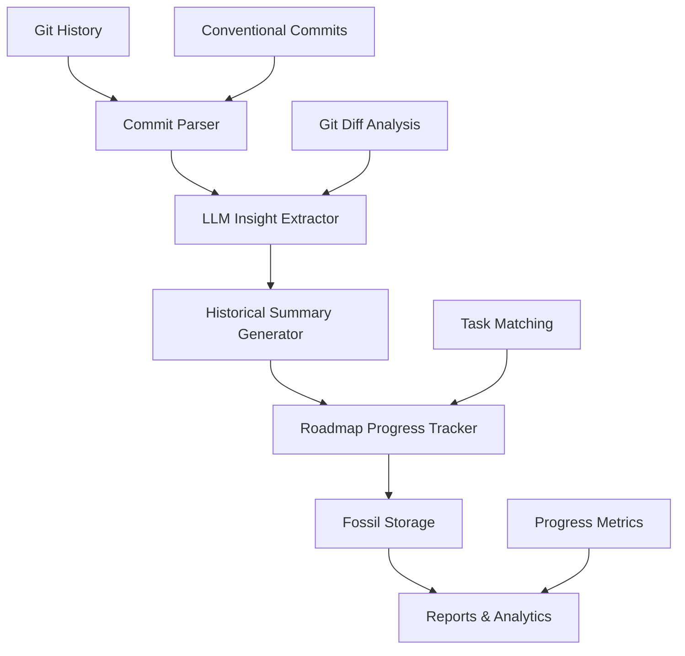
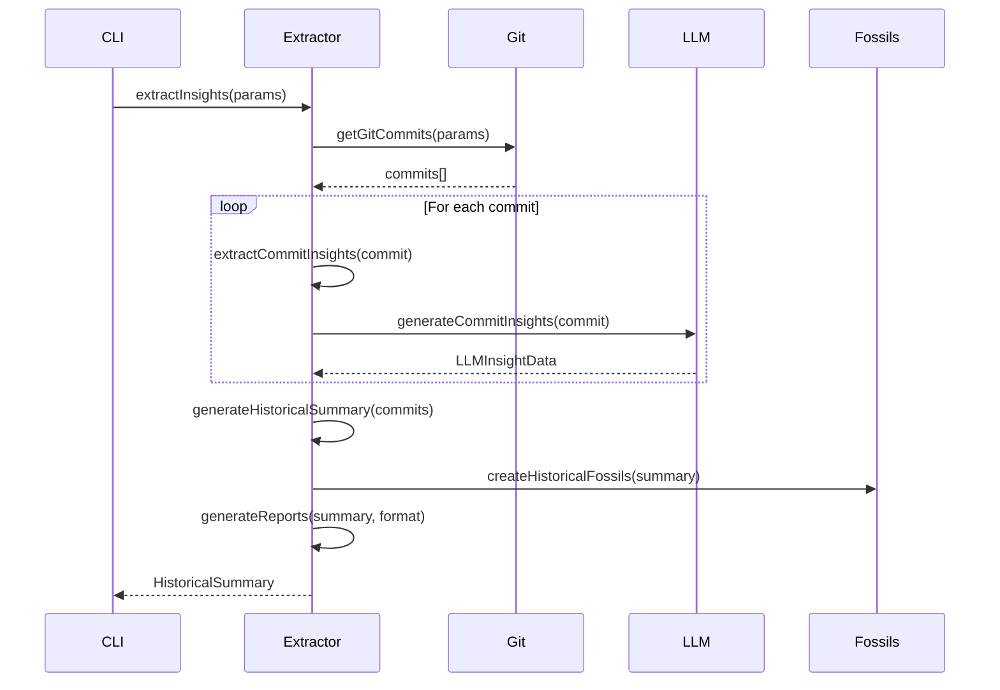
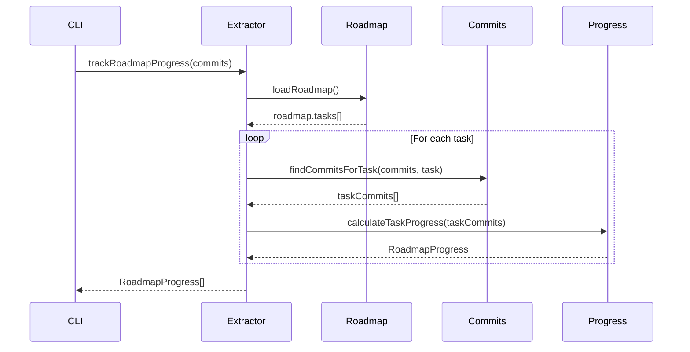

# 🧠 Git History LLM Insights Approach

## 📋 Overview

This approach leverages git diff LLM insights from commit parsing to generate historical summaries and track roadmap progress. It provides valuable structured data for project progress tracking and fossil usage, enabling comprehensive traceability over conventional git commits.

### 🎯 Key Benefits

- **Historical Analysis**: Extract LLM insights from entire git history
- **Roadmap Progress Tracking**: Automatically track task completion and progress
- **Conventional Commit Integration**: Link insights to structured commit messages
- **Fossil-Backed Storage**: Store insights as fossils for full audit trail
- **Batch Processing**: Process multiple commits efficiently
- **Multiple Output Formats**: JSON, YAML, Markdown, and table formats

## 🏗️ Architecture



## 🔧 Implementation Components

### 1. Git History LLM Insights Extractor (`scripts/git-history-llm-insights.ts`)

**Core Features:**
- Parse git commits with conventional commit format
- Extract file changes and diff information
- Generate LLM insights for each commit
- Create historical summaries
- Track roadmap progress
- Store insights as fossils

**Usage Examples:**
```bash
# Analyze last 30 commits
bun run scripts/git-history-llm-insights.ts --range HEAD~30..HEAD

# Analyze commits since specific date
bun run scripts/git-history-llm-insights.ts --since 2025-01-01

# Filter by author
bun run scripts/git-history-llm-insights.ts --author emmanuelbarrera

# Track roadmap progress
bun run scripts/git-history-llm-insights.ts --roadmap-progress
```

### 2. CLI Interface (`src/cli/git-history-insights.ts`)

**Command Options:**
- `--summary`: Show historical summary
- `--insights`: Show individual insights
- `--roadmap-progress`: Show roadmap progress
- `--done-tasks`: Show completed tasks
- `--automation-opportunities`: Show automation opportunities
- `--range <range>`: Git commit range
- `--since <date>`: Since date
- `--author <author>`: Filter by author
- `--format <format>`: Output format (json, yaml, markdown, table)
- `--output <file>`: Output file
- `--limit <number>`: Limit number of results
- `--filter <text>`: Filter results by text

**Usage Examples:**
```bash
# Get summary in table format
bun run src/cli/git-history-insights.ts --summary --format table

# Get insights for specific range
bun run src/cli/git-history-insights.ts --insights --range HEAD~30..HEAD

# Track roadmap progress since date
bun run src/cli/git-history-insights.ts --roadmap-progress --since 2025-01-01

# Find completed tasks by author
bun run src/cli/git-history-insights.ts --done-tasks --author emmanuelbarrera

# Export automation opportunities to file
bun run src/cli/git-history-insights.ts --automation-opportunities --output automation-ops.json
```

## 📊 Data Structures

### Git Commit Structure
```typescript
interface GitCommit {
  hash: string;
  author: string;
  date: string;
  message: string;
  changes: FileChange[];
  llmInsights?: LLMInsightData;
  conventionalFormat: boolean;
  type?: string;
  scope?: string;
  description?: string;
  breakingChange: boolean;
  issues: string[];
}
```

### LLM Insight Data
```typescript
interface LLMInsightData {
  summary: string;
  impact: 'low' | 'medium' | 'high';
  category: string;
  blockers: string[];
  recommendations: string[];
  automationOpportunities: string[];
  roadmapImpact?: {
    affectedTasks: string[];
    newTasks: string[];
    completedTasks: string[];
  };
  done?: {
    retrospective: string;
    insights: string[];
    completedAt: string;
    lessonsLearned: string[];
  };
}
```

### Historical Summary
```typescript
interface HistoricalSummary {
  period: {
    start: string;
    end: string;
    duration: number;
  };
  commits: GitCommit[];
  insights: LLMInsightData[];
  progress: {
    totalCommits: number;
    totalInsights: number;
    averageImpact: string;
    categories: Record<string, number>;
    automationOpportunities: string[];
    completedTasks: string[];
    newTasks: string[];
  };
  roadmapProgress: {
    tasksCompleted: number;
    tasksInProgress: number;
    tasksPlanned: number;
    completionRate: number;
    velocity: number;
  };
  fossils: {
    created: number;
    updated: number;
    insights: string[];
  };
}
```

## 🔄 Workflow

### 1. Git History Analysis


### 2. Roadmap Progress Tracking


## 📈 Usage Patterns

### 1. Daily Progress Tracking
```bash
# Get today's progress summary
bun run src/cli/git-history-insights.ts --summary --since $(date -d "yesterday" +%Y-%m-%d) --format table

# Track specific task progress
bun run src/cli/git-history-insights.ts --roadmap-progress --filter "task-name" --format markdown
```

### 2. Weekly Retrospectives
```bash
# Get weekly summary
bun run src/cli/git-history-insights.ts --summary --since $(date -d "7 days ago" +%Y-%m-%d) --format markdown --output weekly-report.md

# Find automation opportunities
bun run src/cli/git-history-insights.ts --automation-opportunities --since $(date -d "7 days ago" +%Y-%m-%d) --format json
```

### 3. Monthly Analysis
```bash
# Comprehensive monthly analysis
bun run src/cli/git-history-insights.ts --summary --since $(date -d "30 days ago" +%Y-%m-%d) --format yaml --output monthly-analysis.yml

# Track roadmap completion
bun run src/cli/git-history-insights.ts --roadmap-progress --since $(date -d "30 days ago" +%Y-%m-%d) --format table
```

### 4. Project Milestone Tracking
```bash
# Track progress between releases
bun run src/cli/git-history-insights.ts --summary --range v1.0.0..v1.1.0 --format markdown --output milestone-report.md

# Find completed tasks in milestone
bun run src/cli/git-history-insights.ts --done-tasks --range v1.0.0..v1.1.0 --format json
```

## 🦴 Fossil Integration

### Fossil Storage Structure
```
fossils/
├── git_history_insights/
│   ├── historical-summary-{timestamp}.json
│   ├── commit-insights/
│   │   ├── {commit-hash}.json
│   │   └── ...
│   └── reports/
│       ├── git-history-report-{timestamp}.json
│       ├── git-history-report-{timestamp}.yml
│       └── git-history-report-{timestamp}.md
```

### Fossil Types
1. **Historical Summary Fossils**: Complete analysis of a time period
2. **Commit Insight Fossils**: Individual commit analysis
3. **Roadmap Progress Fossils**: Task completion tracking
4. **Report Fossils**: Formatted reports in various formats

## 🔍 Advanced Usage

### 1. Custom Filtering
```bash
# Filter insights by category
bun run src/cli/git-history-insights.ts --insights --filter "automation" --format table

# Filter by impact level
bun run src/cli/git-history-insights.ts --insights --filter "high" --format json

# Filter by author and date range
bun run src/cli/git-history-insights.ts --insights --author emmanuelbarrera --since 2025-01-01 --format markdown
```

### 2. Batch Processing
```bash
# Process multiple ranges
for range in "HEAD~30..HEAD" "HEAD~60..HEAD~30" "HEAD~90..HEAD~60"; do
  bun run src/cli/git-history-insights.ts --summary --range "$range" --output "batch-$range.json"
done

# Compare periods
bun run src/cli/git-history-insights.ts --summary --range HEAD~30..HEAD --format json > current-period.json
bun run src/cli/git-history-insights.ts --summary --range HEAD~60..HEAD~30 --format json > previous-period.json
```

### 3. Integration with CI/CD
```yaml
# GitHub Actions example
- name: Generate Git History Insights
  run: |
    bun run src/cli/git-history-insights.ts --summary --since ${{ github.event.head_commit.timestamp }} --format markdown --output insights-report.md
    
- name: Upload Insights Report
  uses: actions/upload-artifact@v2
  with:
    name: git-history-insights
    path: insights-report.md
```

## 🎯 Roadmap Integration

### Automatic Task Completion Detection
The system automatically detects completed tasks by:
1. Analyzing commit messages for task references
2. Matching LLM insights to roadmap tasks
3. Tracking progress metrics and velocity
4. Identifying blockers and achievements

### Progress Metrics
- **Completion Rate**: Percentage of tasks completed
- **Velocity**: Commits per day
- **Impact Distribution**: Low/medium/high impact changes
- **Category Distribution**: Feature/bugfix/refactor/etc.
- **Automation Opportunities**: Identified automation potential

### Done Properties Tracking
Each completed task includes:
- **Retrospective**: What was accomplished
- **Insights**: Key learnings
- **Completion Date**: When the task was finished
- **Lessons Learned**: Future improvements

## 🚀 Future Enhancements

### 1. Real-time Monitoring
- Webhook integration for automatic analysis
- Real-time dashboard for progress tracking
- Automated alerts for blockers

### 2. Advanced Analytics
- Predictive analytics for project completion
- Team performance metrics
- Code quality correlation analysis

### 3. Integration Extensions
- JIRA/GitHub Issues integration
- Slack/Teams notifications
- Custom dashboard creation

### 4. Machine Learning
- Automated task categorization
- Impact prediction
- Optimal commit message suggestions

## 📚 Related Documentation

- [LLM Insights Workflow](./LLM_INSIGHTS_WORKFLOW.md)
- [Commit Batch Summary](../COMMIT_BATCH_SUMMARY.md)
- [Development Guide](./DEVELOPMENT_GUIDE.md)
- [Fossil Management Analysis](./FOSSIL_MANAGEMENT_ANALYSIS.md)

---

This approach provides a comprehensive system for tracking project progress through git history analysis, enabling data-driven decision making and automated insight generation for roadmap management and project optimization. 