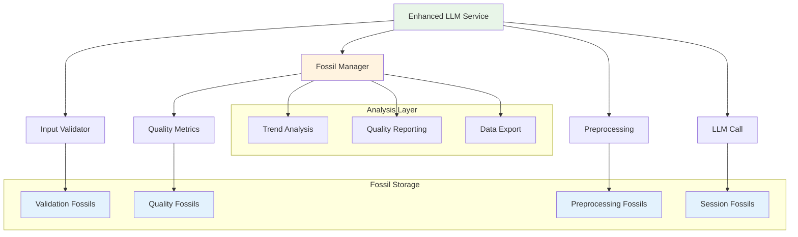
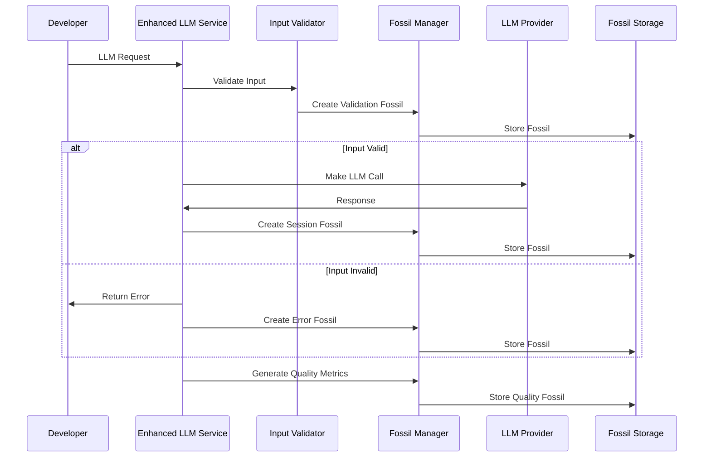

# 🗿 LLM Error Prevention with Fossilization Integration

## 📋 Overview

This document explains how the LLM Error Prevention system integrates with the project's fossilization system to provide comprehensive audit trails, analysis capabilities, and compliance with project guidelines.

## 🎯 Integration with Project Guidelines

### ✅ Params Object Pattern Compliance

Our implementation follows the project's **Params Object Pattern** as specified in the reuse guidelines:

```typescript
// ✅ Following Params Object Pattern
export const LLMFossilManagerParamsSchema = z.object({
  owner: z.string().min(1, 'Repository owner is required'),
  repo: z.string().min(1, 'Repository name is required'),
  commitRef: z.string().optional(),
  sessionId: z.string().optional(),
  fossilStoragePath: z.string().default('fossils/llm_insights/'),
  enableAutoFossilization: z.boolean().default(true),
  enableQualityMetrics: z.boolean().default(true),
  enableValidationTracking: z.boolean().default(true)
});

// Usage with validation
const validatedParams = LLMFossilManagerParamsSchema.parse(params);
```

### ✅ Fossil Management Workflow Integration

Following the **Fossil Management Workflow** guidelines:

1. **Edit fossils in YAML** - Fossil schemas are defined in YAML-compatible format
2. **Convert YAML to JSON** - Using the `yamlToJson` utility for API/automation
3. **Render Markdown** - Fossil data can be exported for documentation
4. **Relate fossils to issues, status, and metadata** - Comprehensive metadata tracking
5. **Keep fossils up to date** - Automatic fossilization on every LLM interaction

### ✅ Legacy Fossil Types Compatibility

Our implementation extends the existing fossil system while maintaining backward compatibility:

```typescript
// ✅ Extends existing fossil types
export const LLMValidationFossilSchema = z.object({
  type: z.literal('llm-validation'),
  timestamp: z.string(),
  commitRef: z.string(),
  // ... other fields compatible with existing fossil structure
});
```

## 🏗️ Architecture Overview

### System Components



### Data Flow



## 📊 Fossil Types

### 1. LLM Validation Fossils

**Purpose**: Track input validation results for audit and analysis

```typescript
interface LLMValidationFossil {
  type: 'llm-validation';
  timestamp: string;
  commitRef: string;
  inputHash: string;
  validation: {
    isValid: boolean;
    errors: string[];
    warnings: string[];
    recommendations: string[];
    qualityScore: number;
    securityIssues: string[];
    performanceIssues: string[];
  };
  preprocessing?: {
    success: boolean;
    changes: string[];
    improvements: string[];
  };
  metadata: {
    model: string;
    context?: string;
    purpose?: string;
    valueScore?: number;
    validationTime: number;
    preprocessingTime?: number;
    totalTime: number;
  };
  fossilId: string;
  status: 'pending' | 'approved' | 'rejected' | 'archived';
  tags: string[];
}
```

### 2. LLM Error Prevention Session Fossils

**Purpose**: Track complete error prevention sessions

```typescript
interface LLMErrorPreventionFossil {
  type: 'llm-error-prevention';
  timestamp: string;
  commitRef: string;
  sessionId: string;
  summary: {
    totalInputs: number;
    errorsPrevented: number;
    warningsGenerated: number;
    recommendationsProvided: number;
    qualityImprovements: number;
    costSavings: number;
    timeSaved: number;
  };
  inputs: Array<{
    inputHash: string;
    originalInput: any;
    processedInput?: any;
    validation: InputValidationResult;
    qualityAnalysis?: ContentQualityMetrics;
    preprocessing?: InputPreprocessingResult;
  }>;
  insights: Array<{
    category: 'structure' | 'quality' | 'security' | 'performance' | 'cost';
    severity: 'low' | 'medium' | 'high' | 'critical';
    description: string;
    recommendation: string;
    impact: string;
  }>;
  metadata: {
    environment: string;
    llmProvider: string;
    validationMode: string;
    preprocessingMode: string;
    totalSessionTime: number;
    fossilizationTime: number;
  };
  fossilId: string;
  status: 'active' | 'completed' | 'archived';
  tags: string[];
}
```

### 3. LLM Quality Metrics Fossils

**Purpose**: Track quality trends and generate recommendations

```typescript
interface LLMQualityMetricsFossil {
  type: 'llm-quality-metrics';
  timestamp: string;
  commitRef: string;
  metrics: {
    averageQuality: number;
    qualityDistribution: {
      excellent: number;
      good: number;
      fair: number;
      poor: number;
      veryPoor: number;
    };
    commonIssues: Array<{
      issue: string;
      frequency: number;
      impact: string;
    }>;
    improvements: Array<{
      category: string;
      beforeScore: number;
      afterScore: number;
      improvement: number;
    }>;
  };
  trends: {
    qualityTrend: 'improving' | 'stable' | 'declining';
    errorRateTrend: 'decreasing' | 'stable' | 'increasing';
    costTrend: 'decreasing' | 'stable' | 'increasing';
  };
  recommendations: Array<{
    priority: 'low' | 'medium' | 'high' | 'critical';
    category: string;
    description: string;
    expectedImpact: string;
    implementationEffort: string;
  }>;
  metadata: {
    analysisPeriod: string;
    totalInputs: number;
    analysisTime: number;
  };
  fossilId: string;
  status: 'draft' | 'reviewed' | 'approved' | 'implemented';
  tags: string[];
}
```

## 🔧 Implementation Details

### Fossil Manager Integration

```typescript
export class LLMFossilManager {
  private baseManager: any;
  private params: LLMFossilManagerParams;
  private sessionMetrics: any;

  constructor(params: LLMFossilManagerParams) {
    // ✅ Params Object Pattern validation
    this.params = LLMFossilManagerParamsSchema.parse(params);
  }

  // ✅ Fossil creation with validation
  async fossilizeValidation(params: {
    inputHash: string;
    validation: InputValidationResult;
    preprocessing?: InputPreprocessingResult;
    metadata: any;
  }): Promise<LLMValidationFossil> {
    const fossil = createLLMValidationFossil({
      commitRef: this.params.commitRef || await this.getCurrentCommitRef(),
      inputHash: params.inputHash,
      validation: params.validation,
      preprocessing: params.preprocessing,
      metadata: params.metadata
    });

    // ✅ Schema validation before storage
    const validatedFossil = LLMValidationFossilSchema.parse(fossil);
    await this.baseManager.storeFossil(validatedFossil);
    return validatedFossil;
  }
}
```

### Enhanced LLM Service Integration

```typescript
export class EnhancedLLMService extends LLMService {
  private fossilManager: any;
  private params: EnhancedLLMServiceParams;

  // ✅ Initialize with fossilization
  async initialize(): Promise<void> {
    if (this.params.enableFossilization) {
      this.fossilManager = await createLLMFossilManager(this.params.fossilManagerParams);
    }
  }

  // ✅ Fossilize every LLM interaction
  async chatCompletion(params: any): Promise<any> {
    const startTime = Date.now();
    const inputHash = this.generateInputHash(params);
    
    // Validate and fossilize
    const validation = validateLLMInput(params);
    if (this.params.enableFossilization && this.fossilManager) {
      await this.fossilManager.fossilizeValidation({
        inputHash,
        validation,
        metadata: {
          model: params.model,
          context: params.context,
          purpose: params.purpose,
          valueScore: params.valueScore,
          validationTime: Date.now() - startTime,
          totalTime: Date.now() - startTime
        }
      });
    }
    
    // Continue with LLM call...
  }
}
```

## 📈 Analysis Capabilities

### Quality Metrics Generation

```typescript
// ✅ Generate quality metrics from fossilized data
async generateQualityMetrics(params: {
  analysisPeriod: string;
  commitRefs?: string[];
}): Promise<LLMQualityMetricsFossil> {
  const validationFossils = await this.getFossilizedInsights({
    type: 'validation',
    limit: 1000
  });

  const metrics = this.calculateQualityMetrics(validationFossils);
  const trends = this.calculateTrends(validationFossils);
  const recommendations = this.generateRecommendations(metrics, trends);

  return await this.fossilizeQualityMetrics({
    metrics,
    trends,
    recommendations,
    metadata: {
      analysisPeriod: params.analysisPeriod,
      totalInputs: validationFossils.length,
      analysisTime: Date.now()
    }
  });
}
```

### Data Export Capabilities

```typescript
// ✅ Export fossilized data for analysis
async exportFossilizedData(params: {
  format: 'json' | 'yaml' | 'csv';
  outputPath: string;
  filters?: any;
}): Promise<string> {
  const fossils = await this.getFossilizedInsights({ limit: 10000 });
  
  switch (params.format) {
    case 'json':
      return await this.exportToJSON(fossils, params.outputPath);
    case 'yaml':
      return await this.exportToYAML(fossils, params.outputPath);
    case 'csv':
      return await this.exportToCSV(fossils, params.outputPath);
    default:
      throw new Error(`Unsupported export format: ${params.format}`);
  }
}
```

## 🎯 Benefits of Fossilization Integration

### 1. **Complete Audit Trail**
- Every LLM interaction is fossilized
- Input validation results are preserved
- Preprocessing changes are tracked
- Session-level insights are captured

### 2. **Historical Analysis**
- Quality trends over time
- Error pattern identification
- Performance optimization opportunities
- Cost analysis and optimization

### 3. **Compliance and Governance**
- Reproducible AI operations
- Traceable decision-making
- Regulatory compliance support
- Risk assessment capabilities

### 4. **Continuous Improvement**
- Data-driven optimization
- Automated quality reporting
- Trend-based recommendations
- Performance benchmarking

### 5. **Integration Benefits**
- Seamless integration with existing fossil system
- Consistent data structures
- Reusable analysis tools
- Standardized reporting

## 🔄 Usage Examples

### Basic Usage with Fossilization

```typescript
// ✅ Initialize with fossilization enabled
const enhancedLLM = await createEnhancedLLMService({
  enableFossilization: true,
  fossilManagerParams: {
    owner: 'your-org',
    repo: 'your-repo',
    fossilStoragePath: 'fossils/llm_insights/',
    enableAutoFossilization: true,
    enableQualityMetrics: true,
    enableValidationTracking: true
  }
});

// ✅ Every call is automatically fossilized
const result = await enhancedLLM.chatCompletion({
  model: 'gpt-4',
  messages: [{ role: 'user', content: 'Hello' }],
  context: 'testing',
  purpose: 'demo'
});
```

### Quality Analysis

```typescript
// ✅ Generate quality metrics from fossilized data
const qualityReport = await enhancedLLM.generateQualityReport({
  analysisPeriod: 'last-7-days',
  commitRefs: ['main', 'feature-branch']
});

console.log('Quality Trend:', qualityReport.trends.qualityTrend);
console.log('Recommendations:', qualityReport.recommendations.length);
```

### Data Export

```typescript
// ✅ Export fossilized data for external analysis
const exportPath = await enhancedLLM.exportFossilizedData({
  format: 'json',
  outputPath: 'fossils/llm_insights/export.json'
});

console.log('Data exported to:', exportPath);
```

## 📋 Compliance Checklist

### ✅ Params Object Pattern
- [x] All configuration uses Zod schemas
- [x] Runtime validation of all parameters
- [x] Consistent error handling
- [x] Type-safe parameter passing

### ✅ Fossil Management Workflow
- [x] YAML-compatible fossil schemas
- [x] JSON conversion for automation
- [x] Markdown export capabilities
- [x] Comprehensive metadata tracking
- [x] Automatic fossil updates

### ✅ Legacy Fossil Types
- [x] Extends existing fossil system
- [x] Maintains backward compatibility
- [x] Consistent data structures
- [x] Reusable fossil utilities

### ✅ Reuse Guidelines
- [x] Uses existing fossil manager
- [x] Reuses CLI utilities
- [x] Follows validation patterns
- [x] Consistent error handling
- [x] Documentation-driven development

## 🚀 Future Enhancements

### Planned Features
1. **Real-time Fossil Streaming** - Live fossil updates
2. **Advanced Analytics** - Machine learning insights
3. **Automated Reporting** - Scheduled quality reports
4. **Integration APIs** - External system integration
5. **Performance Optimization** - Fossil caching and indexing

### Integration Opportunities
- **CI/CD Integration** - Automated quality gates
- **GitHub Integration** - Issue and PR linking
- **Monitoring Integration** - Alert systems
- **Compliance Integration** - Regulatory reporting
- **Team Collaboration** - Shared insights and recommendations

## 📚 Related Documentation

- [LLM Error Prevention Guide](./LLM_ERROR_PREVENTION_GUIDE.md) - Comprehensive error prevention guide
- [LLM Error Prevention Summary](./LLM_ERROR_PREVENTION_SUMMARY.md) - Executive summary
- [Reuse Guidelines](./REUSE_GUIDELINES.md) - Project reuse patterns
- [Fossil Management Workflow](./ROADMAP_FOSSILIZATION.md) - Fossil management patterns
- [API Reference](./API_REFERENCE.md) - Technical API documentation

---

*This document demonstrates how the LLM Error Prevention system fully integrates with the project's fossilization guidelines, providing comprehensive audit trails, analysis capabilities, and compliance with established patterns.* 