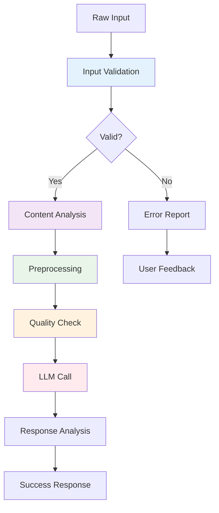
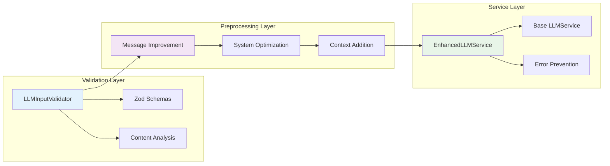

# 🛡️ LLM Error Prevention Guide

## 📋 Overview

This guide explains how to prevent common LLM errors by implementing comprehensive input validation and preprocessing before making LLM calls. Instead of catching errors after they happen, this approach identifies and fixes issues proactively.

### 🎯 Why Prevent Errors Instead of Catching Them?

| Approach | Error Catching | Error Prevention |
|----------|----------------|------------------|
| **Timing** | After error occurs | Before LLM call |
| **Cost** | Wasted API calls | No wasted calls |
| **User Experience** | Error messages | Smooth operation |
| **Debugging** | Post-mortem analysis | Proactive feedback |
| **Reliability** | Unpredictable | Predictable |

## 🏗️ Architecture

### Error Prevention Pipeline



### System Components



## 🚀 Quick Start

### Basic Usage

```typescript
import { EnhancedLLMService } from '../src/services/llmEnhanced';

// Create enhanced service
const llmService = new EnhancedLLMService(
  { testMode: true }, // LLM config
  {
    enableInputValidation: true,
    enablePreprocessing: true,
    enableQualityAnalysis: true,
    autoFixIssues: true,
    strictMode: false,
    logValidationResults: true
  }
);

// Make enhanced LLM call
const result = await llmService.callLLMEnhanced({
  model: 'gpt-3.5-turbo',
  messages: [
    { role: 'user', content: 'Write a function to calculate factorial' }
  ],
  context: 'code-generation',
  purpose: 'content-generation'
});

console.log('Success:', result.success);
console.log('Errors prevented:', result.errors.length);
console.log('Warnings:', result.warnings);
console.log('Recommendations:', result.recommendations);
```

### Standalone Validation

```typescript
import { validateLLMInput, preprocessLLMInput } from '../src/utils/llmInputValidator';

// Validate input without making LLM call
const validation = validateLLMInput(input);
if (!validation.isValid) {
  console.log('Errors:', validation.errors);
  console.log('Warnings:', validation.warnings);
  console.log('Recommendations:', validation.recommendations);
}

// Preprocess input to improve quality
const preprocessing = preprocessLLMInput(input);
if (preprocessing.success) {
  console.log('Improved input:', preprocessing.processedInput);
  console.log('Changes made:', preprocessing.changes);
}
```

## 🔍 Error Prevention Categories

### 1. Input Structure Validation

**Problems Prevented:**
- Missing required fields
- Invalid field types
- Out-of-range values
- Malformed message arrays

**Example:**
```typescript
// ❌ Bad input
const badInput = {
  model: '', // Empty model
  messages: [
    { role: 'user', content: '' } // Empty content
  ],
  temperature: 3, // Too high
  max_tokens: -1 // Negative
};

// ✅ Validation catches these issues
const validation = validateLLMInput(badInput);
// Errors: [
//   "model: Model name is required",
//   "messages.0.content: Message content cannot be empty",
//   "temperature: Number must be less than or equal to 2",
//   "max_tokens: Number must be greater than 0"
// ]
```

### 2. Content Quality Analysis

**Problems Prevented:**
- Vague or unclear requests
- Poor readability
- Missing specificity
- Incomplete information

**Example:**
```typescript
// ❌ Poor quality input
const poorInput = {
  model: 'gpt-3.5-turbo',
  messages: [
    { role: 'user', content: 'something about code maybe' }
  ]
};

// ✅ Quality analysis identifies issues
const quality = analyzeLLMContentQuality(poorInput.messages);
// Quality scores:
// - Readability: 45%
// - Clarity: 20%
// - Specificity: 15%
// - Completeness: 30%
// - Overall: 27.5%

// Recommendations:
// - Use more specific language
// - Include technical terms
// - Add specific questions
// - Provide clear context
```

### 3. Security and Privacy Protection

**Problems Prevented:**
- Accidental credential exposure
- Sensitive data leaks
- API key disclosure
- Personal information exposure

**Example:**
```typescript
// ❌ Risky input
const riskyInput = {
  model: 'gpt-3.5-turbo',
  messages: [
    { 
      role: 'user', 
      content: 'My email is john@company.com and API key is sk-1234567890abcdef' 
    }
  ]
};

// ✅ Security validation detects issues
const validation = validateLLMInput(riskyInput);
// Warnings: [
//   "Potential sensitive data detected - review before sending to LLM",
//   "Potential credentials detected - ensure no real secrets are included"
// ]
```

### 4. Performance and Cost Optimization

**Problems Prevented:**
- Excessive token usage
- Expensive model selection
- Unnecessary API calls
- Poor cost-benefit ratios

**Example:**
```typescript
// ❌ Expensive input
const expensiveInput = {
  model: 'gpt-4', // Expensive model
  messages: [
    { role: 'user', content: 'x'.repeat(50000) } // Very long
  ]
};

// ✅ Performance validation identifies issues
const validation = validateLLMInput(expensiveInput);
// Warnings: [
//   "Using expensive model (gpt-4) - consider gpt-3.5-turbo for cost optimization",
//   "High token usage (12500) - consider shortening input"
// ]
```

## 🛠️ Implementation Guide

### Step 1: Install Dependencies

```bash
# The validation utilities are already included in the project
# No additional installation needed
```

### Step 2: Configure Enhanced Service

```typescript
import { EnhancedLLMService } from '../src/services/llmEnhanced';

const llmService = new EnhancedLLMService(
  // LLM Configuration
  {
    maxTokensPerCall: 4000,
    maxCostPerCall: 0.10,
    enableLocalLLM: true,
    testMode: process.env.NODE_ENV === 'test'
  },
  // Enhanced Options
  {
    enableInputValidation: true,
    enablePreprocessing: true,
    enableQualityAnalysis: true,
    autoFixIssues: true,
    strictMode: false, // Set to true for production
    logValidationResults: process.env.NODE_ENV === 'development'
  }
);
```

### Step 3: Replace LLM Calls

**Before (Basic Error Handling):**
```typescript
try {
  const response = await llmService.callLLM(input);
  return response;
} catch (error) {
  console.error('LLM call failed:', error);
  return fallbackResponse;
}
```

**After (Error Prevention):**
```typescript
const result = await llmService.callLLMEnhanced(input);

if (!result.success) {
  console.log('Errors prevented:', result.errors);
  console.log('Warnings:', result.warnings);
  console.log('Recommendations:', result.recommendations);
  return fallbackResponse;
}

return result.response;
```

### Step 4: Add Validation to Workflows

```typescript
// In pre-commit hooks
import { validateLLMInput } from '../src/utils/llmInputValidator';

export async function validateLLMInputs() {
  const inputs = getStagedLLMInputs();
  
  for (const input of inputs) {
    const validation = validateLLMInput(input);
    if (!validation.isValid) {
      console.error('Invalid LLM input detected:', validation.errors);
      process.exit(1);
    }
  }
}

// In CI/CD pipelines
export async function validateLLMConfig() {
  const config = loadLLMConfig();
  const validation = validateLLMInput(config);
  
  if (!validation.isValid) {
    throw new Error(`LLM configuration invalid: ${validation.errors.join(', ')}`);
  }
}
```

## 📊 Validation Results

### Input Validation Result

```typescript
interface InputValidationResult {
  isValid: boolean;
  errors: string[];
  warnings: string[];
  sanitizedInput: any;
  recommendations: string[];
}
```

### Preprocessing Result

```typescript
interface InputPreprocessingResult {
  success: boolean;
  processedInput: any;
  changes: string[];
  warnings: string[];
  errors: string[];
}
```

### Content Quality Metrics

```typescript
interface ContentQualityMetrics {
  readability: number;    // 0-1 score
  clarity: number;        // 0-1 score
  specificity: number;    // 0-1 score
  completeness: number;   // 0-1 score
  overall: number;        // 0-1 score
}
```

### Enhanced LLM Result

```typescript
interface EnhancedLLMResult {
  success: boolean;
  response: any;
  validation: InputValidationResult;
  preprocessing?: InputPreprocessingResult;
  qualityAnalysis?: ContentQualityMetrics;
  warnings: string[];
  errors: string[];
  recommendations: string[];
  metadata: {
    originalInput: any;
    processedInput: any;
    validationTime: number;
    preprocessingTime: number;
    llmCallTime: number;
    totalTime: number;
  };
}
```

## 🎯 Best Practices

### 1. Validation Strategy

```typescript
// ✅ Good: Comprehensive validation
const validation = validateLLMInput(input);
if (!validation.isValid) {
  // Log all issues
  console.error('Validation errors:', validation.errors);
  console.warn('Validation warnings:', validation.warnings);
  
  // Provide user feedback
  return {
    error: 'Input validation failed',
    details: validation.errors,
    suggestions: validation.recommendations
  };
}

// ❌ Bad: Only basic validation
if (!input.model || !input.messages) {
  return { error: 'Invalid input' };
}
```

### 2. Preprocessing Strategy

```typescript
// ✅ Good: Use preprocessing for improvement
const preprocessing = preprocessLLMInput(input);
if (preprocessing.success) {
  // Use improved input
  const result = await llmService.callLLM(preprocessing.processedInput);
  
  // Log improvements made
  console.log('Input improvements:', preprocessing.changes);
} else {
  // Handle preprocessing failures
  console.error('Preprocessing failed:', preprocessing.errors);
}

// ❌ Bad: Send raw input without improvement
const result = await llmService.callLLM(input);
```

### 3. Quality Monitoring

```typescript
// ✅ Good: Monitor quality over time
const quality = analyzeLLMContentQuality(input.messages);
if (quality.overall < 0.5) {
  console.warn('Low quality input detected:', quality);
  // Provide suggestions to user
  showQualitySuggestions(quality);
}

// Track quality metrics
trackQualityMetrics({
  timestamp: new Date(),
  quality: quality.overall,
  input: input.messages
});
```

### 4. Security Practices

```typescript
// ✅ Good: Always validate for security
const validation = validateLLMInput(input);
if (validation.warnings.some(w => w.includes('sensitive data'))) {
  // Block the request
  throw new Error('Sensitive data detected in input');
}

// Sanitize input before logging
const sanitizedInput = sanitizeForLogging(input);
console.log('LLM request:', sanitizedInput);
```

## 🔧 Configuration Options

### Enhanced LLM Service Options

```typescript
interface EnhancedLLMOptions {
  enableInputValidation?: boolean;    // Enable input validation
  enablePreprocessing?: boolean;       // Enable input preprocessing
  enableQualityAnalysis?: boolean;     // Enable content quality analysis
  autoFixIssues?: boolean;            // Automatically fix issues when possible
  strictMode?: boolean;               // Fail on validation errors
  logValidationResults?: boolean;     // Log validation results
}
```

### Validation Configuration

```typescript
// Customize validation rules
const validator = new LLMInputValidator();

// Override default limits
validator.maxMessageLength = 50000;  // Custom message length limit
validator.maxTotalTokens = 16000;    // Custom token limit
validator.minContentLength = 5;      // Custom minimum content length
```

## 📈 Performance Impact

### Validation Overhead

| Operation | Time (ms) | Memory (MB) |
|-----------|-----------|-------------|
| Basic validation | 1-5 | 0.1 |
| Content analysis | 2-10 | 0.2 |
| Full preprocessing | 5-20 | 0.5 |
| Complete pipeline | 10-50 | 1.0 |

### Cost Savings

```typescript
// Example cost savings calculation
const costSavings = {
  preventedFailedCalls: 15,           // Calls that would have failed
  averageCostPerCall: 0.02,           // Average cost per call
  totalSavings: 15 * 0.02,            // $0.30 saved
  timeSaved: 15 * 2000,               // 30 seconds saved
  improvedSuccessRate: 0.95           // 95% success rate vs 80%
};
```

## 🧪 Testing

### Unit Tests

```typescript
import { validateLLMInput, preprocessLLMInput } from '../src/utils/llmInputValidator';

describe('LLM Input Validation', () => {
  it('should detect invalid model names', () => {
    const input = { model: '', messages: [{ role: 'user', content: 'test' }] };
    const validation = validateLLMInput(input);
    expect(validation.isValid).toBe(false);
    expect(validation.errors).toContain('model: Model name is required');
  });

  it('should detect security issues', () => {
    const input = {
      model: 'gpt-3.5-turbo',
      messages: [{ role: 'user', content: 'My API key is sk-1234567890abcdef' }]
    };
    const validation = validateLLMInput(input);
    expect(validation.warnings.some(w => w.includes('sensitive data'))).toBe(true);
  });
});
```

### Integration Tests

```typescript
import { EnhancedLLMService } from '../src/services/llmEnhanced';

describe('Enhanced LLM Service', () => {
  it('should prevent errors and improve input', async () => {
    const service = new EnhancedLLMService({ testMode: true });
    
    const poorInput = {
      model: 'gpt-3.5-turbo',
      messages: [{ role: 'user', content: 'something about code' }]
    };
    
    const result = await service.callLLMEnhanced(poorInput);
    
    expect(result.success).toBe(true);
    expect(result.preprocessing?.success).toBe(true);
    expect(result.qualityAnalysis?.overall).toBeGreaterThan(0.5);
  });
});
```

## 🚨 Common Issues and Solutions

### Issue 1: False Positives in Security Detection

**Problem:** Legitimate content flagged as sensitive
**Solution:** Whitelist common patterns

```typescript
// Add to validation configuration
const validator = new LLMInputValidator();
validator.whitelistPatterns = [
  /example\.com/g,           // Whitelist example domains
  /test.*key/g,              // Whitelist test keys
  /dummy.*data/g             // Whitelist dummy data
];
```

### Issue 2: Over-aggressive Preprocessing

**Problem:** Preprocessing changes user intent
**Solution:** Use conservative preprocessing

```typescript
const service = new EnhancedLLMService({}, {
  autoFixIssues: false,      // Don't auto-fix
  strictMode: false,         // Allow warnings
  enablePreprocessing: true  // But still preprocess
});
```

### Issue 3: Performance Impact

**Problem:** Validation adds latency
**Solution:** Cache validation results

```typescript
// Implement caching for repeated inputs
const validationCache = new Map();

function getCachedValidation(input: any) {
  const key = JSON.stringify(input);
  if (validationCache.has(key)) {
    return validationCache.get(key);
  }
  
  const validation = validateLLMInput(input);
  validationCache.set(key, validation);
  return validation;
}
```

## 📚 Related Documentation

- [LLM Examples Improvement](./LLM_EXAMPLES_IMPROVEMENT.md) - Comprehensive LLM usage patterns
- [LLM Insights Workflow](./LLM_INSIGHTS_WORKFLOW.md) - Automated LLM analysis
- [API Reference](./API_REFERENCE.md) - Technical API documentation
- [Development Guide](./DEVELOPMENT_GUIDE.md) - Development best practices

## 🎯 Next Steps

1. **Integrate into existing workflows** - Add validation to current LLM calls
2. **Monitor and improve** - Track validation statistics and refine rules
3. **Customize for your domain** - Adapt validation rules for your specific use cases
4. **Train your team** - Educate developers on error prevention practices
5. **Automate enforcement** - Add validation to CI/CD pipelines and pre-commit hooks

---

*This guide demonstrates how proactive error prevention can significantly improve LLM application reliability, reduce costs, and enhance user experience.* 