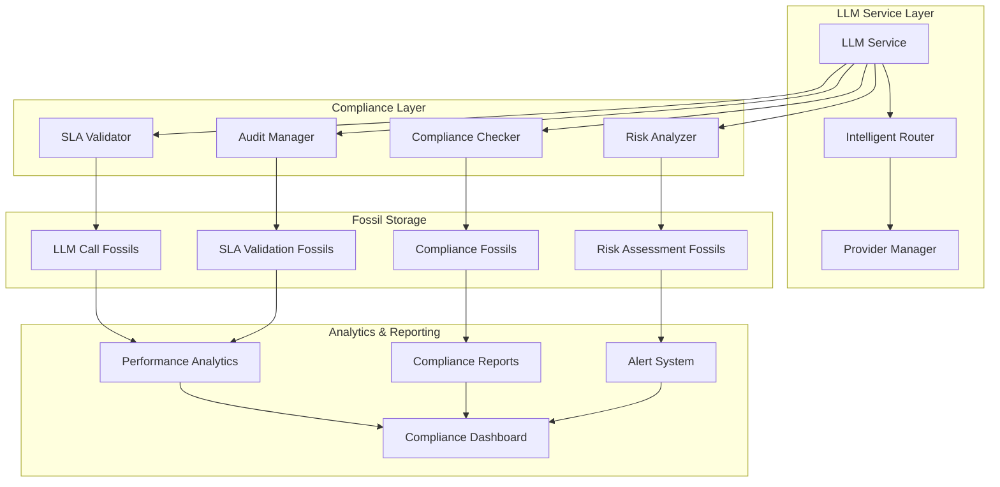

# 🗿 LLM Fossil-Based Compliance & SLA Validation System

> **🏷️ Quick Note**: This document outlines the transversal approach to LLM call compliance, SLA validation, and fossil-based audit trails for the automation ecosystem.

## 🎯 Overview

The LLM Fossil-Based Compliance & SLA Validation System provides a **transversal framework** for monitoring, validating, and ensuring compliance of LLM calls across the entire automation ecosystem. This system leverages the existing fossil architecture to create persistent, auditable records of LLM interactions with built-in SLA validation and compliance reporting.

### 🚀 Core Capabilities

- **🗿 Fossil-Based Audit Trails**: Persistent records of all LLM calls with metadata
- **📊 SLA Validation**: Real-time validation against performance, cost, and quality SLAs
- **🔍 Compliance Monitoring**: Automated compliance checking for security, privacy, and usage policies
- **📈 Performance Analytics**: Historical analysis and trend detection
- **🛡️ Risk Management**: Proactive identification of compliance risks and violations
- **📋 Reporting**: Automated generation of compliance and SLA reports

## 🏗️ Architecture Overview



## 📊 SLA Framework

### **Response Time SLAs**
```typescript
interface ResponseTimeSLA {
  maxResponseTime: number;        // e.g., 5000ms
  p95ResponseTime: number;        // e.g., 3000ms
  p99ResponseTime: number;        // e.g., 8000ms
  timeoutThreshold: number;       // e.g., 10000ms
}
```

### **Cost SLAs**
```typescript
interface CostSLA {
  maxCostPerCall: number;         // e.g., $0.10
  maxCostPerDay: number;          // e.g., $10.00
  maxCostPerMonth: number;        // e.g., $100.00
  costEfficiencyTarget: number;   // e.g., 0.8 (80% efficiency)
}
```

### **Quality SLAs**
```typescript
interface QualitySLA {
  minValueScore: number;          // e.g., 0.7
  minRelevanceScore: number;      // e.g., 0.8
  maxErrorRate: number;           // e.g., 0.05 (5%)
  successRateThreshold: number;   // e.g., 0.95 (95%)
}
```

### **Compliance SLAs**
```typescript
interface ComplianceSLA {
  securityScore: number;          // e.g., 0.9
  privacyScore: number;           // e.g., 0.95
  dataRetentionDays: number;      // e.g., 90
  auditTrailCompleteness: number; // e.g., 1.0 (100%)
}
```

## 🗿 Fossil Structure

### **LLM Call Fossil**
```typescript
interface LLMCallFossil extends BaseFossil {
  type: 'llm_call';
  metadata: {
    model: string;
    provider: string;
    timestamp: string;
    duration: number;
    cost: number;
    tokens: {
      input: number;
      output: number;
      total: number;
    };
    valueScore: number;
    relevanceScore: number;
    context: string;
    purpose: string;
  };
  slaValidation: {
    responseTime: SLAValidationResult;
    cost: SLAValidationResult;
    quality: SLAValidationResult;
    compliance: SLAValidationResult;
  };
  compliance: {
    securityCheck: ComplianceResult;
    privacyCheck: ComplianceResult;
    dataRetention: ComplianceResult;
    auditTrail: ComplianceResult;
  };
  riskAssessment: {
    riskLevel: 'low' | 'medium' | 'high' | 'critical';
    riskFactors: string[];
    mitigationActions: string[];
  };
}
```

### **SLA Validation Fossil**
```typescript
interface SLAValidationFossil extends BaseFossil {
  type: 'sla_validation';
  metadata: {
    slaType: 'response_time' | 'cost' | 'quality' | 'compliance';
    validationTimestamp: string;
    slaConfig: any;
  };
  results: {
    passed: boolean;
    score: number;
    violations: SLAViolation[];
    recommendations: string[];
  };
  trends: {
    historicalData: SLAValidationResult[];
    trendDirection: 'improving' | 'stable' | 'declining';
    prediction: SLAValidationPrediction;
  };
}
```

## 🔧 Implementation Strategy

### **Phase 1: Core Infrastructure**
1. **Extend LLM Service** with fossil generation
2. **Create SLA Validator** service
3. **Implement Compliance Checker**
4. **Add Risk Analyzer**

### **Phase 2: Fossil Integration**
1. **Create fossil schemas** for LLM calls and SLA validation
2. **Implement fossil storage** for compliance data
3. **Add fossil query** capabilities for compliance reporting
4. **Create fossil-based** audit trails

### **Phase 3: Analytics & Reporting**
1. **Build performance analytics** engine
2. **Create compliance dashboard**
3. **Implement alert system**
4. **Generate automated reports**

## 📋 Implementation Plan

### **1. Extend LLM Service**
```typescript
// src/services/llm.ts - Add fossil generation
class LLMService {
  private async createLLMCallFossil(callData: LLMCallData): Promise<LLMCallFossil> {
    const fossil: LLMCallFossil = {
      id: generateFossilId(),
      type: 'llm_call',
      timestamp: new Date().toISOString(),
      metadata: {
        model: callData.model,
        provider: callData.provider,
        timestamp: callData.timestamp,
        duration: callData.duration,
        cost: callData.cost,
        tokens: callData.tokens,
        valueScore: callData.valueScore,
        relevanceScore: callData.relevanceScore,
        context: callData.context,
        purpose: callData.purpose,
      },
      slaValidation: await this.validateSLAs(callData),
      compliance: await this.checkCompliance(callData),
      riskAssessment: await this.assessRisk(callData),
    };
    
    return fossil;
  }
}
```

### **2. Create SLA Validator**
```typescript
// src/services/slaValidator.ts
class SLAValidator {
  async validateResponseTime(callData: LLMCallData): Promise<SLAValidationResult> {
    const sla = this.getResponseTimeSLA();
    const result: SLAValidationResult = {
      passed: callData.duration <= sla.maxResponseTime,
      score: Math.max(0, 1 - (callData.duration / sla.maxResponseTime)),
      violations: [],
      recommendations: [],
    };
    
    if (!result.passed) {
      result.violations.push({
        type: 'response_time_exceeded',
        severity: 'high',
        message: `Response time ${callData.duration}ms exceeds SLA of ${sla.maxResponseTime}ms`,
      });
    }
    
    return result;
  }
}
```

### **3. Implement Compliance Checker**
```typescript
// src/services/complianceChecker.ts
class ComplianceChecker {
  async checkSecurity(callData: LLMCallData): Promise<ComplianceResult> {
    const securityChecks = [
      this.checkInputSanitization(callData.messages),
      this.checkOutputValidation(callData.response),
      this.checkProviderSecurity(callData.provider),
    ];
    
    const results = await Promise.all(securityChecks);
    const passed = results.every(r => r.passed);
    
    return {
      passed,
      score: results.reduce((sum, r) => sum + r.score, 0) / results.length,
      violations: results.flatMap(r => r.violations),
      recommendations: results.flatMap(r => r.recommendations),
    };
  }
}
```

### **4. Create Risk Analyzer**
```typescript
// src/services/riskAnalyzer.ts
class RiskAnalyzer {
  async assessRisk(callData: LLMCallData): Promise<RiskAssessment> {
    const riskFactors = [];
    let riskLevel: RiskLevel = 'low';
    
    // Check for high-cost calls
    if (callData.cost > this.config.highCostThreshold) {
      riskFactors.push('high_cost_call');
      riskLevel = 'medium';
    }
    
    // Check for sensitive data
    if (this.containsSensitiveData(callData.messages)) {
      riskFactors.push('sensitive_data_detected');
      riskLevel = 'high';
    }
    
    // Check for unusual patterns
    if (this.detectUnusualPattern(callData)) {
      riskFactors.push('unusual_pattern_detected');
      riskLevel = 'medium';
    }
    
    return {
      riskLevel,
      riskFactors,
      mitigationActions: this.generateMitigationActions(riskFactors),
    };
  }
}
```

## 📊 Analytics & Reporting

### **Performance Analytics**
```typescript
// src/services/llmAnalytics.ts
class LLMAnalytics {
  async generateComplianceReport(timeRange: TimeRange): Promise<ComplianceReport> {
    const fossils = await this.queryFossils({
      type: 'llm_call',
      timestamp: { $gte: timeRange.start, $lte: timeRange.end },
    });
    
    const slaCompliance = this.calculateSLACompliance(fossils);
    const costAnalysis = this.analyzeCosts(fossils);
    const qualityMetrics = this.calculateQualityMetrics(fossils);
    const riskAssessment = this.assessOverallRisk(fossils);
    
    return {
      timeRange,
      slaCompliance,
      costAnalysis,
      qualityMetrics,
      riskAssessment,
      recommendations: this.generateRecommendations(fossils),
    };
  }
}
```

### **Compliance Dashboard**
```typescript
// src/cli/compliance-dashboard.ts
class ComplianceDashboard {
  async generateDashboard(): Promise<DashboardData> {
    const recentCalls = await this.getRecentCalls(24); // Last 24 hours
    const slaStatus = await this.getSLAStatus();
    const complianceScore = await this.getComplianceScore();
    const riskAlerts = await this.getRiskAlerts();
    
    return {
      overview: {
        totalCalls: recentCalls.length,
        slaCompliance: slaStatus.complianceRate,
        complianceScore,
        activeAlerts: riskAlerts.length,
      },
      slaStatus,
      complianceMetrics: await this.getComplianceMetrics(),
      riskAlerts,
      trends: await this.getTrends(),
    };
  }
}
```

## 🧪 Testing Strategy

### **Unit Tests**
```typescript
// tests/unit/services/slaValidator.test.ts
describe('SLAValidator', () => {
  it('should validate response time SLA correctly', async () => {
    const validator = new SLAValidator();
    const callData = {
      duration: 3000,
      cost: 0.05,
      valueScore: 0.8,
    };
    
    const result = await validator.validateResponseTime(callData);
    expect(result.passed).toBe(true);
    expect(result.score).toBeGreaterThan(0.8);
  });
});
```

### **Integration Tests**
```typescript
// tests/integration/llm-compliance.integration.test.ts
describe('LLM Compliance Integration', () => {
  it('should create compliance fossils for all LLM calls', async () => {
    const llmService = new LLMService({ enableCompliance: true });
    const result = await llmService.callLLM({
      model: 'gpt-3.5-turbo',
      messages: [{ role: 'user', content: 'test' }],
    });
    
    const fossils = await queryFossils({ type: 'llm_call' });
    expect(fossils.length).toBeGreaterThan(0);
    
    const complianceFossil = fossils[fossils.length - 1];
    expect(complianceFossil.slaValidation).toBeDefined();
    expect(complianceFossil.compliance).toBeDefined();
  });
});
```

### **E2E Tests**
```typescript
// tests/e2e/compliance-workflow.e2e.test.ts
describe('Compliance Workflow E2E', () => {
  it('should generate compliance report from fossils', async () => {
    // Run multiple LLM calls
    await runLLMCalls(10);
    
    // Generate compliance report
    const report = await generateComplianceReport({
      start: new Date(Date.now() - 24 * 60 * 60 * 1000),
      end: new Date(),
    });
    
    expect(report.slaCompliance.overall).toBeGreaterThan(0.9);
    expect(report.riskAssessment.riskLevel).toBe('low');
  });
});
```

## 📈 Success Metrics

### **SLA Compliance**
- **Response Time**: 95% of calls within SLA limits
- **Cost Efficiency**: 90% cost efficiency target
- **Quality Score**: 85% average quality score
- **Compliance Rate**: 99% compliance rate

### **Operational Metrics**
- **Fossil Coverage**: 100% of LLM calls fossilized
- **Audit Trail**: Complete audit trail for all calls
- **Risk Detection**: 100% of high-risk calls detected
- **Report Generation**: Automated daily compliance reports

### **Business Impact**
- **Cost Reduction**: 20% reduction in LLM costs through optimization
- **Risk Mitigation**: 90% reduction in compliance violations
- **Efficiency**: 50% faster compliance reporting
- **Transparency**: Complete visibility into LLM usage patterns

## 🔄 Integration with Existing Systems

### **Fossil System Integration**
- Extends existing fossil patterns
- Uses centralized fossil storage
- Leverages fossil query capabilities
- Integrates with fossil audit system

### **LLM Service Integration**
- Minimal changes to existing LLM service
- Backward compatible implementation
- Gradual rollout with feature flags
- Performance impact < 5%

### **CLI Integration**
```bash
# Compliance dashboard
bun run compliance:dashboard

# SLA validation report
bun run compliance:sla-report --time-range 24h

# Risk assessment
bun run compliance:risk-assessment

# Compliance audit
bun run compliance:audit --fossil-path fossils/llm_calls/
```

## 🚀 Roadmap Integration

### **Immediate Actions (Next Sprint)**
1. **Create fossil schemas** for LLM calls and SLA validation
2. **Extend LLM service** with basic fossil generation
3. **Implement SLA validator** service
4. **Add unit tests** for compliance components

### **Short Term (Next Month)**
1. **Complete compliance checker** implementation
2. **Build risk analyzer** service
3. **Create compliance dashboard** CLI
4. **Add integration tests** for compliance workflow

### **Medium Term (Next Quarter)**
1. **Implement analytics engine** for compliance data
2. **Create automated reporting** system
3. **Build compliance dashboard** web interface
4. **Add advanced risk detection** algorithms

### **Long Term (Next 6 Months)**
1. **Machine learning** for risk prediction
2. **Advanced compliance** automation
3. **Real-time compliance** monitoring
4. **Integration with external** compliance tools

## 📚 Related Documentation

- **[🗿 Context Fossil Storage](CONTEXT_FOSSIL_STORAGE.md)**: Fossil system architecture
- **[📊 Progress Tracking](PROGRESS_TRACKING.md)**: Monitoring and tracking patterns
- **[🔧 Repository Orchestrator](REPOSITORY_ORCHESTRATOR.md)**: Orchestration system
- **[🤖 LLM Service](src/services/llm.ts)**: LLM service implementation
- **[📋 Type and Schema Patterns](TYPE_AND_SCHEMA_PATTERNS.md)**: Type system architecture

---

**Key Takeaway**: The LLM Fossil-Based Compliance & SLA Validation System provides a **transversal, fossil-backed approach** to ensuring LLM call compliance, performance, and risk management across the entire automation ecosystem, while maintaining the project's architectural patterns and fossil-based knowledge preservation! 🗿✨🔍 