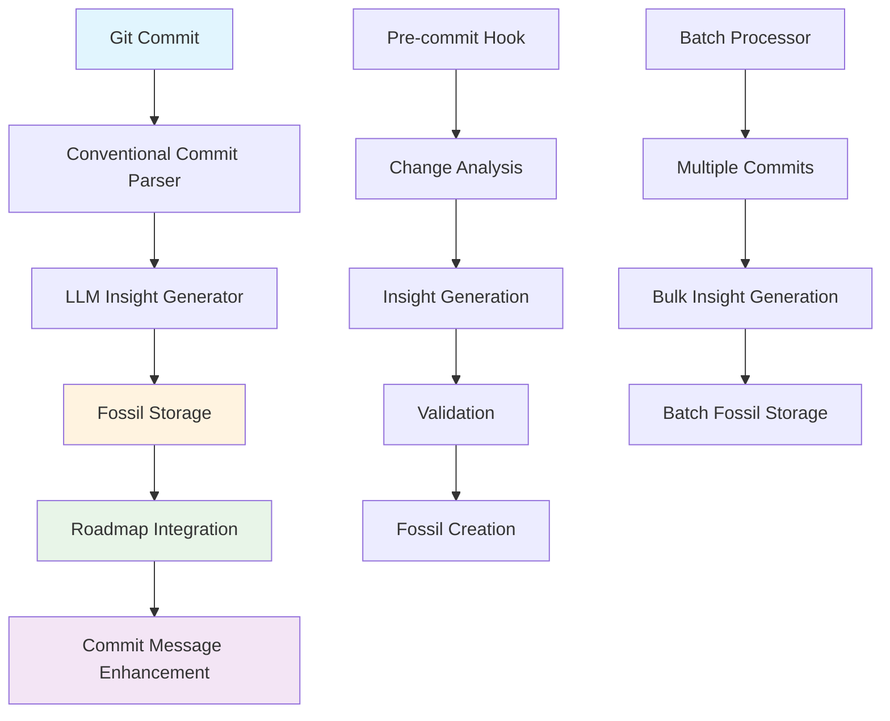
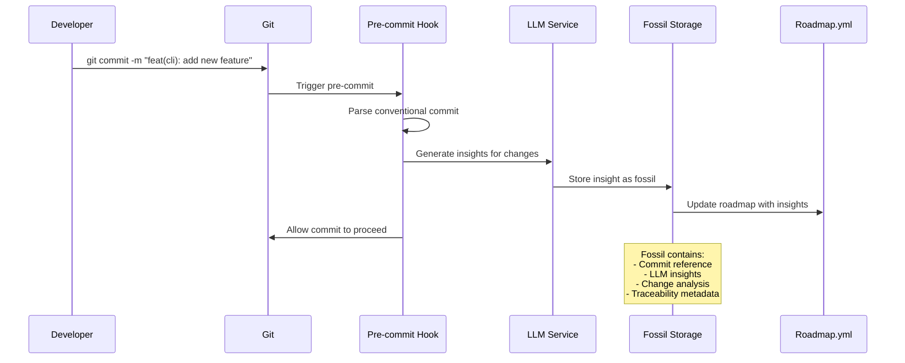

# 🧠 LLM Insights Commit Traceability System

## 📋 Overview

The LLM Insights Commit Traceability System provides a comprehensive approach to track and materialize roadmap insights with full traceability over conventional git commits. This system enables automated insight generation, fossil-backed storage, and seamless integration with existing automation workflows.

### 🎯 Purpose
- **Automated Insight Generation**: Generate LLM insights for every commit and roadmap change
- **Conventional Commit Integration**: Link insights to conventional commit messages
- **Fossil-Backed Traceability**: Store insights as fossils for full audit trail
- **Roadmap Materialization**: Automatically update roadmap.yml with LLM insights
- **Batch Processing**: Support for processing multiple commits and changes

## 🔄 System Architecture

### Core Components



### Data Flow



## 🏗️ Implementation Strategy

### 1. Conventional Commit Integration

#### Enhanced Commit Message Format
```bash
# Standard conventional commit
feat(cli): add new feature

# Enhanced with LLM insights reference
feat(cli): add new feature

LLM-Insights: fossil:insight-commit-hash-123
Roadmap-Impact: high
Automation-Scope: cli, fossilization
```

#### Commit Message Parser
```typescript
interface CommitMessageAnalysis {
  message: string;
  conventionalFormat: boolean;
  type: string;
  scope: string;
  description: string;
  llmInsightsRef?: string;
  roadmapImpact?: 'low' | 'medium' | 'high';
  automationScope?: string[];
  breakingChange: boolean;
  issues: string[];
  suggestions: string[];
  score: number;
}
```

### 2. LLM Insight Generation

#### Insight Types
```typescript
interface LLMCommitInsight {
  commitHash: string;
  commitMessage: string;
  changes: FileChange[];
  insights: {
    summary: string;
    impact: 'low' | 'medium' | 'high';
    category: string;
    blockers: string[];
    recommendations: string[];
    automationOpportunities: string[];
  };
  roadmapIntegration: {
    affectedTasks: string[];
    newTasks: string[];
    updatedStatus: string[];
  };
  fossilMetadata: {
    fossilId: string;
    timestamp: string;
    model: string;
    provider: string;
  };
}
```

#### Insight Generation Process
```typescript
async function generateCommitInsights(params: {
  commitHash: string;
  commitMessage: string;
  changes: FileChange[];
  llmService: LLMService;
}): Promise<LLMCommitInsight> {
  // 1. Parse conventional commit
  const commitAnalysis = parseConventionalCommit(params.commitMessage);
  
  // 2. Analyze changes
  const changeAnalysis = await analyzeChanges(params.changes);
  
  // 3. Generate LLM insights
  const insights = await generateLLMInsights({
    commit: commitAnalysis,
    changes: changeAnalysis,
    llm: params.llmService
  });
  
  // 4. Create fossil
  const fossil = await createInsightFossil(insights);
  
  // 5. Update roadmap
  await updateRoadmapWithInsights(insights);
  
  return {
    commitHash: params.commitHash,
    commitMessage: params.commitMessage,
    changes: params.changes,
    insights,
    roadmapIntegration: await getRoadmapIntegration(insights),
    fossilMetadata: fossil.metadata
  };
}
```

### 3. Fossil-Backed Storage

#### Insight Fossil Structure
```typescript
interface LLMCommitInsightFossil extends LLMInsightFossil {
  type: 'commit-insight';
  commitHash: string;
  commitMessage: string;
  conventionalAnalysis: CommitMessageAnalysis;
  changeAnalysis: ChangeAnalysis;
  roadmapImpact: RoadmapImpact;
  automationOpportunities: AutomationOpportunity[];
  traceability: {
    commitRef: string;
    fossilId: string;
    parentFossils: string[];
    childFossils: string[];
  };
}
```

#### Fossil Storage Strategy
```typescript
// Store in fossils/commit_insights/
const fossilPath = `fossils/commit_insights/${commitHash}.json`;

// Create fossil with full traceability
const fossil: LLMCommitInsightFossil = {
  type: 'commit-insight',
  timestamp: new Date().toISOString(),
  model: 'llama2',
  provider: 'ollama',
  excerpt: `Insights for commit ${commitHash}: ${insights.summary}`,
  promptId: 'commit-analysis-v1',
  promptVersion: 'v1',
  prompt: `Analyze commit: ${commitMessage}`,
  systemMessage: 'You are an expert code reviewer and automation specialist.',
  inputHash: commitHash,
  commitRef: commitHash,
  response: JSON.stringify(insights, null, 2),
  commitHash,
  commitMessage,
  conventionalAnalysis,
  changeAnalysis,
  roadmapImpact,
  automationOpportunities,
  traceability: {
    commitRef: commitHash,
    fossilId: `commit-insight-${commitHash}`,
    parentFossils: [],
    childFossils: []
  }
};
```

### 4. Roadmap Integration

#### Roadmap Update Process
```typescript
interface RoadmapInsightUpdate {
  taskId: string;
  llmInsights: {
    summary: string;
    blockers: string[];
    recommendations: string[];
    impact: string;
    deadline?: string;
    done?: {
      retrospective: string;
      insights: string[];
      completedAt: string;
    };
  };
  commitReference: string;
  fossilId: string;
}

async function updateRoadmapWithCommitInsights(
  insights: LLMCommitInsight
): Promise<void> {
  // 1. Load current roadmap
  const roadmap = await loadRoadmap();
  
  // 2. Match insights to roadmap tasks
  const matchedTasks = matchInsightsToTasks(insights, roadmap);
  
  // 3. Update tasks with insights
  for (const task of matchedTasks) {
    const update: RoadmapInsightUpdate = {
      taskId: task.id,
      llmInsights: insights.insights,
      commitReference: insights.commitHash,
      fossilId: insights.fossilMetadata.fossilId
    };
    
    await updateRoadmapTask(task.id, update);
  }
  
  // 4. Create new tasks if needed
  const newTasks = generateNewTasksFromInsights(insights);
  for (const task of newTasks) {
    await addRoadmapTask(task);
  }
  
  // 5. Save updated roadmap
  await saveRoadmap(roadmap);
}
```

## 🚀 Usage Patterns

### 1. Pre-commit Integration

#### Enhanced Pre-commit Hook
```typescript
// scripts/precommit-llm-insight.ts
async function precommitLLMInsight() {
  // 1. Get staged changes
  const stagedChanges = await getStagedChanges();
  
  // 2. Generate insights
  const insights = await generateCommitInsights({
    commitHash: 'HEAD',
    commitMessage: await getCommitMessage(),
    changes: stagedChanges,
    llmService: await createLLMService()
  });
  
  // 3. Create fossil
  await fossilizeCommitInsight(insights);
  
  // 4. Update roadmap
  await updateRoadmapWithInsights(insights);
  
  // 5. Enhance commit message
  const enhancedMessage = enhanceCommitMessage(
    await getCommitMessage(),
    insights
  );
  
  // 6. Update commit message
  await updateCommitMessage(enhancedMessage);
}
```

### 2. Batch Processing

#### Batch Insight Generation
```typescript
interface BatchInsightConfig {
  commitRange: string;
  includeStaged?: boolean;
  includeUnstaged?: boolean;
  llmService: LLMService;
  outputFormat: 'json' | 'yaml' | 'markdown';
}

async function generateBatchInsights(
  config: BatchInsightConfig
): Promise<BatchInsightResult> {
  // 1. Get commit range
  const commits = await getCommitsInRange(config.commitRange);
  
  // 2. Process each commit
  const results: LLMCommitInsight[] = [];
  
  for (const commit of commits) {
    const changes = await getCommitChanges(commit.hash);
    const insights = await generateCommitInsights({
      commitHash: commit.hash,
      commitMessage: commit.message,
      changes,
      llmService: config.llmService
    });
    
    results.push(insights);
  }
  
  // 3. Create batch fossil
  const batchFossil = await createBatchInsightFossil(results);
  
  // 4. Generate report
  const report = await generateBatchReport(results, config.outputFormat);
  
  return {
    insights: results,
    batchFossil,
    report,
    summary: {
      totalCommits: commits.length,
      totalInsights: results.length,
      averageImpact: calculateAverageImpact(results),
      automationOpportunities: extractAutomationOpportunities(results)
    }
  };
}
```

### 3. CLI Integration

#### Commit Analysis CLI
```bash
# Analyze current commit
bun run src/cli/analyze-commit.ts --commit HEAD

# Analyze commit range
bun run src/cli/analyze-commit.ts --range HEAD~5..HEAD

# Generate insights for staged changes
bun run src/cli/analyze-commit.ts --staged

# Export insights in different formats
bun run src/cli/analyze-commit.ts --commit HEAD --format json
bun run src/cli/analyze-commit.ts --commit HEAD --format markdown
bun run src/cli/analyze-commit.ts --commit HEAD --format yaml
```

## 📊 Traceability Features

### 1. Commit-to-Fossil Mapping

#### Traceability Matrix
```typescript
interface TraceabilityMatrix {
  commitHash: string;
  fossils: {
    insight: string;
    validation?: string;
    benchmark?: string;
    discovery?: string;
  };
  roadmapTasks: string[];
  automationTriggers: string[];
  dependencies: {
    parentCommits: string[];
    childCommits: string[];
    relatedFossils: string[];
  };
}
```

#### Traceability Queries
```typescript
// Find all fossils for a commit
async function getCommitFossils(commitHash: string): Promise<AnyLLMFossil[]>

// Find all commits for a fossil
async function getFossilCommits(fossilId: string): Promise<string[]>

// Find roadmap tasks affected by a commit
async function getCommitRoadmapTasks(commitHash: string): Promise<RoadmapTask[]>

// Find automation opportunities from commit insights
async function getCommitAutomationOpportunities(commitHash: string): Promise<AutomationOpportunity[]>
```

### 2. Insight Chain Tracking

#### Insight Dependencies
```typescript
interface InsightChain {
  rootInsight: string;
  chain: {
    insightId: string;
    dependencyType: 'parent' | 'child' | 'related';
    relationship: string;
    timestamp: string;
  }[];
  metadata: {
    chainLength: number;
    averageQuality: number;
    automationImpact: number;
  };
}
```

## 🔧 Configuration

### Environment Variables
```bash
# LLM Configuration
LLM_PREFER_LOCAL=true
LLM_DEFAULT_MODEL=llama2
OLLAMA_HOST=http://localhost:11434

# Fossil Configuration
FOSSIL_STORAGE_PATH=fossils/commit_insights/
FOSSIL_BACKUP_ENABLED=true

# Roadmap Configuration
ROADMAP_AUTO_UPDATE=true
ROADMAP_INSIGHT_THRESHOLD=0.7

# Traceability Configuration
TRACEABILITY_ENABLED=true
TRACEABILITY_DEPTH=5
```

### Configuration Schema
```typescript
interface LLMInsightConfig {
  llm: {
    preferLocal: boolean;
    defaultModel: string;
    fallbackProvider: string;
  };
  fossil: {
    storagePath: string;
    backupEnabled: boolean;
    retentionDays: number;
  };
  roadmap: {
    autoUpdate: boolean;
    insightThreshold: number;
    maxInsightsPerTask: number;
  };
  traceability: {
    enabled: boolean;
    depth: number;
    includeMetadata: boolean;
  };
}
```

## 📈 Quality Metrics

### Insight Quality Assessment
```typescript
interface InsightQualityMetrics {
  relevance: number;        // 0-1: How relevant to the commit
  specificity: number;      // 0-1: How specific and actionable
  completeness: number;     // 0-1: How complete the analysis
  accuracy: number;         // 0-1: How accurate the insights
  automationValue: number;  // 0-1: Potential automation value
  overall: number;          // 0-1: Overall quality score
}
```

### Quality Validation
```typescript
async function validateInsightQuality(
  insight: LLMCommitInsight
): Promise<InsightQualityMetrics> {
  const metrics: InsightQualityMetrics = {
    relevance: calculateRelevance(insight),
    specificity: calculateSpecificity(insight),
    completeness: calculateCompleteness(insight),
    accuracy: calculateAccuracy(insight),
    automationValue: calculateAutomationValue(insight),
    overall: 0
  };
  
  metrics.overall = (
    metrics.relevance * 0.3 +
    metrics.specificity * 0.25 +
    metrics.completeness * 0.2 +
    metrics.accuracy * 0.15 +
    metrics.automationValue * 0.1
  );
  
  return metrics;
}
```

## 🚀 Future Enhancements

### 1. Advanced Automation

#### Automated Task Creation
```typescript
interface AutomatedTaskGeneration {
  trigger: 'commit-insight' | 'roadmap-gap' | 'automation-opportunity';
  source: string;
  generatedTasks: RoadmapTask[];
  confidence: number;
  reasoning: string;
}
```

#### Intelligent Routing
```typescript
interface InsightRouting {
  insightType: 'commit' | 'roadmap' | 'automation';
  priority: 'low' | 'medium' | 'high' | 'critical';
  routingRules: RoutingRule[];
  destination: 'roadmap' | 'automation' | 'documentation' | 'testing';
}
```

### 2. Enhanced Traceability

#### Cross-Repository Tracking
```typescript
interface CrossRepoTraceability {
  sourceRepo: string;
  targetRepo: string;
  commitMapping: Map<string, string>;
  fossilMapping: Map<string, string>;
  dependencyGraph: DependencyNode[];
}
```

#### Temporal Analysis
```typescript
interface TemporalInsightAnalysis {
  timeRange: string;
  trends: InsightTrend[];
  patterns: InsightPattern[];
  predictions: InsightPrediction[];
}
```

## 📚 Integration Examples

### 1. GitHub Actions Integration
```yaml
# .github/workflows/llm-insights.yml
name: LLM Insights Generation
on:
  push:
    branches: [main, develop]
  pull_request:
    branches: [main]

jobs:
  generate-insights:
    runs-on: ubuntu-latest
    steps:
      - uses: actions/checkout@v3
      - uses: actions/setup-node@v3
        with:
          node-version: '18'
      
      - name: Setup Bun
        uses: oven-sh/setup-bun@v1
      
      - name: Generate LLM Insights
        run: |
          bun run src/cli/analyze-commit.ts --range ${{ github.event.before }}..${{ github.event.after }}
      
      - name: Update Roadmap
        run: |
          bun run scripts/update-roadmap-with-insights.ts
      
      - name: Commit Changes
        run: |
          git config user.name "GitHub Actions"
          git config user.email "actions@github.com"
          git add fossils/commit_insights/ fossils/roadmap.yml
          git commit -m "feat(automation): update roadmap with LLM insights" || exit 0
          git push
```

### 2. Local Development Integration
```bash
#!/bin/bash
# scripts/pre-commit-llm-insight.sh

# Generate insights for staged changes
bun run src/cli/analyze-commit.ts --staged

# Update roadmap with insights
bun run scripts/update-roadmap-with-insights.ts

# Validate changes
bun run scripts/precommit-validate.ts
```

## 🎯 Best Practices

### 1. Insight Generation
- **Quality Over Quantity**: Focus on high-quality, actionable insights
- **Context Awareness**: Consider commit history and project context
- **Automation Focus**: Prioritize insights that enable automation
- **Traceability**: Always maintain full traceability to source commits

### 2. Fossil Management
- **Consistent Naming**: Use consistent naming conventions for fossils
- **Metadata Richness**: Include comprehensive metadata for searchability
- **Version Control**: Version fossils appropriately for changes
- **Cleanup Strategy**: Implement fossil cleanup and archival strategies

### 3. Roadmap Integration
- **Incremental Updates**: Update roadmap incrementally, not in bulk
- **Validation**: Validate all roadmap updates before committing
- **Conflict Resolution**: Handle conflicts between human and LLM insights
- **Audit Trail**: Maintain audit trail for all roadmap changes

### 4. Performance Optimization
- **Batch Processing**: Use batch processing for multiple commits
- **Caching**: Cache LLM responses for similar commits
- **Parallel Processing**: Process insights in parallel when possible
- **Resource Management**: Monitor and optimize resource usage

## 📚 Related Documentation

- [LLM Insights Workflow](./LLM_INSIGHTS_WORKFLOW.md) - Core LLM insights workflow
- [Fossil Management](./FOSSIL_MANAGEMENT_ANALYSIS.md) - Fossil management patterns
- [Conventional Commits](./DEVELOPMENT_GUIDE.md#commit-message-format) - Commit message standards
- [Roadmap Fossilization](./ROADMAP_FOSSILIZATION.md) - Roadmap fossilization patterns
- [Automation Ecosystem](./COMPLETE_AUTOMATION_ECOSYSTEM.md) - Complete automation overview

---

*This system provides a comprehensive foundation for LLM-powered commit traceability and roadmap materialization, enabling enhanced automation and insight generation across the development workflow.* 