# 🧠 LLM Insights Workflow Documentation

## 📋 Overview

The LLM Insights Workflow is an automated system that generates AI-powered analysis and recommendations for code changes, providing structured insights that guide both human decision-making and AI-powered automation.

### 🎯 Purpose
- **Automated Analysis**: Generate insights for every code change
- **Structured Data**: Provide consistent, machine-readable analysis
- **Human Guidance**: Offer actionable recommendations for developers
- **Audit Trail**: Maintain traceable, reproducible AI-generated content

### 🔄 Workflow Diagram

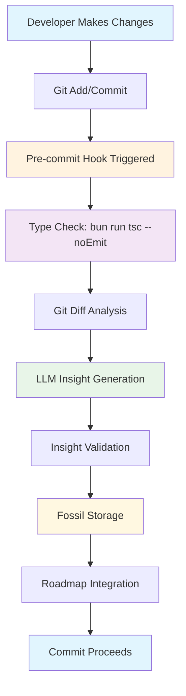

> **Note:** All steps use canonical utilities and are enforced by the validator. Deprecated patterns (direct execSync, JSON.parse, ad-hoc scripts) are blocked.

## 🏗️ Architecture

### System Components

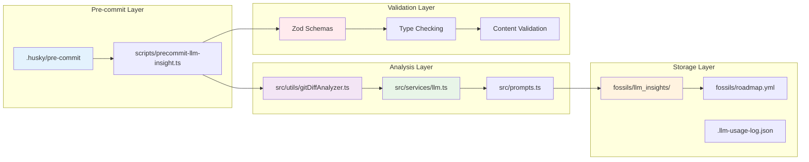

> **Note:** All steps use canonical utilities and are enforced by the validator. Deprecated patterns (direct execSync, JSON.parse, ad-hoc scripts) are blocked.

### Data Flow

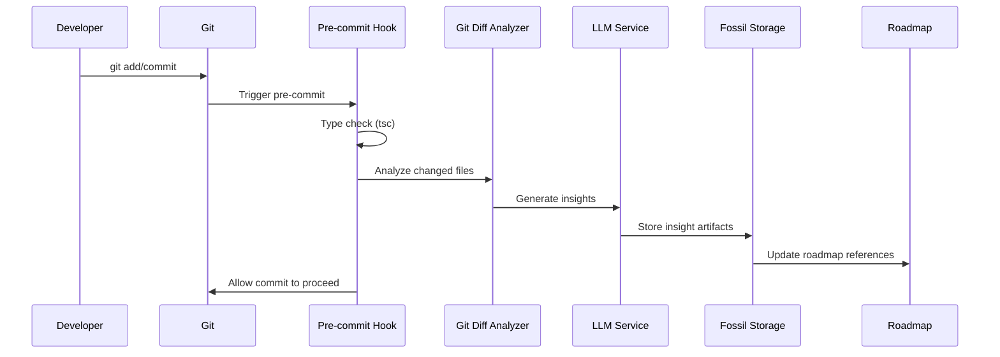

## ⚙️ Setup & Configuration

### 1. Pre-commit Hook Setup

The workflow is automatically configured via `.husky/pre-commit`:

```bash
#!/bin/sh
bun run scripts/precommit-validate.ts
```

### 2. Environment Configuration

Required environment variables in `.env`:

```bash
# LLM Provider Configuration
OPENAI_API_KEY=your_openai_key_here
OLLAMA_HOST=http://localhost:11434

# GitHub Integration
GITHUB_TOKEN=your_github_token_here

# Optional: Custom LLM Settings
LLM_PREFER_LOCAL=true
LLM_DEFAULT_MODEL=llama2
```

### 3. LLM Provider Priority

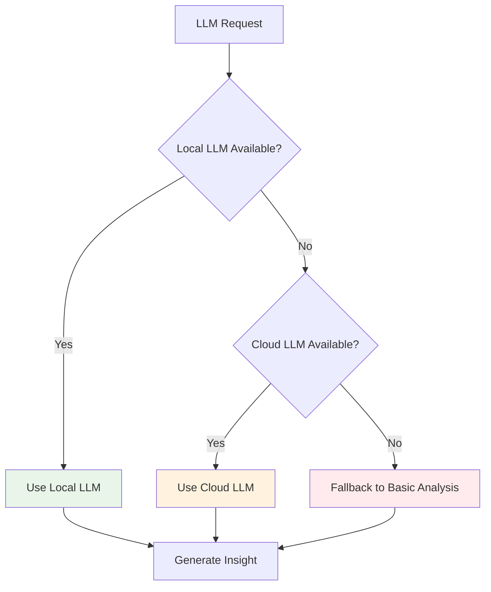

## 🚀 Usage Guide

### Manual Execution

Run the workflow manually for testing:

```bash
# Generate insights for all staged files
bun run scripts/precommit-llm-insight.ts

# Generate insights for specific file
bun run scripts/generate-llm-insights.ts --file src/utils/newFeature.ts

# Analyze git diff and generate insights
bun run src/cli/analyze-git-diff.ts --include-staged
```

### CLI Options

```bash
# Pre-commit script options
bun run scripts/precommit-llm-insight.ts [options]

Options:
  --dry-run          Preview changes without applying
  --verbose          Show detailed output
  --approve-all      Auto-approve all insights
  --review           Interactive review mode
  --skip-validation  Skip Zod schema validation
```

### Interactive Review Mode

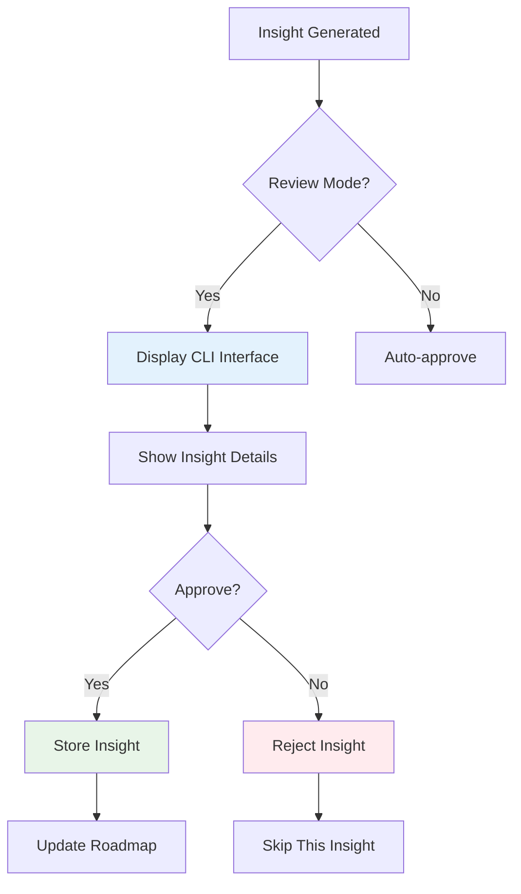

## 📊 Insight Structure

### Analysis Categories

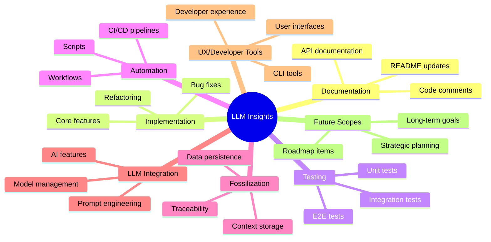

### Insight Output Format

```yaml
llmInsights:
  summary: "Task completed successfully with medium impact. documentation category task achieved objectives and is now operational."
  blockers: "None - task completed successfully."
  recommendations: "Document lessons learned and consider optimization opportunities."
  impact: "Positive - task objectives achieved and deliverables completed."
  category: "documentation"
  priority: "medium"
  status: "done"
  done:
    retrospective: "Documentation task completed successfully. Review for lessons learned and optimization opportunities."
    insights: "Consider documenting patterns and utilities for reuse in similar future tasks."
    completedAt: "2025-07-04T21:44:31.468Z"
```

## 🔍 Analysis Framework

### Strategic Priority Assessment

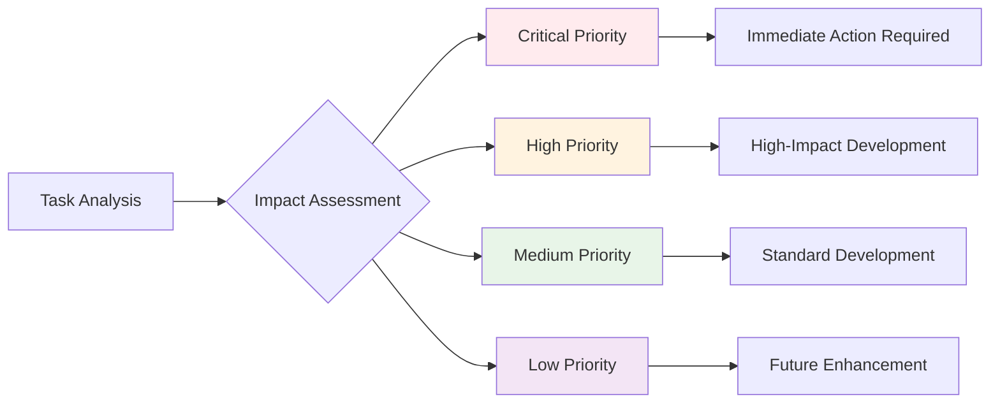

### Impact Level Classification

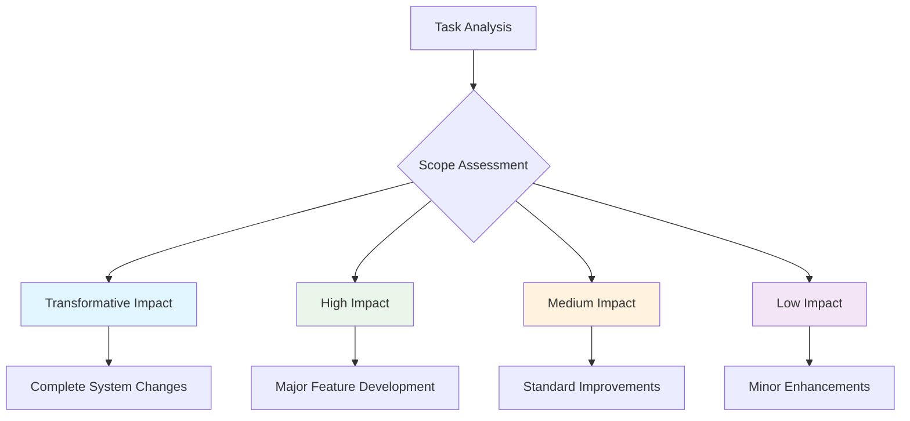

## 🛠️ Customization

### Prompt Customization

Edit `src/prompts.ts` to customize LLM prompts:

```typescript
export const PROMPT_REGISTRY: Record<string, PromptTemplate> = {
  'roadmap-insight-v2': {
    id: 'roadmap-insight',
    version: 'v2',
    description: 'Enhanced task analysis with custom categories',
    template: (params: Record<string, any>) => {
      const { task, context = '', customCategories = [] } = params;
      return `Analyze this task with enhanced categories: ${customCategories.join(', ')}
      
Task: ${task}
Context: ${context}`;
    },
    systemMessage: 'You are an expert project automation assistant with deep technical knowledge.'
  },
};
```

### Category Customization

Add custom analysis categories:

```typescript
// In your analysis script
const CUSTOM_CATEGORIES = {
  SECURITY: 'security',
  PERFORMANCE: 'performance',
  ACCESSIBILITY: 'accessibility',
  // Add your custom categories
};
```

## 🔧 Troubleshooting

### Common Issues

| Issue | Cause | Solution |
|-------|-------|----------|
| LLM service unavailable | No LLM provider configured | Set `OPENAI_API_KEY` or start Ollama |
| Type check fails | TypeScript errors in code | Fix type errors before commit |
| Insight generation fails | Invalid prompt template | Check `src/prompts.ts` syntax |
| Fossil storage fails | Invalid schema | Validate insight against Zod schema |
| Roadmap update fails | YAML syntax error | Check roadmap.yml format |

### Debug Mode

Enable verbose logging:

```bash
# Set debug environment variable
export LLM_DEBUG=true

# Run with verbose output
bun run scripts/precommit-llm-insight.ts --verbose
```

### Performance Optimization

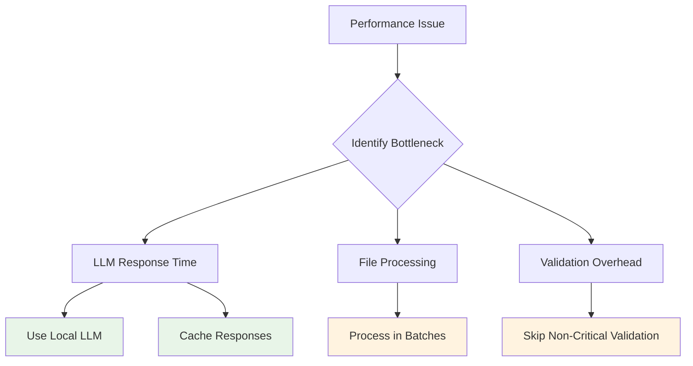

## 📈 Monitoring & Analytics

### Usage Tracking

The workflow automatically logs usage in `.llm-usage-log.json`:

```json
[
  {
    "timestamp": "2025-07-04T21:29:49.867Z",
    "model": "llama2",
    "provider": "ollama",
    "inputTokens": 97,
    "outputTokens": 0,
    "totalTokens": 97,
    "cost": 0.00014549999999999999,
    "duration": 3647,
    "success": false,
    "error": "OpenAI API error: 401",
    "context": "roadmap-llm-insight",
    "purpose": "roadmap-insight",
    "valueScore": 0.7
  }
]
```

### Performance Metrics

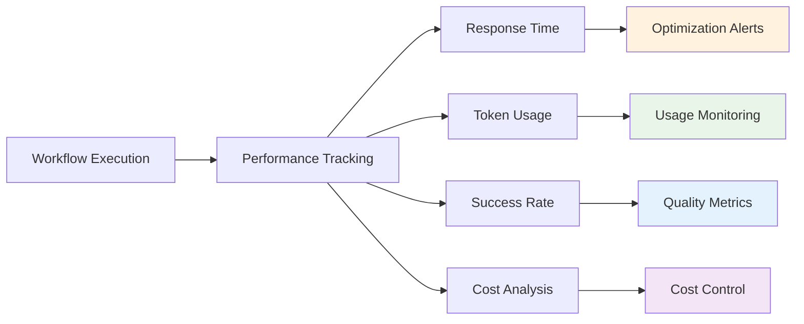

## 🔮 Future Enhancements

### Planned Features

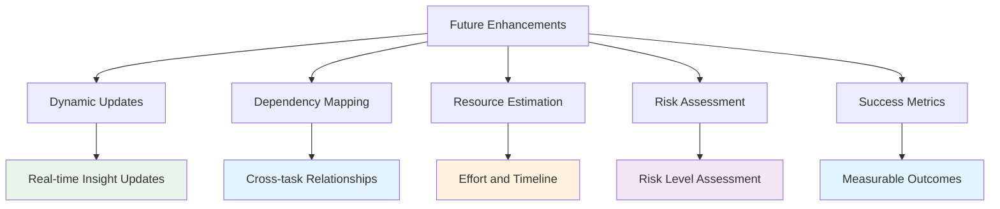

### Integration Opportunities

- **CI/CD Integration**: Automated insight updates in pipelines
- **GitHub Integration**: Issue and PR insight linking
- **Reporting**: Automated insight reporting and analytics
- **AI Enhancement**: LLM-powered insight refinement
- **Team Collaboration**: Shared insight review and approval

## 📚 API Reference

### Core Functions

```typescript
// Generate LLM insight for a task
async function generateLLMInsight(task: any, llm: LLMService): Promise<any>

// Analyze git diff and generate insights
async function analyzeDiff(config: GitDiffAnalysisConfig): Promise<DiffAnalysisResult>

// Validate insight against schema
function validateInsight(insight: any): ValidationResult

// Store insight as fossil
async function fossilizeLLMInsight(fossil: LLMInsightFossil): Promise<void>
```

### Configuration Types

```typescript
interface GitDiffAnalysisConfig {
  commitHash?: string;
  includeStaged?: boolean;
  includeUnstaged?: boolean;
  filePatterns?: string[];
  maxFiles?: number;
}

interface LLMInsightFossil {
  type: 'insight';
  timestamp: string;
  model: string;
  provider: string;
  excerpt: string;
  prompt: string;
  response: string;
  promptId: string;
  promptVersion: string;
  systemMessage: string;
  inputHash: string;
  commitRef: string;
}
```

## 🎯 Best Practices

### For Developers

1. **Review Insights**: Always review generated insights before committing
2. **Customize Prompts**: Adapt prompts for your specific use cases
3. **Monitor Performance**: Track usage and optimize for your workflow
4. **Validate Output**: Ensure insights meet your quality standards

### For Teams

1. **Standardize Categories**: Use consistent analysis categories across the team
2. **Share Templates**: Collaborate on prompt templates and configurations
3. **Review Process**: Establish clear review and approval workflows
4. **Document Patterns**: Share successful insight patterns and use cases

### For Organizations

1. **Compliance**: Ensure insights meet organizational standards
2. **Security**: Review LLM provider security and data handling
3. **Scalability**: Plan for workflow scaling across multiple projects
4. **Integration**: Integrate with existing development workflows

## 📚 Related Documentation

- [Visual Documentation Standards](./VISUAL_DOCUMENTATION_STANDARDS.md) - Comprehensive visual standards and Mermaid usage patterns
- [API Reference](API_REFERENCE.md) - Technical API documentation
- [Development Guide](DEVELOPMENT_GUIDE.md) - Development best practices
- [Environment Guide](ENVIRONMENT_GUIDE.md) - Configuration management
- [Contributing Guide](CONTRIBUTING_GUIDE.md) - How to contribute
- [Examples](../examples/basic-usage.ts) - Usage examples

---

*This documentation is automatically generated and maintained as part of the LLM insights workflow. For questions or contributions, see the project's contributing guidelines.* 