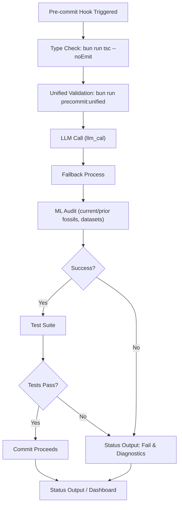
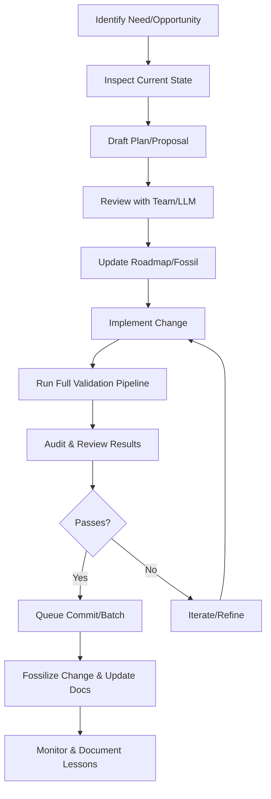
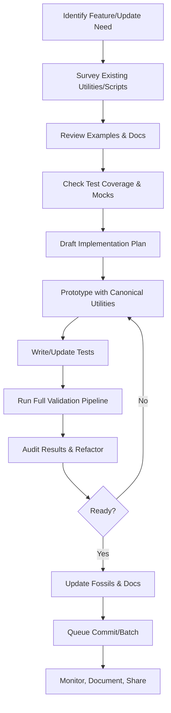

# 🚦 Pipeline Status & Audit Dashboard

## 🏷️ Repository Metadata

- **Local Repo:** `automate_workloads`
- **Remote Repo:** [BarreraSlzr/automate_workloads](https://github.com/BarreraSlzr/automate_workloads)
- **Default Branch:** `main`
- **Docs:** [GitHub Docs](https://github.com/BarreraSlzr/automate_workloads/tree/main/docs)
- **Last Sync:** <!-- Optionally auto-update this -->

---

## 🗂️ Repository Structure (Top Level)

| Path                | Type      | GitHub Link                                                                 |
|---------------------|-----------|-----------------------------------------------------------------------------|
| `/src/`             | Source    | [src/](https://github.com/BarreraSlzr/automate_workloads/tree/main/src)     |
| `/scripts/`         | Scripts   | [scripts/](https://github.com/BarreraSlzr/automate_workloads/tree/main/scripts) |
| `/fossils/`         | Fossils   | [fossils/](https://github.com/BarreraSlzr/automate_workloads/tree/main/fossils) |
| `/docs/`            | Docs      | [docs/](https://github.com/BarreraSlzr/automate_workloads/tree/main/docs)   |
| `/tests/`           | Tests     | [tests/](https://github.com/BarreraSlzr/automate_workloads/tree/main/tests) |
| `package.json`      | Config    | [package.json](https://github.com/BarreraSlzr/automate_workloads/blob/main/package.json) |
| ...                 | ...       | ...                                                                         |

---

## 📊 Central Pipeline Diagram (LLM/ML Audit POV)

> **Note:** This diagram reflects the clarified real-world order: LLM Call → Fallback → ML Audit (using current and previous commit data, fossils, or datasets) → Success/Fail → Test Suite → Status Output. Nodes can be linked to their GitHub source for direct inspection. This diagram can be updated and fossilized after each pipeline run, providing a living dashboard and audit trail for the entire process. Future automation can use this as a source of truth for status checks, dashboards, and commit planning.

---

## 🔗 Pipeline Stage Mapping

| Stage                  | Local Script/Doc                        | GitHub Link                                                                 |
|------------------------|-----------------------------------------|-----------------------------------------------------------------------------|
| Type Check             | `src/cli/analyze-git-diff.ts`           | [analyze-git-diff.ts](https://github.com/BarreraSlzr/automate_workloads/blob/main/src/cli/analyze-git-diff.ts) |
| Unified Validation     | `scripts/precommit:unified.ts`          | [precommit:unified.ts](https://github.com/BarreraSlzr/automate_workloads/blob/main/scripts/precommit:unified.ts) |
| LLM Call               | `src/services/llm.ts`                   | [llm.ts](https://github.com/BarreraSlzr/automate_workloads/blob/main/src/services/llm.ts) |
| Fallback Process       | `src/services/fallback.ts`               | [fallback.ts](https://github.com/BarreraSlzr/automate_workloads/blob/main/src/services/fallback.ts) |
| ML Audit               | `src/services/mlFunnel.ts`               | [mlFunnel.ts](https://github.com/BarreraSlzr/automate_workloads/blob/main/src/services/mlFunnel.ts) |
| Test Suite             | `tests/`                                | [tests/](https://github.com/BarreraSlzr/automate_workloads/tree/main/tests) |
| Pattern Enforcement    | `src/utils/cli.ts`                      | [cli.ts](https://github.com/BarreraSlzr/automate_workloads/blob/main/src/utils/cli.ts) |
| Fossil Curation        | `src/cli/canonical-fossil-manager.ts`    | [canonical-fossil-manager.ts](https://github.com/BarreraSlzr/automate_workloads/blob/main/src/cli/canonical-fossil-manager.ts) |
| Status Output          | `docs/PIPELINE_STATUS_AND_AUDIT_DASHBOARD.md` | [PIPELINE_STATUS_AND_AUDIT_DASHBOARD.md](https://github.com/BarreraSlzr/automate_workloads/blob/main/docs/PIPELINE_STATUS_AND_AUDIT_DASHBOARD.md) |

---

## 🗂️ Stage References & Deep Dives

- **Type Check:** See [Type and Schema Patterns](./TYPE_AND_SCHEMA_PATTERNS.md)
- **Unified Validation:** See [Canonical Fossil Management Guide](./CANONICAL_FOSSIL_MANAGEMENT_GUIDE.md)
- **LLM Call:** See [LLM Insights Workflow](./LLM_INSIGHTS_WORKFLOW.md)
- **Fallback Process:** See [Core Data Structures and Outputs](./CORE_DATA_STRUCTURES_AND_OUTPUTS.md)
- **ML Audit:** See [ML Ready Approach Success Summary](./ML_READY_APPROACH_SUCCESS_SUMMARY.md)
- **Test Suite:** See [Test Plan](./TEST_PLAN.md), [Test Coverage Plan](./TEST_COVERAGE_PLAN.md)
- **Pattern Enforcement:** See [Documentation Coherence Checklist](./DOCUMENTATION_COHERENCE_CHECKLIST.md), [Utility Patterns](./UTILITY_PATTERNS.md)
- **Fossil Curation:** See [Fossil Publication Workflow](./FOSSIL_PUBLICATION_WORKFLOW.md)
- **Status Output:** See [Visual Documentation Standards](./VISUAL_DOCUMENTATION_STANDARDS.md), [Core Data Structures and Outputs](./CORE_DATA_STRUCTURES_AND_OUTPUTS.md)

---

## 🔄 Transversal Pipelines & Project-Wide Change Approaches

For implementing or editing changes across the project (transversal refactors, batch updates, or new feature rollouts), use these patterns and references:

- **Transversal Refactor Plan:** See [TRANSVERSAL_REFACTOR_PLAN.md](./TRANSVERSAL_REFACTOR_PLAN.md)
- **Batch Commit Orchestration:** See [BATCH_COMMIT_ORCHESTRATION_GUIDE.md](./BATCH_COMMIT_ORCHESTRATION_GUIDE.md)
- **Unified Approach Summary:** See [UNIFIED_APPROACH_SUMMARY.md](./UNIFIED_APPROACH_SUMMARY.md)
- **Canonical Fossil Management:** See [CANONICAL_FOSSIL_MANAGEMENT_GUIDE.md](./CANONICAL_FOSSIL_MANAGEMENT_GUIDE.md)
- **Type & Schema Patterns:** See [TYPE_AND_SCHEMA_PATTERNS.md](./TYPE_AND_SCHEMA_PATTERNS.md)
- **Fossil Publication Workflow:** See [FOSSIL_PUBLICATION_WORKFLOW.md](./FOSSIL_PUBLICATION_WORKFLOW.md)
- **Test Plan & Coverage:** See [TEST_PLAN.md](./TEST_PLAN.md), [TEST_COVERAGE_PLAN.md](./TEST_COVERAGE_PLAN.md)

**Guidance:**
- Always start with a plan (see the refactor or batch commit guides).
- Use the canonical utilities and patterns for all changes.
- Update or create fossils for traceability.
- Validate changes with the full pipeline (diagram above).
- Document and cross-link all major changes for future audit and onboarding.

---

## 🧭 How to Use This Dashboard

- **Monitor pipeline health:** Update the diagram/status after each run.
- **Drill down:** Use the links above to explore each stage in detail, both locally and on GitHub.
- **Automate:** Use this file as a source of truth for dashboards, status checks, and commit planning.
- **Extend:** Add new stages, references, or status outputs as the project evolves.

---

**This dashboard is the canonical entry point for pipeline status, audit, transversal refactors, and future automation.** 

---

## 🔄 Transversal Pipeline: Implementing or Updating Features/Processes

When you need to inspect, implement, or update a feature or pipeline, follow this transversal process. This ensures all changes are planned, validated, fossilized, and auditable.

> **How to address next...**
>
> 1. **Identify** what needs to change (feature, bug, process, etc.).
> 2. **Inspect** the current state (code, fossils, docs).
> 3. **Draft a plan** (see [TRANSVERSAL_REFACTOR_PLAN.md](./TRANSVERSAL_REFACTOR_PLAN.md), [BATCH_COMMIT_ORCHESTRATION_GUIDE.md](./BATCH_COMMIT_ORCHESTRATION_GUIDE.md)).
> 4. **Review** with team or LLM for feedback.
> 5. **Update the roadmap/fossil** to track the change.
> 6. **Implement** the change using canonical patterns/utilities.
> 7. **Run the full validation pipeline** (see diagram above).
> 8. **Audit and review** results; if not passing, iterate.
> 9. **Queue for commit/batch** when ready.
> 10. **Fossilize** the change and update documentation.
> 11. **Monitor** and document lessons for future improvements.

**References:**
- [TRANSVERSAL_REFACTOR_PLAN.md](./TRANSVERSAL_REFACTOR_PLAN.md)
- [BATCH_COMMIT_ORCHESTRATION_GUIDE.md](./BATCH_COMMIT_ORCHESTRATION_GUIDE.md)
- [CANONICAL_FOSSIL_MANAGEMENT_GUIDE.md](./CANONICAL_FOSSIL_MANAGEMENT_GUIDE.md)
- [PROJECT_STRUCTURE.md](./PROJECT_STRUCTURE.md)
- [PIPELINE_STATUS_AND_AUDIT_DASHBOARD.md](./PIPELINE_STATUS_AND_AUDIT_DASHBOARD.md) 

---

## 🔍 Detailed Transversal Pipeline: Leveraging Current Utilities, Scripts, and Tests

This pipeline shows how to address new features or updates by making the most of the project's current utilities, scripts, examples, and test coverage. It ensures you use the best available helpers and patterns at every step.

> **How to address with current art state:**
>
> 1. **Identify** the feature or update needed.
> 2. **Survey** all relevant utilities in [`src/utils/`](https://github.com/BarreraSlzr/automate_workloads/tree/main/src/utils) and scripts in [`scripts/`](https://github.com/BarreraSlzr/automate_workloads/tree/main/scripts).
> 3. **Review examples** in [`examples/`](https://github.com/BarreraSlzr/automate_workloads/tree/main/examples) and documentation for patterns and best practices.
> 4. **Check test coverage** and available mocks in [`tests/`](https://github.com/BarreraSlzr/automate_workloads/tree/main/tests).
> 5. **Draft a plan** that leverages canonical utilities and avoids duplication.
> 6. **Prototype** using helpers/utilities, updating or extending as needed.
> 7. **Write or update tests** to ensure coverage and correctness.
> 8. **Run the full validation pipeline** (see above) to catch issues early.
> 9. **Audit and refactor** based on results; iterate if needed.
> 10. **Update fossils and documentation** to capture the change.
> 11. **Queue for commit or batch** when ready.
> 12. **Monitor, document, and share** lessons learned for future improvements.

**Key References:**
- [src/utils/](https://github.com/BarreraSlzr/automate_workloads/tree/main/src/utils) — Canonical utilities
- [scripts/](https://github.com/BarreraSlzr/automate_workloads/tree/main/scripts) — Automation scripts
- [examples/](https://github.com/BarreraSlzr/automate_workloads/tree/main/examples) — Usage patterns
- [tests/](https://github.com/BarreraSlzr/automate_workloads/tree/main/tests) — Test coverage and mocks
- [fossils/](https://github.com/BarreraSlzr/automate_workloads/tree/main/fossils) — Fossilized context and outputs
- [docs/PIPELINE_STATUS_AND_AUDIT_DASHBOARD.md](./PIPELINE_STATUS_AND_AUDIT_DASHBOARD.md) — This dashboard 

---

## 🧩 Pipeline Stages, Canonical Types, and Schemas: Integration Map

This section maps every major pipeline stage to its canonical types and schemas, with explicit notes on integration breakpoints and how to avoid circular loops during extension or integration.

### 🔗 Integration Map Table

| Pipeline Stage                | Canonical Types (from @/types)         | Canonical Schemas (from schemas.ts)         | Integration Breakpoints / Notes                |
|------------------------------|----------------------------------------|---------------------------------------------|------------------------------------------------|
| Pre-commit Validation        | ValidationResult, TestResult           | ValidationResultSchema                      | Only validate via CLI entrypoints; never call validation recursively from within hooks. |
| LLM Call & Audit             | LLMProvider, LLMUsageMetrics           | LLMInputSchema, LLMFossilManagerParamsSchema| Always use Params Object Pattern; avoid calling LLM from within fossilization or audit logic. |
| Fossilization                | BaseFossil, ContextEntry               | BaseFossilParamsSchema, ContextEntrySchema  | Fossilization must not trigger new audits or LLM calls. |
| Test Monitoring              | TestMonitorConfig, TestMonitoringResult| (see test-monitoring.ts)                    | Test monitoring should only report, not mutate pipeline state. |
| Commit Message Validation    | CommitAuditData, CommitFix             | CommitAuditDataSchema, CommitFixSchema      | Never auto-commit from within validation; always require explicit queue/approval. |
| Project Status/Footprint     | FileFootprint, ProjectStatus           | FileAnalysisSchema, ProjectStatusSchema     | Status/footprint scripts must not trigger new fossilization or validation. |

### 🛡️ Guidance: Avoiding Circular Loops & Integration Pitfalls

- **Never trigger fossilization, LLM calls, or audits from within validation or commit hooks.**
- **Always use the Params Object Pattern and validate all inputs at the CLI/service boundary.**
- **Keep each pipeline stage idempotent and side-effect free unless explicitly designed otherwise.**
- **When extending the pipeline:**
  - Map new stages to canonical types/schemas in @/types and schemas.ts.
  - Update this table and the dashboard diagram.
  - Document any new integration breakpoints or restrictions.
- **For cross-pipeline integrations:**
  - Use explicit orchestration scripts (never implicit triggers).
  - Fossilize integration points for traceability.

> **Note:** This map and guidance are designed to prevent circular loops and integration breakpoints as the project grows. Always review and update this section when making transversal changes or adding new automation. 