```mermaid
graph TD
    %% Types and Schemas
    subgraph Types
      A1[core.ts] 
      A2[fossil.ts]
      A3[cli.ts]
      A4[llm.ts]
      A5[workflow.ts]
      A6[performance.ts]
      A7[external.ts]
      A8[error-snapshot-log.ts]
      A9[memory-monitoring.ts]
      A10[event-loop-monitoring.ts]
      A11[roadmapInsights.ts]
      A12[examples.ts]
      A13[legacy-fossil.ts]
    end
    subgraph Schemas
      S1[schemas.ts]
    end

    %% Scripts and Services
    subgraph Scripts
      SC1[scripts/automation/*]
      SC2[scripts/migrations/*]
      SC3[scripts/monitoring/*]
      SC4[scripts/add-llm-insights-to-roadmap.ts]
      SC5[scripts/analyze-batch-plan.ts]
      SC6[scripts/advanced-fossil-analysis.ts]
    end
    subgraph Services
      SV1[src/services/github.ts]
      SV2[src/services/llm.ts]
      SV3[src/services/llmEnhanced.ts]
      SV4[src/services/llmPredictiveMonitoring.ts]
    end
    subgraph CLI
      CLI1[src/cli/analyze-git-diff.ts]
      CLI2[src/cli/automate-github-fossils.ts]
      CLI3[src/cli/canonical-fossil-manager.ts]
    end

    %% Relationships
    S1 -->|"Validates"| A1
    S1 -->|"Validates"| A2
    S1 -->|"Validates"| A3
    S1 -->|"Validates"| A4
    S1 -->|"Validates"| A5
    S1 -->|"Validates"| A6
    S1 -->|"Validates"| A7
    S1 -->|"Validates"| A8
    S1 -->|"Validates"| A9
    S1 -->|"Validates"| A10
    S1 -->|"Validates"| A11
    S1 -->|"Validates"| A12
    S1 -->|"Validates"| A13

    SC1 -->|"Uses"| S1
    SC2 -->|"Uses"| S1
    SC3 -->|"Uses"| S1
    SC4 -->|"Uses"| S1
    SC5 -->|"Uses"| S1
    SC6 -->|"Uses"| S1

    SC1 -->|"Implements"| A2
    SC2 -->|"Implements"| A3
    SC3 -->|"Implements"| A6
    SC4 -->|"Implements"| A11
    SC5 -->|"Implements"| A5
    SC6 -->|"Implements"| A8

    SV1 -->|"Implements"| A3
    SV1 -->|"Implements"| A2
    SV2 -->|"Implements"| A4
    SV3 -->|"Implements"| A4
    SV4 -->|"Implements"| A4

    SV1 -->|"Validates"| S1
    SV2 -->|"Validates"| S1
    SV3 -->|"Validates"| S1
    SV4 -->|"Validates"| S1

    CLI1 -->|"Uses"| S1
    CLI2 -->|"Uses"| S1
    CLI3 -->|"Uses"| S1
    CLI1 -->|"Implements"| A3
    CLI2 -->|"Implements"| A2
    CLI3 -->|"Implements"| A2

    %% Package Scripts
    subgraph PackageScripts
      PKG1[package.json scripts]
    end
    PKG1 -->|"Runs"| SC1
    PKG1 -->|"Runs"| SC2
    PKG1 -->|"Runs"| SC3
    PKG1 -->|"Runs"| SC4
    PKG1 -->|"Runs"| SC5
    PKG1 -->|"Runs"| SC6
    PKG1 -->|"Runs"| CLI1
    PKG1 -->|"Runs"| CLI2
    PKG1 -->|"Runs"| CLI3

    %% Legend
    classDef types fill:#e0f7fa,stroke:#00796b;
    classDef schemas fill:#fff3e0,stroke:#e65100;
    classDef scripts fill:#f3e5f5,stroke:#6a1b9a;
    classDef services fill:#e8f5e9,stroke:#2e7d32;
    classDef cli fill:#fbe9e7,stroke:#bf360c;
    classDef pkg fill:#f9fbe7,stroke:#827717;
    class Types types;
    class Schemas schemas;
    class Scripts scripts;
    class Services services;
    class CLI cli;
    class PackageScripts pkg;
```

# 🗺️ Schema, Type, Script, and Service Relationship Diagram

This document provides a comprehensive, up-to-date visual map of how schemas, types, package scripts, and service endpoints are related in the automation ecosystem. Use this as a reference for onboarding, refactoring, and future automation.

---

## 📐 Canonical Relationship Diagram

---

**Legend:**
- **Types**: Centralized interfaces and types in `src/types/`
- **Schemas**: Zod schema registry in `src/types/schemas.ts`
- **Scripts**: Automation, migration, and monitoring scripts
- **Services**: Core service endpoints (GitHub, LLM, etc.)
- **CLI**: Canonical CLI entrypoints
- **PackageScripts**: `package.json` scripts orchestrating the pipeline

> **Note:** This diagram is a living artifact. Update it as you add or refactor types, schemas, scripts, or services to keep the project fully traceable and ML/LLM-ready. 