# 📊 Visual Documentation Standards

## 📋 Overview

This document establishes comprehensive standards for visual documentation using Mermaid diagrams across the automation ecosystem. These standards ensure consistent, human-auditable visual representations for technical audiences, issue bodies, fossil management, and automated outputs.

## 🎯 Purpose

- **Human Audit**: Provide visual clarity for complex workflows and relationships
- **Technical Communication**: Bridge technical and non-technical audiences
- **Issue Management**: Enhance GitHub issue bodies with visual context
- **Fossil Documentation**: Add visual elements to fossil publication outputs
- **Automation Transparency**: Make automated processes visually traceable

## 🔄 Mermaid Usage Patterns

### 1. Workflow Diagrams

#### Standard Workflow Pattern
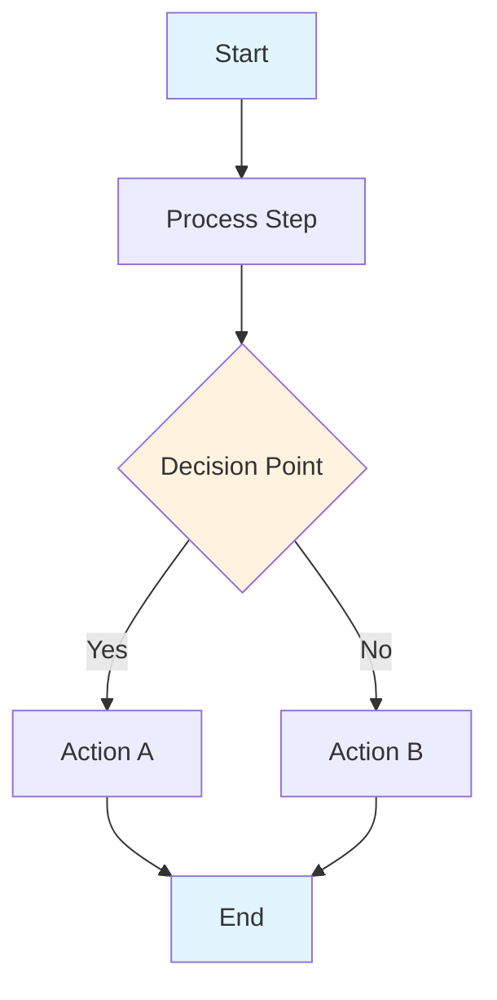

#### Automation Workflow Pattern
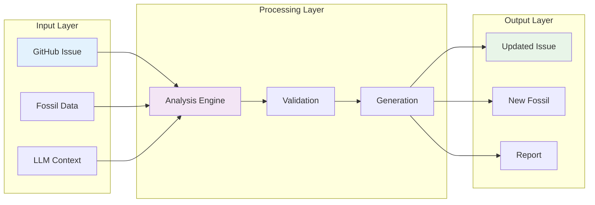

### 2. System Architecture Diagrams

#### Component Architecture
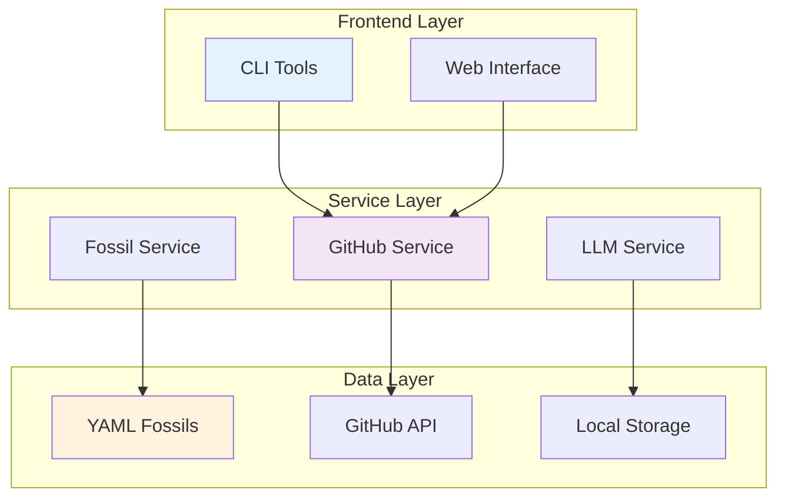

### 3. Data Flow Diagrams

#### Fossil Publication Flow
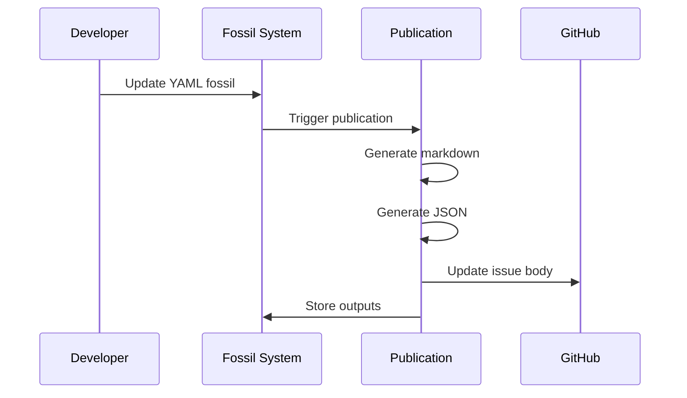

### 4. Decision Trees

#### Issue Creation Decision Tree
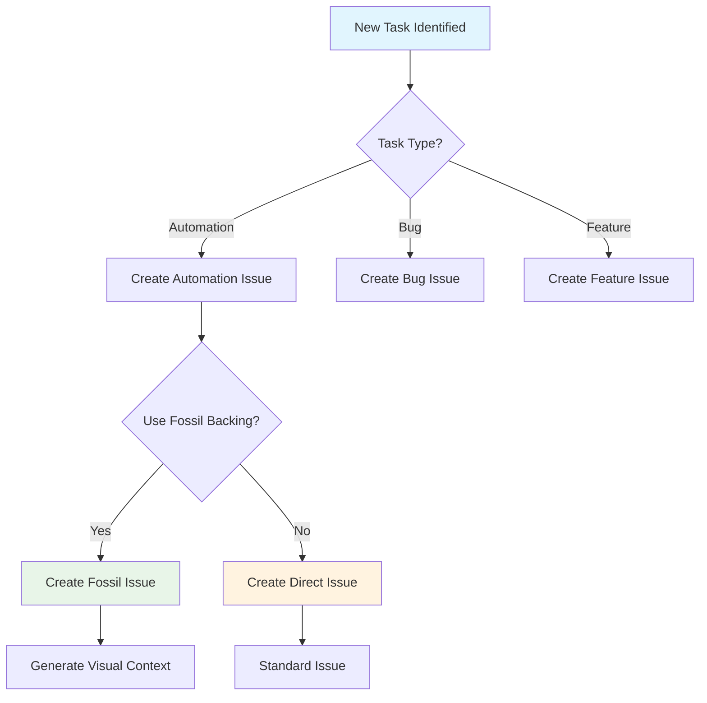

## 📝 Issue Body Visual Standards

### 1. Issue Body Template with Visuals

```markdown
## 🎯 Task Overview

### Purpose
[Task description with clear objectives]

### Visual Context
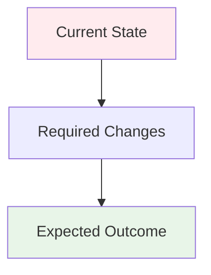

### Implementation Flow
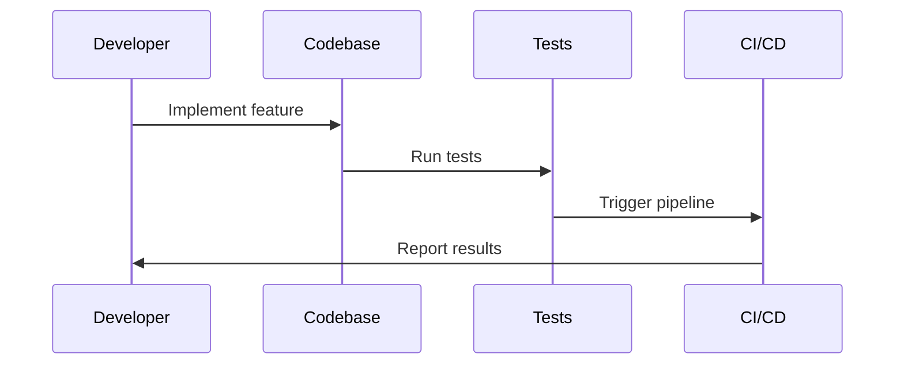

### Checklist
- [ ] [ ] Task 1
- [ ] [ ] Task 2
- [ ] [ ] Task 3

### Dependencies
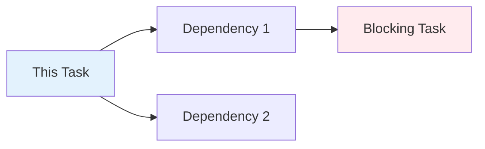

### Success Metrics
- [ ] Metric 1: [target value]
- [ ] Metric 2: [target value]
```

### 2. Automation Issue Visual Template

```markdown
## 🤖 Automation Task

### Purpose
[Automation objective with clear scope]

### Current Workflow
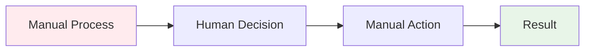

### Proposed Automation
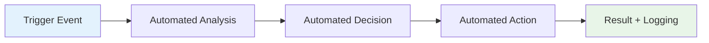

### Implementation Steps
1. **Analysis Phase**
   ```mermaid
   graph TD
       A[Input Data] --> B[Pattern Recognition]
       B --> C[Decision Logic]
       C --> D[Output Format]
   ```

2. **Execution Phase**
   ```mermaid
   graph TD
       A[Trigger] --> B[Validation]
       B --> C[Execution]
       C --> D[Verification]
   ```

### Risk Assessment
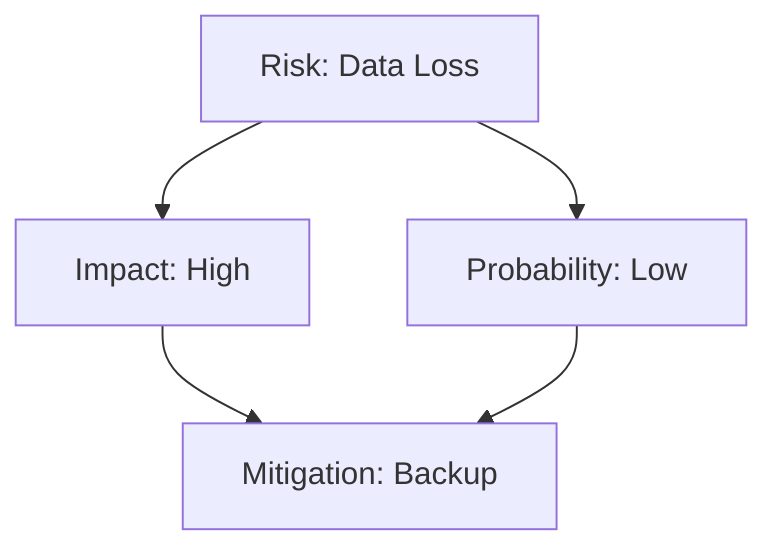

### Success Criteria
- [ ] Automation reduces manual effort by [X]%
- [ ] Error rate remains below [Y]%
- [ ] Processing time improves by [Z]%
```

## 🗿 Fossil Management Visual Standards

### 1. Fossil Publication Visual Flow

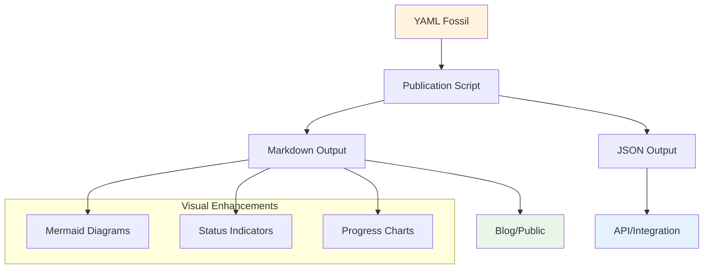

### 2. Fossil Relationship Visualization

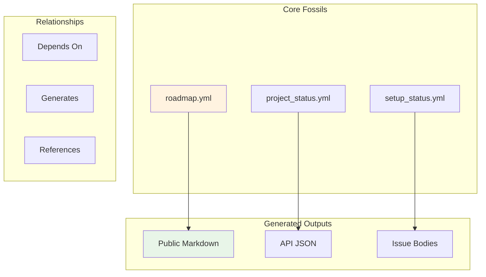

## 🔧 Technical Implementation

### 1. Mermaid Diagram Generation

#### Utility Function
```typescript
interface DiagramConfig {
  type: 'workflow' | 'architecture' | 'flow' | 'decision';
  title?: string;
  description?: string;
  theme?: 'default' | 'dark' | 'forest';
}

function generateMermaidDiagram(config: DiagramConfig, data: any): string {
  // Implementation for generating Mermaid diagrams
  // based on configuration and data
}
```

#### Diagram Templates
```typescript
const DIAGRAM_TEMPLATES = {
  workflow: (steps: string[]) => `
    graph TD
      ${steps.map((step, i) => `${String.fromCharCode(65 + i)}[${step}]`).join('\n      ')}
      ${steps.map((_, i) => i < steps.length - 1 ? `${String.fromCharCode(65 + i)} --> ${String.fromCharCode(66 + i)}` : '').filter(Boolean).join('\n      ')}
  `,
  
  architecture: (components: string[]) => `
    graph TB
      ${components.map(comp => `subgraph "${comp.name}"\n        ${comp.items.join('\n        ')}\n      end`).join('\n      ')}
  `,
  
  flow: (participants: string[], interactions: string[]) => `
    sequenceDiagram
      ${participants.map(p => `participant ${p.name} as ${p.label}`).join('\n      ')}
      ${interactions.map(i => `${i.from}->>${i.to}: ${i.message}`).join('\n      ')}
  `
};
```

### 2. Issue Body Enhancement

#### Enhanced Issue Body Generator
```typescript
interface VisualIssueBodyParams {
  purpose: string;
  checklist: string[];
  dependencies?: string[];
  workflow?: WorkflowStep[];
  architecture?: Component[];
  risks?: Risk[];
}

function generateVisualIssueBody(params: VisualIssueBodyParams): string {
  const { purpose, checklist, dependencies, workflow, architecture, risks } = params;
  
  return `
## 🎯 Task Overview

### Purpose
${purpose}

${workflow ? `
### Workflow
\`\`\`mermaid
${generateWorkflowDiagram(workflow)}
\`\`\`
` : ''}

${architecture ? `
### Architecture
\`\`\`mermaid
${generateArchitectureDiagram(architecture)}
\`\`\`
` : ''}

### Checklist
${checklist.map(item => `- [ ] ${item}`).join('\n')}

${dependencies ? `
### Dependencies
\`\`\`mermaid
${generateDependencyDiagram(dependencies)}
\`\`\`
` : ''}

${risks ? `
### Risk Assessment
\`\`\`mermaid
${generateRiskDiagram(risks)}
\`\`\`
` : ''}
  `.trim();
}
```

### 3. Fossil Publication Enhancement

#### Enhanced Publication Script
```typescript
interface PublicationConfig {
  source: string;
  outputs: {
    markdown: string;
    json: string;
  };
  visualizations?: {
    workflow?: boolean;
    architecture?: boolean;
    relationships?: boolean;
  };
}

async function publishFossilWithVisuals(config: PublicationConfig): Promise<void> {
  const fossil = await loadFossil(config.source);
  
  // Generate enhanced markdown with visuals
  const enhancedMarkdown = await generateVisualMarkdown(fossil, config.visualizations);
  
  // Generate JSON with visual metadata
  const enhancedJson = await generateVisualJson(fossil, config.visualizations);
  
  // Write outputs
  await writeFile(config.outputs.markdown, enhancedMarkdown);
  await writeFile(config.outputs.json, enhancedJson);
}
```

## 📊 Visual Standards by Audience

### 1. Technical Developers

#### Focus Areas
- **Architecture diagrams** showing system components
- **Data flow diagrams** for API interactions
- **Sequence diagrams** for complex workflows
- **Dependency graphs** for code relationships

#### Example: Code Review Issue
```markdown
## 🔍 Code Review: [Feature Name]

### Architecture Impact
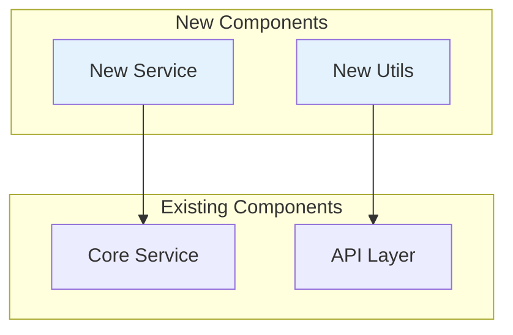

### Data Flow
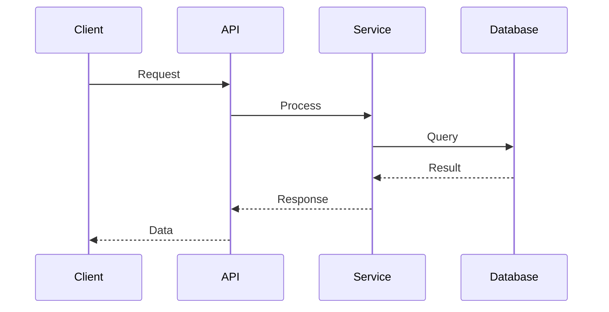
```

### 2. Project Managers

#### Focus Areas
- **Timeline diagrams** showing project phases
- **Resource allocation charts** for team planning
- **Progress tracking** with visual indicators
- **Risk assessment** matrices

#### Example: Project Status Issue
```markdown
## 📊 Project Status: [Phase Name]

### Timeline Overview
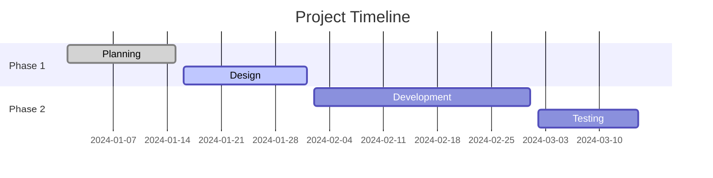

### Resource Allocation
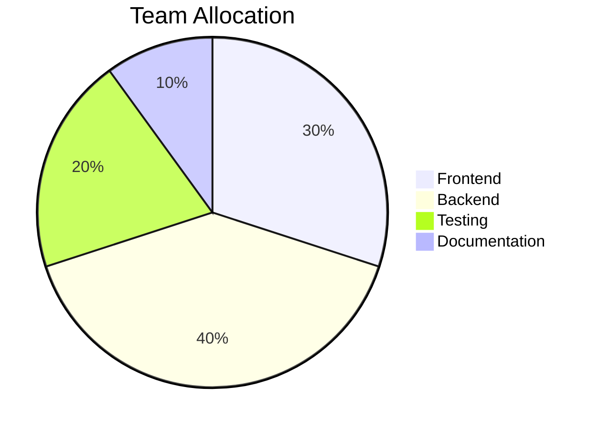

### Progress Tracking
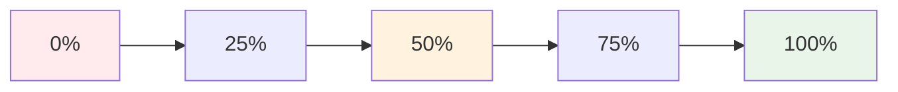
```

### 3. Stakeholders

#### Focus Areas
- **High-level process flows** for business understanding
- **Value proposition diagrams** showing benefits
- **ROI calculations** with visual breakdowns
- **Success metrics** with progress indicators

#### Example: Business Case Issue
```markdown
## 💼 Business Case: [Initiative Name]

### Value Proposition
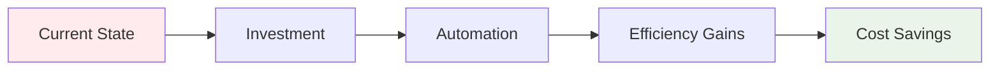

### ROI Breakdown
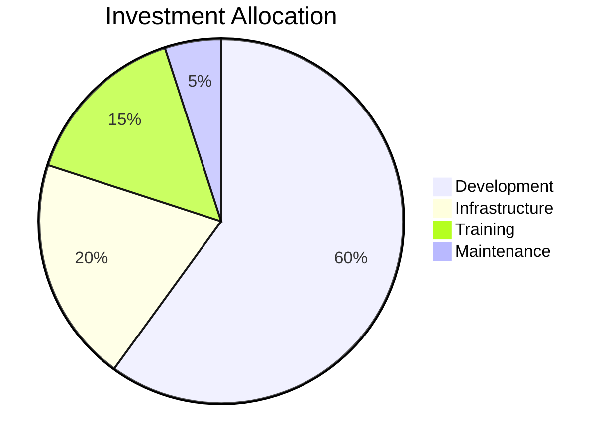

### Success Metrics
```mermaid
graph TD
    A[Time Savings] --> B[40% reduction]
    B --> C[Cost Impact]
    A --> D[Error Reduction]
    D --> E[90% fewer errors]
    E --> C
    C --> F[ROI: 300%]
    
    style F fill:#e8f5e8
```
```

## 🔄 Integration with Existing Systems

### 1. GitHub Issue Integration

#### Enhanced Issue Creation
```typescript
// Enhanced fossil issue creation with visuals
const result = await createFossilIssue({
  title: 'Implement Visual Documentation',
  body: generateVisualIssueBody({
    purpose: 'Add Mermaid diagrams to all documentation',
    checklist: [
      'Create visual standards guide',
      'Update issue templates',
      'Enhance fossil publication',
      'Add diagram generation utilities'
    ],
    workflow: [
      { step: 'Analysis', description: 'Identify documentation needs' },
      { step: 'Design', description: 'Create diagram templates' },
      { step: 'Implementation', description: 'Add visual generation' },
      { step: 'Validation', description: 'Test with real content' }
    ],
    dependencies: ['LLM Insights Workflow', 'Fossil Publication System'],
    risks: [
      { risk: 'Diagram complexity', impact: 'Medium', mitigation: 'Template system' },
      { risk: 'Performance impact', impact: 'Low', mitigation: 'Lazy loading' }
    ]
  }),
  type: 'enhancement',
  tags: ['documentation', 'visual', 'mermaid']
});
```

### 2. Fossil Publication Enhancement

#### Enhanced Publication Workflow
```mermaid
graph TD
    A[YAML Fossil] --> B[Content Analysis]
    B --> C[Visual Generation]
    C --> D[Enhanced Markdown]
    C --> E[Enhanced JSON]
    D --> F[Public Documentation]
    E --> G[API Endpoints]
    
    subgraph "Visual Analysis"
        H[Workflow Detection]
        I[Architecture Analysis]
        J[Relationship Mapping]
    end
    
    B --> H
    B --> I
    B --> J
    H --> C
    I --> C
    J --> C
    
    style A fill:#fff3e0
    style F fill:#e8f5e8
    style G fill:#e3f2fd
```

### 3. CLI Tool Enhancement

#### Visual CLI Output
```typescript
// Enhanced CLI with visual output
const visualOutput = await generateVisualReport({
  type: 'project-status',
  data: projectData,
  includeDiagrams: true,
  audience: 'technical'
});

console.log(visualOutput.markdown);
// Outputs markdown with embedded Mermaid diagrams
```

## 📈 Success Metrics

### 1. Adoption Metrics
- **Visual Issue Rate**: Percentage of issues with visual elements
- **Diagram Usage**: Number of Mermaid diagrams per documentation
- **Audience Engagement**: Time spent on visual vs. text content

### 2. Quality Metrics
- **Clarity Score**: User feedback on visual clarity
- **Comprehension Rate**: Understanding improvement with visuals
- **Error Reduction**: Fewer misunderstandings with visual context

### 3. Technical Metrics
- **Generation Performance**: Time to generate visual elements
- **Storage Impact**: Size increase from visual content
- **Rendering Success**: Percentage of diagrams that render correctly

## 🎯 Implementation Roadmap

### Phase 1: Foundation (Week 1-2)
- [ ] Create visual documentation standards
- [ ] Implement basic diagram generation utilities
- [ ] Update issue body templates with visual elements
- [ ] Add visual generation to fossil publication

### Phase 2: Enhancement (Week 3-4)
- [ ] Create audience-specific diagram templates
- [ ] Implement automated visual analysis
- [ ] Add visual elements to CLI outputs
- [ ] Create visual documentation examples

### Phase 3: Integration (Week 5-6)
- [ ] Integrate visuals with existing workflows
- [ ] Add visual validation and testing
- [ ] Create visual documentation guidelines
- [ ] Train team on visual standards

### Phase 4: Optimization (Week 7-8)
- [ ] Optimize diagram generation performance
- [ ] Add advanced visual features
- [ ] Create visual analytics dashboard
- [ ] Document best practices and lessons learned

## 📚 Related Documentation

- [LLM Insights Workflow](./LLM_INSIGHTS_WORKFLOW.md) - Existing Mermaid usage patterns
- [Fossil Publication Workflow](./FOSSIL_PUBLICATION_WORKFLOW.md) - Publication system
- [API Reference](./API_REFERENCE.md) - Technical implementation details
- [Development Guide](./DEVELOPMENT_GUIDE.md) - Development standards

---

*This document establishes comprehensive visual documentation standards that enhance human audit capabilities and improve communication across technical and non-technical audiences.* 