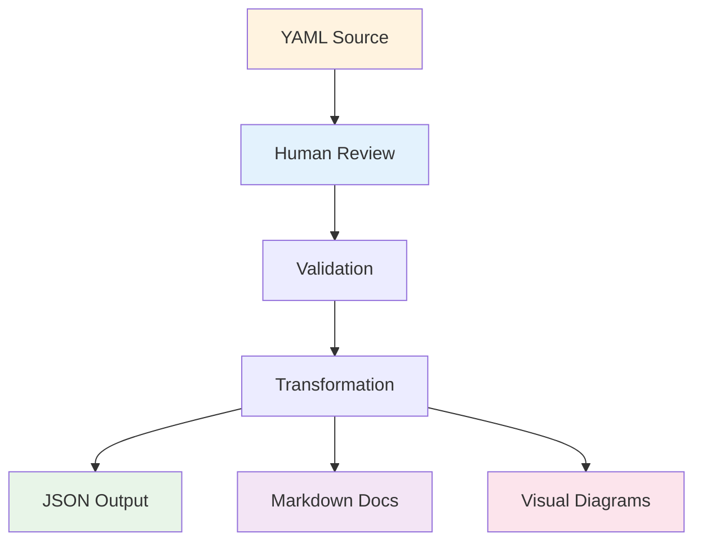
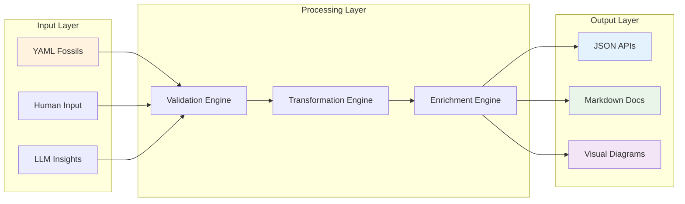
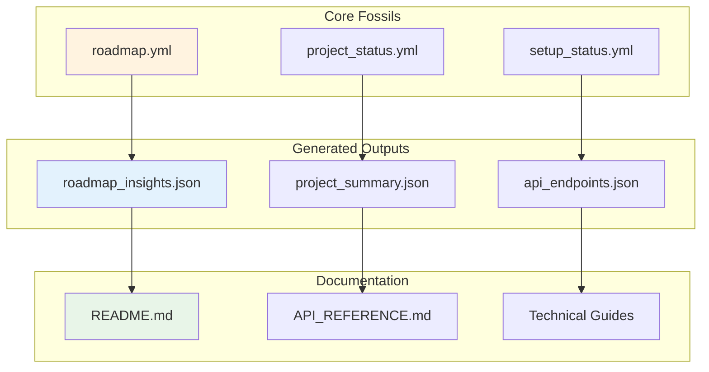

# Core Data Structures Demo

## Overview
This document demonstrates the YAML→JSON→Markdown transformation workflow for core data structures.

## Summary
- **Total Tasks**: 5
- **Completed**: 2
- **In Progress**: 2
- **Planned**: 1
- **Pending**: 0

## Workflow Diagram


## Data Flow Architecture


## Relationship Mapping


## Task Insights

### Project Setup and Onboarding
- **Status**: done
- **Owner**: emmanuelbarrera
- **Tags**: setup, onboarding
- **Summary**: Project Setup and Onboarding is done with positive impact.
- **Impact**: Positive
- **Recommendations**: Document lessons learned and consider optimization opportunities.


### Visual Documentation System
- **Status**: in_progress
- **Owner**: emmanuelbarrera
- **Tags**: documentation, visual, mermaid
- **Summary**: Visual Documentation System is in_progress with pending impact.
- **Impact**: Pending
- **Recommendations**: Review task requirements and prepare for implementation.


### Create Visual Standards Guide
- **Status**: done
- **Owner**: emmanuelbarrera
- **Tags**: documentation, standards
- **Summary**: Create Visual Standards Guide is done with positive impact.
- **Impact**: Positive
- **Recommendations**: Document lessons learned and consider optimization opportunities.


### Implement Diagram Generation
- **Status**: in_progress
- **Owner**: emmanuelbarrera
- **Tags**: implementation, diagrams
- **Summary**: Implement Diagram Generation is in_progress with pending impact.
- **Impact**: Pending
- **Recommendations**: Review task requirements and prepare for implementation.


### API Integration Framework
- **Status**: planned
- **Owner**: emmanuelbarrera
- **Tags**: api, integration
- **Summary**: API Integration Framework is planned with pending impact.
- **Impact**: Pending
- **Recommendations**: Review task requirements and prepare for implementation.


## JSON API Structure
```json
{
  "type": "roadmap-insights",
  "version": "1.0.0",
  "generatedAt": "2025-07-06T04:45:12.294Z",
  "roadmapSource": "demo-roadmap.yml",
  "summary": {
    "total": 5,
    "completed": 2,
    "inProgress": 2,
    "planned": 1,
    "pending": 0,
    "highImpact": 0,
    "withBlockers": 0,
    "withDeadlines": 0
  },
  "insights": [
    {
      "taskId": "projectsetup",
      "taskTitle": "Project Setup and Onboarding",
      "taskPath": [
        "Project Setup and Onboarding"
      ],
      "status": "done",
      "owner": "emmanuelbarrera",
      "tags": [
        "setup",
        "onboarding"
      ],
      "context": "Complete project setup and onboarding documentation",
      "milestone": "Immediate Actions",
      "issues": [
        201
      ],
      "labels": [
        "automation",
        "onboarding"
      ],
      "llmInsights": {
        "summary": "Project Setup and Onboarding is done with positive impact.",
        "impact": "Positive",
        "blockers": "None",
        "recommendations": "Document lessons learned and consider optimization opportunities."
      },
      "metadata": {
        "generatedAt": "2025-07-06T04:45:12.294Z",
        "model": "demo",
        "provider": "local",
        "fossilId": "demo-projectsetup",
        "roadmapVersion": "1.0.0"
      }
    },
    {
      "taskId": "visualdocume",
      "taskTitle": "Visual Documentation System",
      "taskPath": [
        "Visual Documentation System"
      ],
      "status": "in_progress",
      "owner": "emmanuelbarrera",
      "tags": [
        "documentation",
        "visual",
        "mermaid"
      ],
      "context": "Add comprehensive visual documentation using Mermaid diagrams",
      "milestone": "Documentation Enhancement",
      "issues": [
        202
      ],
      "labels": [
        "documentation",
        "enhancement"
      ],
      "llmInsights": {
        "summary": "Visual Documentation System is in_progress with pending impact.",
        "impact": "Pending",
        "blockers": "None",
        "recommendations": "Review task requirements and prepare for implementation."
      },
      "metadata": {
        "generatedAt": "2025-07-06T04:45:12.294Z",
        "model": "demo",
        "provider": "local",
        "fossilId": "demo-visualdocume",
        "roadmapVersion": "1.0.0"
      }
    },
    {
      "taskId": "createvisual",
      "taskTitle": "Create Visual Standards Guide",
      "taskPath": [
        "Visual Documentation System",
        "Create Visual Standards Guide"
      ],
      "status": "done",
      "owner": "emmanuelbarrera",
      "tags": [
        "documentation",
        "standards"
      ],
      "issues": [],
      "labels": [],
      "llmInsights": {
        "summary": "Create Visual Standards Guide is done with positive impact.",
        "impact": "Positive",
        "blockers": "None",
        "recommendations": "Document lessons learned and consider optimization opportunities."
      },
      "metadata": {
        "generatedAt": "2025-07-06T04:45:12.294Z",
        "model": "demo",
        "provider": "local",
        "fossilId": "demo-createvisual",
        "roadmapVersion": "1.0.0"
      }
    },
    {
      "taskId": "implementdia",
      "taskTitle": "Implement Diagram Generation",
      "taskPath": [
        "Visual Documentation System",
        "Implement Diagram Generation"
      ],
      "status": "in_progress",
      "owner": "emmanuelbarrera",
      "tags": [
        "implementation",
        "diagrams"
      ],
      "issues": [],
      "labels": [],
      "llmInsights": {
        "summary": "Implement Diagram Generation is in_progress with pending impact.",
        "impact": "Pending",
        "blockers": "None",
        "recommendations": "Review task requirements and prepare for implementation."
      },
      "metadata": {
        "generatedAt": "2025-07-06T04:45:12.294Z",
        "model": "demo",
        "provider": "local",
        "fossilId": "demo-implementdia",
        "roadmapVersion": "1.0.0"
      }
    },
    {
      "taskId": "apiintegrati",
      "taskTitle": "API Integration Framework",
      "taskPath": [
        "API Integration Framework"
      ],
      "status": "planned",
      "owner": "emmanuelbarrera",
      "tags": [
        "api",
        "integration"
      ],
      "context": "Create comprehensive API integration framework",
      "milestone": "Future Development",
      "issues": [
        203
      ],
      "labels": [
        "api",
        "framework"
      ],
      "llmInsights": {
        "summary": "API Integration Framework is planned with pending impact.",
        "impact": "Pending",
        "blockers": "None",
        "recommendations": "Review task requirements and prepare for implementation."
      },
      "metadata": {
        "generatedAt": "2025-07-06T04:45:12.294Z",
        "model": "demo",
        "provider": "local",
        "fossilId": "demo-apiintegrati",
        "roadmapVersion": "1.0.0"
      }
    }
  ],
  "metadata": {
    "generatedAt": "2025-07-06T04:45:12.294Z",
    "version": "1.0.0",
    "source": "demo-transformation",
    "processor": "core-data-structures-demo"
  }
}
```

---
*Generated by Core Data Structures Demo - 2025-07-06T04:45:12.299Z*
