# Fossil Structure Tree Diagram

**Generated:** 2025-07-06T05:35:00Z  
**Purpose:** Visual representation of current fossil structure and growth patterns  
**Total Files:** 32 | **Total Size:** 1.9MB  

## 🌳 Fossil Structure Tree

## 📊 Growth Pattern Flow

```mermaid
flowchart LR
    %% Input Triggers
    TRIGGERS[Triggers 🎯]
    TRIGGERS --> PROJECT_CHANGES[Project Changes<br/>New modules, functions, tests]
    TRIGGERS --> MONITORING[Continuous Monitoring<br/>Performance, tests, analysis]
    TRIGGERS --> QUALITY_CHECKS[Quality Checks<br/>Pre-commit, validation]
    TRIGGERS --> ROADMAP_EXECUTION[Roadmap Execution<br/>Progress, milestones]
    TRIGGERS --> TEST_EXECUTION[Test Execution<br/>Results, learning]
    
    %% Fossil Creation
    PROJECT_CHANGES --> CANONICAL_CREATION[Canonical Fossil Creation<br/>project_status.yml, roadmap.yml]
    MONITORING --> ANALYSIS_CREATION[Analysis Fossil Creation<br/>insights, patterns, ML models]
    QUALITY_CHECKS --> AUDIT_CREATION[Audit Fossil Creation<br/>quality reports, validation]
    ROADMAP_EXECUTION --> ROADMAP_CREATION[Roadmap Fossil Creation<br/>insights, progress, API]
    TEST_EXECUTION --> TEST_CREATION[Test Fossil Creation<br/>learning models, monitoring]
    
    %% Validation and Storage
    CANONICAL_CREATION --> VALIDATION[Schema Validation ✅]
    ANALYSIS_CREATION --> VALIDATION
    AUDIT_CREATION --> VALIDATION
    ROADMAP_CREATION --> VALIDATION
    TEST_CREATION --> VALIDATION
    
    VALIDATION --> STORAGE[Organized Storage 📁]
    STORAGE --> USAGE[Usage & Integration 🔄]
    USAGE --> GROWTH_MONITORING[Growth Monitoring 📈]
    GROWTH_MONITORING --> CLEANUP[Cleanup & Consolidation 🧹]
    CLEANUP --> TRIGGERS
    
    %% Styling
    classDef trigger fill:#e3f2fd,stroke:#1565c0,stroke-width:2px
    classDef creation fill:#f3e5f5,stroke:#7b1fa2,stroke-width:2px
    classDef process fill:#e8f5e8,stroke:#2e7d32,stroke-width:2px
    
    class TRIGGERS,PROJECT_CHANGES,MONITORING,QUALITY_CHECKS,ROADMAP_EXECUTION,TEST_EXECUTION trigger
    class CANONICAL_CREATION,ANALYSIS_CREATION,AUDIT_CREATION,ROADMAP_CREATION,TEST_CREATION creation
    class VALIDATION,STORAGE,USAGE,GROWTH_MONITORING,CLEANUP process
```

## 🔄 Fossil Lifecycle

## 📈 Value Proposition Matrix

```mermaid
graph TD
    %% Value Categories
    VALUE[Value Categories 💎]
    
    VALUE --> CONTEXT_VALUE[Context Value 📚]
    CONTEXT_VALUE --> CANONICAL_CONTEXT[Canonical: Project State & Direction]
    CONTEXT_VALUE --> ANALYSIS_CONTEXT[Analysis: ML Insights & Patterns]
    CONTEXT_VALUE --> AUDIT_CONTEXT[Audit: Quality & Compliance]
    CONTEXT_VALUE --> ROADMAP_CONTEXT[Roadmap: Strategic Direction]
    CONTEXT_VALUE --> PERFORMANCE_CONTEXT[Performance: Optimization]
    CONTEXT_VALUE --> TEST_CONTEXT[Test: Quality & Learning]
    
    VALUE --> GROWTH_VALUE[Growth Value 🌱]
    GROWTH_VALUE --> INCREMENTAL_LEARNING[Incremental Learning]
    GROWTH_VALUE --> PATTERN_RECOGNITION[Pattern Recognition]
    GROWTH_VALUE --> DECISION_SUPPORT[Decision Support]
    GROWTH_VALUE --> AUTOMATION_ENABLEMENT[Automation Enablement]
    GROWTH_VALUE --> QUALITY_ASSURANCE[Quality Assurance]
    
    VALUE --> DISTINCTIVENESS[Distinctiveness ✨]
    DISTINCTIVENESS --> UNIQUE_CONTEXT[Unique Context]
    DISTINCTIVENESS --> SPECIFIC_PURPOSE[Specific Purpose]
    DISTINCTIVENESS --> VALUABLE_CONTENT[Valuable Content]
    DISTINCTIVENESS --> TRACEABLE_SOURCE[Traceable Source]
    
    %% Styling
    classDef valueCategory fill:#fff3e0,stroke:#e65100,stroke-width:2px
    classDef contextValue fill:#e1f5fe,stroke:#01579b,stroke-width:1px
    classDef growthValue fill:#f3e5f5,stroke:#4a148c,stroke-width:1px
    classDef distinctiveness fill:#e8f5e8,stroke:#1b5e20,stroke-width:1px
    
    class VALUE,CONTEXT_VALUE,GROWTH_VALUE,DISTINCTIVENESS valueCategory
    class CANONICAL_CONTEXT,ANALYSIS_CONTEXT,AUDIT_CONTEXT,ROADMAP_CONTEXT,PERFORMANCE_CONTEXT,TEST_CONTEXT contextValue
    class INCREMENTAL_LEARNING,PATTERN_RECOGNITION,DECISION_SUPPORT,AUTOMATION_ENABLEMENT,QUALITY_ASSURANCE growthValue
    class UNIQUE_CONTEXT,SPECIFIC_PURPOSE,VALUABLE_CONTENT,TRACEABLE_SOURCE distinctiveness
```

## 🎯 Usage Instructions

### **For Future Reference**
1. **Tree Structure:** Use the tree diagram to understand fossil organization
2. **Growth Patterns:** Reference the flow diagram for fossil creation processes
3. **Lifecycle:** Use the state diagram to understand fossil management
4. **Value Matrix:** Reference the value proposition for decision-making

### **For Maintenance**
- **Add New Fossils:** Follow the growth pattern flow
- **Cleanup:** Use the lifecycle diagram for maintenance decisions
- **Validation:** Ensure schema compliance before storage
- **Documentation:** Update this diagram when structure changes

### **For Integration**
- **Scripts:** Reference tree structure for file paths
- **CI/CD:** Use growth patterns for automation
- **LLM Services:** Reference value proposition for context
- **Analysis:** Use lifecycle for trend analysis

---

**This Mermaid diagram serves as a visual source of truth for the fossil structure, making it easy to understand, reference, and maintain the fossil system.** 